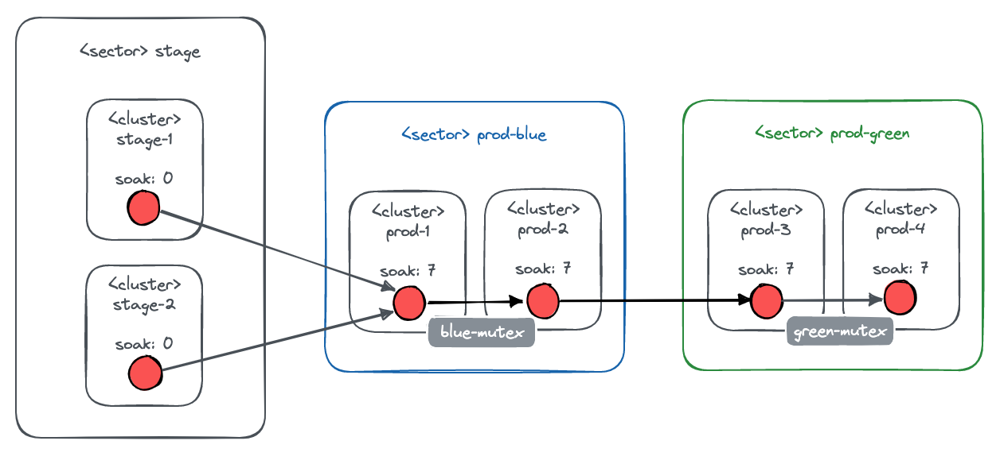

# Cluster upgrades

[TOC]

## Motivation

AppSRE manages a fleet of clusters with various workloads and various constraints on how these clusters continously receive Openshift version updates.

Following the SRE principles, AppSRE build strong tooling around its upgrade policies and turned a complex continous effort into a no-toil process. The result is a powerful policy framework driven a set of integration (`ocm-upgrade-*`) that together form the Advanced Upgrade Service (AUS).

This document explains the concepts behind the policies, shows how policies can be defined and how they drive the decision about which cluster is upgrade when to what version.

Jira ticket: <https://issues.redhat.com/browse/SDE-1376>

> Note: The end goal is to expose this SRE capability to external customers as well, likely as an OCM API.

## Applicability

AUS policies can be applied to all clusters from Red Hat owned OCM organizations but depending on the organization ownership

* different [support models](#support-model) apply
* different ways of [placing a policy](#placing-a-policy) apply

## Concepts

AUS revolves around the concepts of `workloads` and `conditions` to declare upgrades.

`Workloads` are freely chooseable identifiers to define what workloads are hosted on a cluster.

The most central condition is `soak days`, which defines the number of days an Openshift version must run on other clusters with the same `workloads` before it is considered to be applied to a cluster. Those days are accumlated, e.g. a version running on 2 clusters for 3 days satisfies a condition for 6 soak days.

> There needs to be at least one cluster with 0 `soak days` to start the process.

Another useful condition is `mutexes`. A mutex acts as an exclusive lock a cluster must aquire before an upgrade is applied. This way, one-cluster-at-a-time semantics can be achieved for upgrades. Mutexes only consider clusters and not workloads.

Clusters can also be partitioned into workload aware `sectors`, e.g. stage and production. Updates are applied to all clusters of a sector before it is considered for a dependant sector, e.g. first stage then production.

## Placing a policy

Upgrade policies for clusters can be defined in two different places.

### AppSRE managed clusters

For AppSRE managed clusters, upgrade policies can be placed directly into the `/openshift/cluster-1.yml` files.

```yaml
$schema: /openshift/cluster-1.yml
name: my-cluster
...
upgradePolicy:
  <workloads and conditions>
```

### Additional OCM organizations

In the scope of SRE capabilities, upgrade policies are configured in an OCM organization file (`/openshift/openshift-cluster-manager-1.yml`). See this [guide](/docs/app-sre/sop/onboard-ocm-organisation.md) to learn how to onboard such an organization file.

```yaml
$schema: /openshift/openshift-cluster-manager-1.yml
name: my-ocm-org
...
upgradePolicyClusters:
- name: my-cluster (1)
  upgradePolicy:
    <workloads and conditions>
- name: my-other-cluster (1)
  upgradePolicy:
    <workloads and conditions>
```

The name of the clusters (1) must match the names in OCM.

This is the result of a PoC ([SDE-2341](https://issues.redhat.com/browse/SDE-2341)) to expose advanced cluster upgrade capabilities to internal RH teams.

Example: [/data/dependencies/ocm/osd-fleet-manager/integration.yml](/data/dependencies/ocm/osd-fleet-manager/integration.yml)

## The anatomy of a policy

The general structure of an upgrade policy looks as follows and can be placed into context as defined in the section `[Placing a policy](#placing-a-policy)`.

```yaml
upgradePolicy:
  # types of workloads running on this cluster
  workloads:
  - workload1
  - workload2
  # cron expression to determine when upgrades should be scheduled
  schedule: 0 12 * * 1-5
  # conditions to decide if upgrade should be scheduled
  conditions:
    # number of days this version has been running in clusters with the same workloads
    soakDays: 0
    # list of mutexes to acquire in order to schedule the upgrade
    mutexes:
    - mutex-1
    - mutex-2
    # OCM upgrade sector to which the cluster belongs
    sector: sector-1
```

Each cluster with an `upgradePolicy` is checked for the following conditions on a regular basis. If all of them are met, a cluster upgrade is triggered via OCM.

* The cluster has no current upgrade pending.
* There are available versions to upgrade to and they are not blocked (see [Blocked upgrades to versions](#block-upgrades-to-versions)).
* The upgrade schedule is within the next 2 hours.
* The version has been soaking in other clusters with the same workloads (more than `soakDays`). See the section [Defining soak days](#defining-soak-days) for more details.
* All the configured `mutexes` can be acquired. Said differently, there is no ongoing cluster upgrades with any of these `mutexes`, so mutexes are the enabler for on-cluster-at-a-time semantics. See the section [Defining mutexes](#defining-mutexes) for more details.
* An upgrade can be applied on a cluster only if all clusters from previous sectors already run at least that version. See the section [Defining sectors](#defining-sectors) for more details.

The versions to upgrade to are iterated over in reverse order, so it is assumed that the latest/highest version that meets the conditions is chosen.

## Conditions in detail

### Defining soak days

Soak days are a way to gain trust in version running on other clusters with the same workloads. They are accumulated from all clusters running that workload on a version and also account for clusters that were running that workload/version combination in the past.

The more clusters are running a specific workload/version combination, the faster the number of soak days is increasing, unlocking upgrades to that version for other clusters.

In the following example, two stage clusters get new versions immediately (`soakDays: 0`), while the production cluster waits until 4 soak days have been accumulated.

```yaml
upgradePolicyClusters:
- name: stage-1
  upgradePolicy:
    workloads:
    - my-service (1)
    schedule: 0 13 * * 1-5
    conditions:
      soakDays: 0 (2)
- name: stage-2
  upgradePolicy:
    workloads:
    - my-service (1)
    schedule: 0 13 * * 1-5
    conditions:
      soakDays: 0 (2)

- name: prod
  upgradePolicy:
    workloads:
    - my-service (3)
    schedule: 0 13 * * 1-5 (2)
    conditions:
      soakDays: 4 (4)
```

(1) The stage clusters runs a workload named my-service

(2) A new available Openshift version (based on the upgrade channel) is immedately considered to be applied during the next maintenance window. Each workload needs at least one cluster with 0 `soak days`

(3) The production cluster defines the same workload...

(4) ... so it waits for a version to soak for 4 days on the stage clusters. Since there are 2 stage clusters with `soakDays: 0`, the required soak days can be reached after 2 days.

> For upgrade policies defined in an OCM organization file, all used workload identifiers must also be declared in the `upgradePolicyAllowedWorkloads` config section.

### Defining mutexes

Mutexes are a safe way to achieve one-cluster-at-a-time semantics for upgrades. A cluster needs to aquire all mutexes defined in its upgrade policy, before an upgrade can start. A single mutex can be held by only one cluster at a time. Once acquired by a cluster, a mutex is held for the whole duration of the upgrade.

> Mutexes are not workload aware.

In the following example, only one production cluster can upgrade at a time, even though they define the same maintenance window.

```yaml
upgradePolicyClusters:
- name: prod-1
  upgradePolicy:
    ...
    schedule: 0 13 * * 1-5
    conditions:
      mutexes:
      - prod (1)
- name: prod-2
  upgradePolicy:
    ...
    schedule: 0 13 * * 1-5
    conditions:
      mutexes:
      - prod (1)
```

(1) both clusters define the same mutex

> For upgrade policies defined in an OCM organization file, all used mutexes must also be declared in the `upgradePolicyAllowedMutexes` config section.

### Defining sectors

Clusters can be grouped in sectors. A version needs to be applied to all clusters of a sectors before it is considered for a dependant sector. Sectors are workload aware.

In the following example, updates progress from the `stage` sector to the `prod-blue` sector and then to the `prod-green` sector. Mutexes are in place in the prod sectors to prevent more than one cluster to be upgraded at the same time.



```yaml
upgradePolicyClusters:
- name: stage-1
  upgradePolicy:
    ...
    conditions:
      sector: stage
- name: stage-2
  upgradePolicy:
    ...
    conditions:
      sector: stage
- name: prod-1
  upgradePolicy:
    ...
    conditions:
      soakDays: 7
      sector: prod-blue
      mutexes:
      - blue-mutex
- name: prod-2
  upgradePolicy:
    ...
    conditions:
      soakDays: 7
      sector: prod-blue
      mutexes:
      - blue-mutex
- name: prod-3
  upgradePolicy:
    ...
    conditions:
      soakDays: 7
      sector: prod-green
      mutexes:
      - green-mutex
- name: prod-4
  upgradePolicy:
    ...
    conditions:
      soakDays: 7
      sector: prod-green
      mutexes:
      - green-mutex
```

Sectors and their dependencies are defines in the `sectors` section of the organization file (also for upgrade policies defined in cluster files).

```yaml
sectors:
- name: stage
- name: prod-blue
  dependencies:
  - name: stage
- name: prod-green
  dependencies:
  - name: prod-blue
```

## Upgrade channels

Note that each cluster follows an upgrade channel. Clusters following different channels don't get the same version available at the same time (e.g. the `stable` channel enables upgrade paths much later than the `candidate` and `fast` channels). Timely version progression from cluster to cluster works best if all clusters share the same upgrade `channel`.

> AppSRE does not use different channels for clusters. This avoids clusters lagging behind, not getting any upgrade (not even patch/CVE) while other clusters are running fine on later releases. See [APPSRE-5393](https://issues.redhat.com/browse/APPSRE-5393) for more context and discussion.

## Version history

Information on how long a version has been running in our clusters can be found in the `version-history` app-interface-output page: <https://gitlab.cee.redhat.com/service/app-interface-output/-/blob/master/version-history.md>

This page can be used to debug why certain upgrades are scheduled or not or to help with providing a signal for pre-release OCP versions.

## Block upgrades to versions

In order to block upgrades to specific versions, follow these steps:

1. Disable `ocm-upgrade-scheduler` in [Unleash](https://app-interface.unleash.devshift.net) to prevent any new upgrades from being triggered for AppSRE managed clusters
2. Disable `ocm-upgrade-scheduler-org` in [Unleash](https://app-interface.unleash.devshift.net) to prevent any new upgrades from being triggered for clusters defined in OCM organization files
3. Add the version to the `blockedVersions` list in the OCM instance file.

Notes:

* Regex expressions are supported.
* These steps will also cause existing upgrades to be cancelled if time allows.
* All AppSRE clusters are provisioned in the [OCM production instance](https://gitlab.cee.redhat.com/service/app-interface/-/blob/master/data/dependencies/ocm/production.yml#L13).

In the following example, all release candidates are being blocked within an OCM organization.

```yaml
blockedVersions:
- ^.*-rc\..*$
```

## Support model

Depending on the ownership of the clusters or OCM organizations, differen SLOs apply for the AUS service.

* for AppSRE owned clusters and organizations, the [AppSRE SLOs](https://gitlab.cee.redhat.com/app-sre/contract/-/tree/master/#appsre-service-level-objectives) apply
* for cluster or OCM organizations not managed by AppSRE, the [AUS SRE capability SLOs](/docs/app-sre/sre-capabilities/advanced-upgrade-service.md#aus-service-level-objectives) apply

## AppSRE cluster upgrade policy strategy

### Hive

The first clusters to be upgraded belong to the integration and SSO test environments (hivei01ue1, ssotest01ue1).

Once a version has soaked for 10 days, the stage clusters will be upgraded (hive-stage-01, hives02ue1).

Once a version has soaked for 20 days, it will begin rolling out to the production clusters. Start with the least critical ones:

* hivep04 will go first as it's a hot standby and holds no customer clusters.
* hivep06 is going to replace hivep03 (2 AZs), and currently also has no customer clusters
* hivep03 has very few customer clusters and is not being scheduled with any new ones until it's deprecation

All other Hive production clusters (01, 02, 05) hold most customer clusters and are the only ones being scheduled with new customer clusters.

We choose different soak days to give some interval between upgrades. Should anything go wrong - we will have some time to intervene, block versions, only handle one issue at a time, etc.

### AppSRE

The first clusters to be upgraded belong to the stage environment (app-sre-stage-01, appsres03ue1).

Once a version has soaked for 7 days, the production clusters will be upgraded (app-sre-prod-01, appsrep05ue1).

### console.redhat.com (CRC)

The first cluster to be upgraded belongs to the stage environment (crcs02ue1). It is upgraded once a week.

Once a version has soaked for 6 days, the production cluster will be upgraded (crcp01ue1).

### OCM

OCM runs on 3 clusters with 0 soakdays, getting upgrades from the candidate channel:

* app-sre-stage-01
* appsres04ue2
* ssotest01ue1

Then the production clusters app-sre-prod-04 and appsrep06ue2 will be upgraded from the fast channel after 18 soakdays. Since soakdays are cumulated with each cluster running the workload, the ocm soakdays number will grow fast: they should get upgraded after 18/3=6 days, provided the version is available in the fast channel.

OCM and Quay production clusters share a mutex `ocm-quay-critical` which avoids simultaneous upgrades of these clusters:

* app-sre-prod-04
* appsrep06ue2
* quayp04ue2
* quayp05ue1

### Quay

The first cluster to be upgraded is the stage environment cluster quays02ue1, on the candidate channel. It is upgraded with every new version.

Then the 2 production clusters are upgraded after

* 6 days for quayp05ue1 (fast channel).
* 11 days for quayp04ue2 (fast channel). This should allow some delay between the two clusters, even if the first one is being done late, on a Monday for example.

OCM and Quay production clusters share a mutex `ocm-quay-critical` which avoids simultaneous upgrades of these clusters:

* app-sre-prod-04
* appsrep06ue2
* quayp04ue2
* quayp05ue1

### OCM-Quay

The first clusters to be upgraded are the read-only ocm-quay clusters.

The first one is upgraded with every new version. The second after the version has soaked for a day, the third after 2 days.

Once a version has soaked for 7 days, the read-write cluster will be upgraded.

All ocmquay production clusters (read-only and read-write) share a mutex `ocmquay-production` to avoid any simultaneous cluster upgrade.

### Telemeter

The first cluster with telemeter workload is app-sre-stage-01 which also host other workloads (See [AppSRE](#appsre)). This cluster will be upgraded on every new version in the candidate channel.

Then the telemeter-prod-01 cluster will be upgraded from the fast channel if the version remains up for 6 days.
