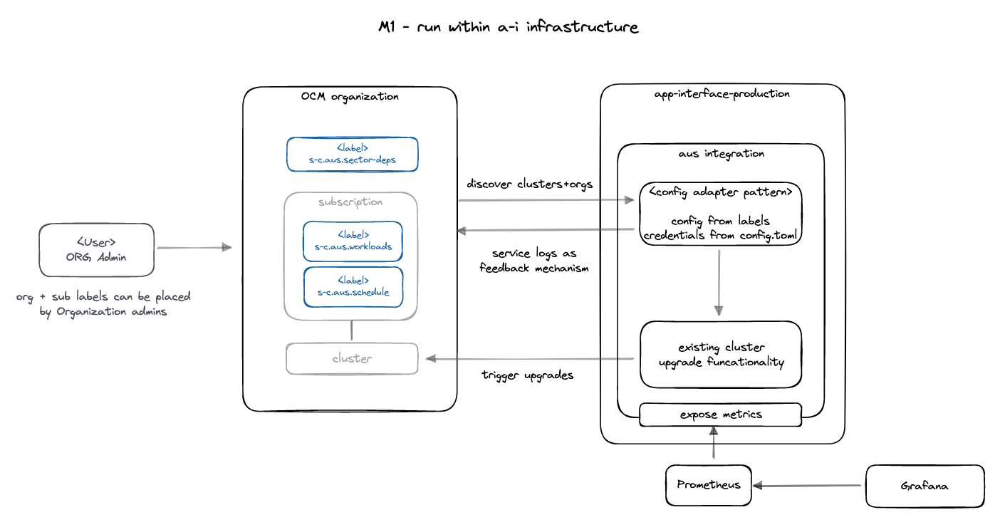

# Design doc: Advanced Upgrade Service without app-interface

[toc]

## Author/date

Gerd Oberlechner / April 2023

## Tracking JIRA

[https://issues.redhat.com/browse/SDE-2789](https://issues.redhat.com/browse/SDE-2789)

## Problem Statement

Advanced cluster Upgrade Service (AUS) as described [here](https://service.pages.redhat.com/dev-guidelines/docs/sre-capabilities/advanced-upgrade-service/) are valueable beyond the scope of AppSRE tenants and app-interface. While interested parties can open tickets with AppSRE to get their OCM organization and clusters configured for AUS into app-interface without actual app-interface touchpoints, it leaves the toil of change-management with AppSRE.

## Goals

- make AUS as a self-serviceable offering for Red Hat engineering teams without AppSRE and app-interface touchpoints
- reuse the current app-interface bound AUS implementation as much as possible without major modifications
- clarify the relationship and distinction between SRE capabilities and AppSRE offerings

## Non goals

- support model specific alerting for SRE capabilitites - this will be coverd in Milestone 2 of the [SRE capabilitites initiative](docs/app-sre/inititives/sre-capabilities.md)
- dedicated runtime environment for SRE capabilitites - this will be covered in Milestone 3 of the [SRE capabilitites initiative](docs/app-sre/inititives/sre-capabilities.md)

## Proposals

The following proposal covers several aspects:

- use OCM labels as widely available definition language for policies
- the implementation of the reconciler and its runtime
- alerting

### Defining policies via OCM label

We will offer AUS to all Red Hat engineering teams via the [OCM label based consumption model](https://service.pages.redhat.com/dev-guidelines/docs/sre-capabilities/framework/ocm-labels) from the [SRE capabilities framework](https://service.pages.redhat.com/dev-guidelines/docs/sre-capabilities/framework).

> TLDR about the label based approach: configuration information is placed on clusters via subscription labels. For organization wide configurations, organization labels are used. Labels can be placed by any organization admin.

To define a upgrade policy, a user places a set of labels to a cluster subscription and the organization. Following the naming scheme described in the consumption model docs, all labels will be prefixed with `sre-capabilities.aus.`.

| Label Type   | Label Key                                | Maps to policy                    | example         | Notes                                                                                              |
|--------------|------------------------------------------|-----------------------------------|-----------------|----------------------------------------------------------------------------------------------------|
| Subscription | sre-capabilities.aus.workloads           | upgradePolicy.workloads           | wl-1,wl-2       | Multiple values are represented as CSV                                                             |
| Subscription | sre-capabilities.aus.soak-days           | upgradePolicy.conditions.soakDays | 2               |                                                                                                    |
| Subscription | sre-capabilities.aus.schedule            | upgradePolicy.schedule            | 0 * * * 1-5     |                                                                                                    |
| Subscription | sre-capabilities.aus.mutexes             | upgradePolicy.conditions.mutexes  | mtx-1,mtx-2     | Multiple values are represented as CSV                                                             |
| Subscription | sre-capabilities.aus.sector              | upgradePolicy.conditions.sector   | green           | If a sector is defined, additional sector configuration labels must be defined on the organization |
| Organization | sre-capabilities.aus.blocked-versions    | blockedVersions                   | ^4\.12\..*$     | Regular expressions. Multiple values are represented as CSV                                        |
| Organization | sre-capabilities.aus.sector-deps.$sector | sectors.name.dependencies         | green,red       | Multiple values are represented as CSV                                                             |

### Considerations for the use of OCM labels

The [OCM label based consumption model](https://service.pages.redhat.com/dev-guidelines/docs/sre-capabilities/framework/ocm-labels) states that labels should hold only small pieces of configuration information. The label values required for an average cluster upgrade policy (including blocked version and sector configuration) are less than 100 bytes spread across 5-7 labels.

Reading all the relevant labels fleet wide and establishing context by reading all involved subscriptions and clusters requires 3 OCM API calls. After the configuration state has been established, each involved cluster needs to be queried for existing upgrade policies and gate agreements. These are per-cluster OCM API endpoints. The number of OCM API calls scales with the number of involved clusters.

For the time being, we will limit the number of OCM organizations that can use AUS, to keep the number of clusters and the load for the OCM API at bay.

### Reconciler and runtime

The label based AUS reconciler is going to be implemented as a new integration in qontract-reconcile. This is in alignment with Milestone 1 of the [SRE capabilitites initiative](docs/app-sre/inititives/sre-capabilities.md).

The existing core functionality for cluster upgrades is part of the qontract-reconcile repository. The code in `reconcile.aus` is prepared to be reused with other datasources than app-interface, so it makes more than sense to reuse that code for the label based AUS implementation.

AUS will be managed via the integrations-manager within the regular app-interface runtime infrastructure. This allows us to ship in a timely manner and gives us time to define the runtime environment for SRE capabilities that deals with the new paths and requirements they open (user relationship, support model, ...).



The [SRE capabilitites initiative](docs/app-sre/inititives/sre-capabilities.md) defines a change in runtime environment for capabilities in Milesteone 3. Capabilitites will be homed in a dedicated environment that is detached from app-interface but still close enough so that most integrations can be run as a capability without a major overhaul.

### Alerting

For the time being, alertig for the AUS capability will follow the qontract-reconcile alerting scheme (tldr: a failing reconcile run will trigger a page after some time). To adhere to the differences in the support model between integrations and capabilitites, the AUS capability will not fail for situations uncovered by the support model, e.g. bad configuration data provided via OCM labels. These situations will be highlighted to users via OCM service logs and will not trigger pages for AppSRE.

AUS can still fail in other situations and would trigger pages.

Milestone 2 of the [SRE capabilitites initiative](docs/app-sre/inititives/sre-capabilities.md) defines work revoling around alerting schemes for capabilitites, covering alert severity levels for different integrations/capabilitites and for data partitions/shards (e.g. don't alert for OCM stage).

### Reporting

Instead of relying on `app-interface-output` reports to show the active upgrade policies and cluster soak days, AUS will expose cluster, policy and remaining soak day information as Prometheus metrics. These can be visualized via Grafana.

The static/slowly changing policy and cluster base information is represented in an info metric `aus_cluster_info`. The information about remaining soak days per cluster and version is exposed as `aus_cluster_version_remaining_soak_days`.

```text
aus_cluster_info{cluster_id="xxx", cluster_name="name", org_id="yyy", version="4.12.5", channel="stable", schedule="0 * * * *", sector="main", mutexes="m-1,m-2", soak_days=5, workloads="wl-1,wl-2"} 1

aus_remaining_soak_days{cluster_id="xxx", version="4.12.10"} 12.93
```

Both metrics combined hold the information currently present on the [fleet upgrade policies page](https://gitlab.cee.redhat.com/service/app-interface-output/-/blob/master/ocm-fleet-upgrade-policies.md).

The Grafana dashboard can be filtered per OCM organization to provide users an overview of their organization.

### Future

Eventually the cluster uprade core code might move from qontract-reconcile into a dedicated code repository. app-interface would evolve into a consumer of AUS instead of being the provider of it.

## Milestones

### Milestone 1

Implement the reconciler based on OCM labels and deploy along the app-interface workload with app-interface-output reporting

### Milestone 2

- alerting scheme based on capability support model (part of M2 of the initiative)
- deploy AUS into a dedicated runtime environment (part of M3 of the initiative)
- Grafana based cluster and policy [reporting](https://issues.redhat.com/browse/APPSRE-7360)

### Milestone 3

user tooling, e.g. cli tool to create and manage policies
