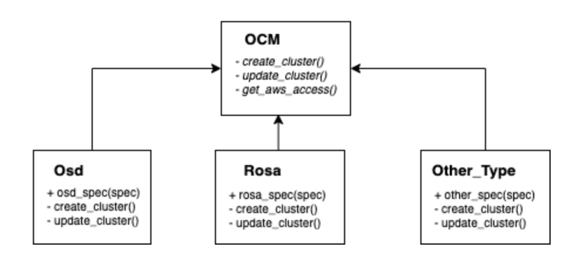

# Design doc: ROSA support in App-Interface

[toc]

## Author/date

Jordi Piriz / 2022-04-18

## Tracking JIRA

[https://issues.redhat.com/browse/APPSRE-4268](https://issues.redhat.com/browse/APPSRE-4268)

## Problem Statement

As part of hypershift support, we need to be able to support openshift ROSA clusters through
app-interface. Our current `OCM` code only supports`OSD` type clusters. Some enhancements are
needed to support `ROSA` or other cluster types.

## Goals

- Identify changes required by A-I and Q-R to support ROSA clusters
- Define `ROSA` clusters provisioning details

## Non-Goals

- Define Hypershift topology/deployments
- ROSA clusters deployment through app-interface. As OCM team is actively working on supporting ROSA
  deployments entirely. The cluster creation part will be set on hold until they finish. Clusters creation
  will be covered in an additional design doc if applies.

## Proposals

### OCM code changes

Our OCM code is very focused to OSD-type clusters. Some changes are needed:

- Getting the clusters spec: Our current approach takes `OSD` related fields as mandatory but those are
  not set in `ROSA` or other types.

- Cluster Updates: Some updates that do not apply on `ROSA` such as quotas or making the cluster private.

- Cluster Creation: TBD. `OCM` support for ROSA is happening right now. Maybe is better to hold off until
  the support is done instead of implementing this with `ROSA cli`.

- AWSInfrastructureAccess: `ROSA` does not have this option through `OCM` because the aws account is
  fully managed by the customer.

The `OCM` code needs to be refactored to allow different cluster types. At first, using an interface instead
of a single cluster type is the appropriate way to manage this. A cluster implementation will be created for
each type of cluster we need to support.

The code changes to do this seems located in the `ocm.py` file, the integrations get the `ocm` reference from
the `OCM_Map` class. This needs a more deep view but at first, seems that with the clusters' initialization
an additional object could be set to add the product implementation object.

About the AWSInfrastructureAccess, as the accounts are managed by us, we could mimic how we are managing
`OSD` aws accounts. Creating both `read-only` and `network-mgmt` roles in the destination account and adding
the IAM policies when new accesses need to be granted. There are 2 things to consider.

1. Users access to the account. These accesses will be managed by app-interface through aws groups and the
  terraform-users integration.
2. Terraform integrations will leverage the `assume-role` feature to get the `network-mgmt` role in the account.
  This approach has been used in Fedramp.

### Schema changes

- Convert `Cluster` type to an interface. As `OCM` supports various types of cluster types and there is a need in AI
  to support some of them, it's worth having diferentiated specs for each cluster type. We will have `OSD` and `ROSA`
  but this could be extended with future offerings (Hypershift, KCP...), so adding separate types makes sense at
  this point.

- Add a `product` attribute to identify the cluster type. `product` is already part of `OCM` api spec and is used to
  identify the cluster type. We could use the same approach in our cluster specs. This attribute will be used to identify
  the graphql subtypes and to instantiate the right OCM implementation.

### Clusters location

ROSA clusters will be set in dedicated aws account to host this clusters. Each cluster will be deployed in its own VPC.

### OCM Integrations summary

- ocm_additional_routers: Not supported in ROSA. ROSA clusters will be excluded from this integration
- ocm_addons: Supported. No changes needed.
- ocm_aws_infrastructure_access: N/A to ROSA. ROSA clusters will be excluded from this integration.
- ocm_clusters: This integration will be changed to use product specific OCM code.
- ocm_external_configuration_labels: Supported. No changes needed
- ocm_github_idp: Supported. No changes needed.
- ocm_groups: Supported. No changes needed.
- ocm_machine_pools: Supported. No changes needed.
- ocm_upgrade_scheduler: Needs to be updated to support STS version gates. [REF](https://github.com/app-sre/qontract-reconcile/blob/master/reconcile/utils/ocm.py#L856)

## Alternatives considered

### OCM code conditional branching

A possible way is to branch the code with if/else and manage `ROSA` clusters with additional paths. I consider this
a bad design as all the code would need to be modified if a new cluster type needs to be supported in the future.
On the contrary, adding separate implementations leads to a clean approach and adds maintainability to the code.

### Separate methods in the OCM module

Such as kafka clusters, managing `ROSA` with additional methods is a viable way. I think it's better for the sake of
code comprehension, maintainability and coherence to just have different types under the cluster meta type with its
separate implementations.

## Decissions made

- Cluster installation logic will be set on hold until the OCM implementation is done.
- ROSA clusters will be deployed in a dedicated aws account owned by APPSRE.
- Clusters' access will be managed the same way as `OSD`. `dedicated-admin` and `cluster-admin` roles.
- Aws infra access will follow the same approach used in fedRamp.
  - Users access will be granted through terraform_users integration
  - Terraform access will leverage `assume-role` feature in the destination account.

## Changes list summary

- Change the `cluster` schema to be an interface. Each cluster type will be identified by the `product` attribute.
  Each cluster definition will only have its necessary attributes.
- Update the `ocm` code to manage different cluster implementations (OSD and ROSA). This step will open the way to
  support other `ocm` cluster implementations in the future.
- Change `ocm_clusters` integration into support `ROSA` and `OSD` cluster types.
- Create an additional account to host AppSRE `ROSA` clusters.
- Update SOPS to include `ROSA` type clusters onboarding to app-interface

## Milestones

1. Adapt OCM library and integrations to work with different OCM implementations
2. Add ROSA OCM Implementation. Test all functionalities
3. Update OCM documentation, SOPS, etc to include ROSA clusters.
4. Add a ROSA Cluster to App-Interface.

## Resources

- [OCM API Spec](https://api.openshift.com/#/default/get_api_clusters_mgmt_v1_clusters)
- [Discussion Meeting](https://drive.google.com/file/d/1gq3R3LyTFihxBScmwXrhYpq-KR0CHNiV/view?usp=sharing)
