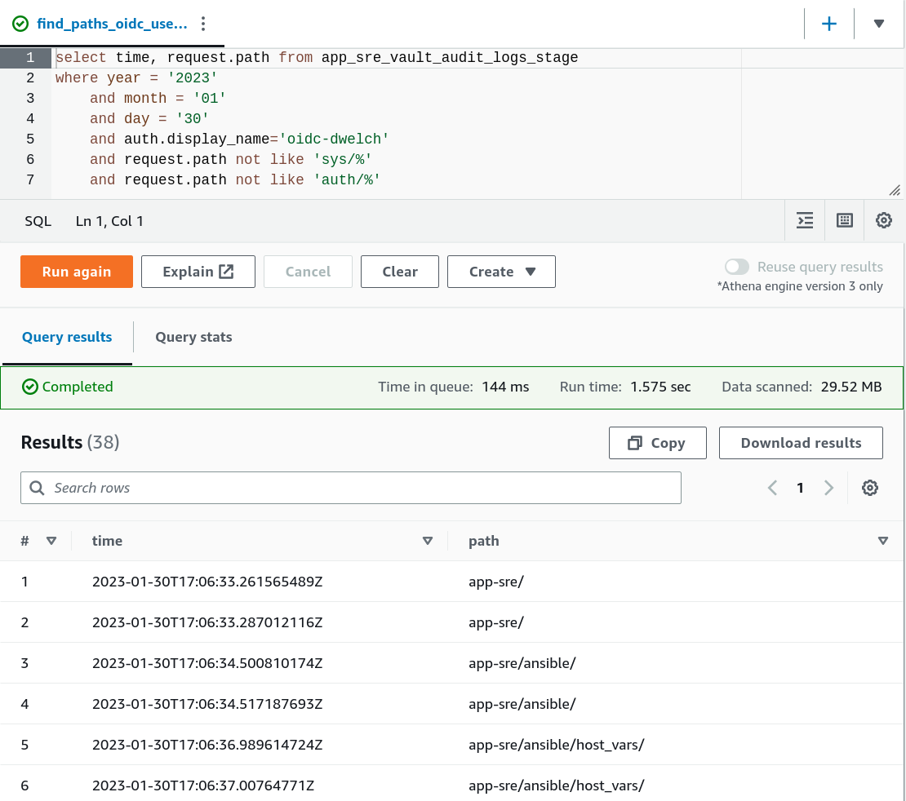

# Design doc: Athena Log Querying
Note: this design doc utilizes Vault for POC. The proposed solution can be extended to other services with similiar logging configurations.

## Author/date
dwelch / January 2023


## Tracking JIRA
https://issues.redhat.com/browse/APPSRE-6770


## Problem Statement
Multiple scenarios have occurred in which review of Vault audit logs was necessary. The configuration of a [vault audit file device](https://gitlab.cee.redhat.com/service/app-interface/-/blob/master/data/services/vault.devshift.net/config/prod/audit-backends/file-audit.yml) and [fluentd exporter](https://gitlab.cee.redhat.com/service/vault-devshift-net/-/blob/master/openshift-vault.yaml#L181) yields aggregation of all vault logs within s3 buckets (one bucket per instance). The logs are further partitioned within each bucket by year, month, and day. However, even with this level of partitioning, review of logs is cumbersome due to the sheer volume of data that a single day can generate (ex: vault.devshift.net logs for 1/18/2023 within s3 is over 1,500 gzipped files, averaging ~2.5MB per file). With no well defined process for reviewing logs of this magnitude within s3, the storage of these logs is of little use. 


## Goals
Define resources that can be utilized to efficiently query s3 data via Athena. Vault is utilized as an example.


## Non-goals
* Identifying/configuring other services for Athena usage


## Proposal
A recent [Athena demo by Steve Teahan](https://drive.google.com/file/d/1CtPeGLoFInvRiesCL_A6H1Aj6ESH65lz) highlighted the capability of Athena to perform SQL queries over large amounts of s3 data. With some initial setup of the data schemas and at a mere [$5.00 per TB scanned](https://aws.amazon.com/athena/pricing/), this approach would dramatically improve the usefulness of s3 logs.


### Update vault fluentd config
The existing fluentd configuration yields audit log entries with the following TSV format:
```
TIMESTAMP   TAG   JSON-LOG
```
This complicates the process when attempting to create a table schema within Athena because a substantial amount of json mapping must occur within a single column. Additionally, TAG is the same for every entry and yields unnecssary bloat.  

A [fluentd config update](https://gitlab.cee.redhat.com/service/vault-devshift-net/-/merge_requests/51) has been merged and applied to `vault.stage.devshift.net`. This MR refactored the log output to be a single json object per entry.

### Define audit log table schema
With the refactored log output from above, attributes within the JSON logs can be mapped to an Athena table with more granularity. See the infra MR in proceeding section for proposed table schema.

Utilizing the table schema, intuitive queries like the proceeding can be created:


Note: Athena supports numerous file formats when creating tables. The format that provides the easiest transition to creating a granular schema should be selected.

### Manage Athena resources with Terraform
Currently, it is not anticipated that Athena resources will be frequently provisioned / updated. For that reason, [infra](https://gitlab.cee.redhat.com/app-sre/infra) has been elected as the destination for Athena terraform files that will be used to create Athena resources (databases, workgroups, queries, etc...)

Terraform supports several Athena-specific resources. [This MR](https://gitlab.cee.redhat.com/app-sre/infra/-/merge_requests/574) illustrates management of a database, workgroup, and several saved queries.

### Workgroups and IAM Policies
Usage of [Athena Workgroups](https://docs.aws.amazon.com/athena/latest/ug/manage-queries-control-costs-with-workgroups.html) allows for users to be aggregated into teams and provides enforcement of cost constraints. For example, a workgroup could be defined that restricts the total amount of data scanned by a query to `10GB`. Additionally, saved queries and query history are isolated to each workgroup.

IAM policies can be created that assign granular permissions to specific workgroups. As an example, a subset of users could be assigned [CRUD permission on queries](https://docs.aws.amazon.com/athena/latest/ug/example-policies-workgroup.html#example3-user-access), while all other users are assigned a more restrictive policy that only grants [start and stop of defined queries](https://docs.aws.amazon.com/athena/latest/ug/example-policies-workgroup.html#example7-run-queries-access).

### SOP detailing usage of provisioned resources
Ideally, each service configured for Athena querying should provide template saved queries for common use cases. Referencing the infra MR above once more, there is a saved query defined for determining what secret paths a specific user accessed and another query for creating a new daily partition. In this example, an SOP should explain usage of partitions to dramatically reduce total data scanned.


## Milestones
* SOP / saved queries for obtaining commonly requested information from vault audit logs
  * Creation and assignment of IAM policy for current tenants requesting access
