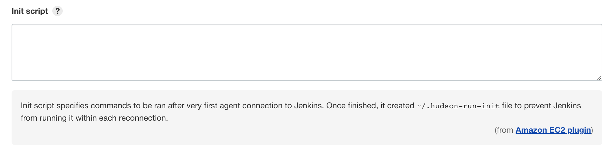
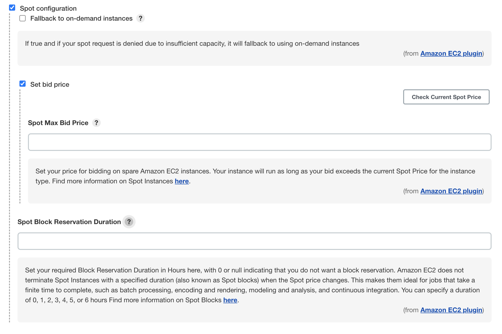
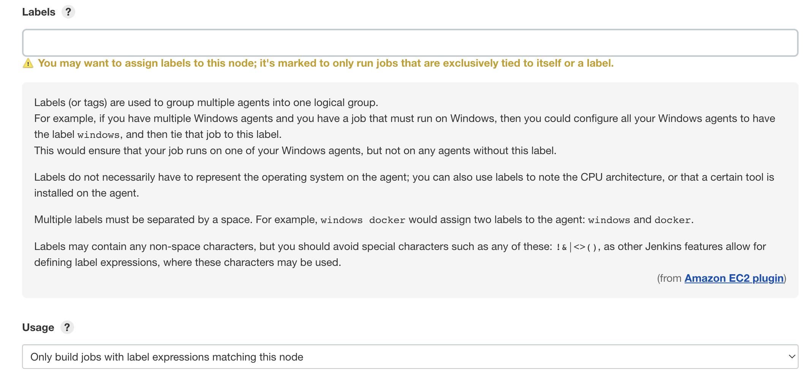
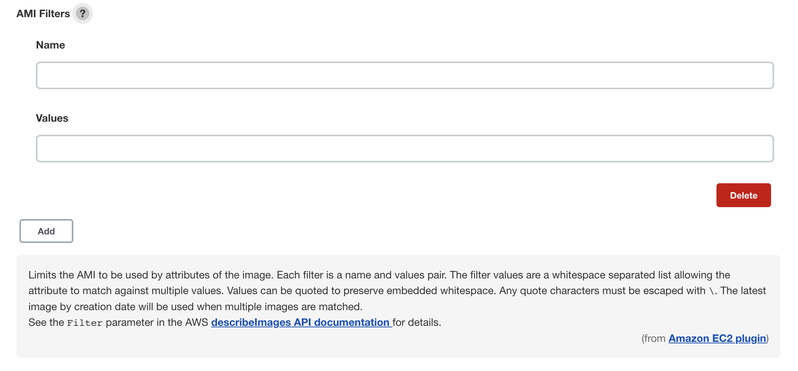

# Design doc: AWS AMI for Jenkins Worker

## Author/date

Feng Huang / 2022-06-01

## Tracking JIRA

https://issues.redhat.com/browse/APPSRE-5045

## Background

Manually configuring and maintaining Jenkins workers via ansible is painful. The upgrade process (upgrading packages periodically) may also be considered painful.

We would like build generic (ci-int/ext) Jenkins workers AMIs instead and retire worker build job [ci-int](https://ci.int.devshift.net/job/gl-build-master-ansible-playbook-ci-int-aws-jenkins-worker/) [ci-ext] (https://ci.int.devshift.net/job/gl-build-master-ansible-playbook-ci-ext-jenkins-worker/)

We may also being able to elastically increase or reduce workers of a particular class.

### Ansible Roles

We used to build Jenkins Worker based on a public AMI and config the EC2 instance with multiple ansible-playbook roles.

Meanwhile, Packer Ansible Provisioner can run Ansible playbooks and make use of most of our existing roles.

By reviewing each [role](https://gitlab.cee.redhat.com/app-sre/infra/-/tree/master/ansible/playbooks/roles) for jenkins worker, they can be separated into 2 kinds:
- Install dependency or hardcode resources (e.g. [install docker](https://gitlab.cee.redhat.com/app-sre/infra/-/blob/master/ansible/playbooks/roles/docker-ce/tasks/main.yml), [app-sre-bot](https://gitlab.cee.redhat.com/app-sre/infra/-/blob/master/ansible/playbooks/roles/app-sre-bot/tasks/main.yml))
This kind of role can be moved directly into Packer roles.

- One-time setting for EC2 instance (e.g. [hostname](https://gitlab.cee.redhat.com/app-sre/infra/-/blob/master/ansible/playbooks/roles/hostname/tasks/main.yml), [format-mount](https://gitlab.cee.redhat.com/app-sre/infra/-/blob/master/ansible/playbooks/roles/format-mount/tasks/main.yml))
Since we are going to use ephemeral agent for worker node, we would like to remove all additional EBS volume. So we can remove roles related with format-mount and symlink. We can set hostname in node Init script.

### Build AMI

Packer allowed us to build different AMIs based on different base AMIs (We are using CentOS 7, RHEL 7, and RHEL 8) and run different playbooks. We can build all kinds of worker nodes (app-sre, hive, ocm, insights ...) for each new commit, but it seems like a waste since we don't need to upgrade all kinds of instances at the same time. We can reuse the version control design from [container-images](https://github.com/app-sre/container-images) and only build new AMI when its VERSION changes.

### Share AMI

AMI will be build from the "source" account (app-sre-ci) and shared with the "destination" accounts (app-sre) by [aws_ami_share](https://github.com/app-sre/qontract-reconcile/blob/master/reconcile/aws_ami_share.py)

### Provision and update existing workers

We may start using [Jenkins EC2 plugin](https://plugins.jenkins.io/ec2/) to spin up workers on demand.

Jenkins will automatically start instances when the load goes up, and the instances will be terminated automatically if they're idle for more than 30 mins.

We can use spot instances for saving the cost.

It allowed us to add different AMI for worker node with different label.

We can also set AMI filters to get the latest version of AMI.

### Monitoring

TODO

We probably want to capture metrics like CPU/RAM usage.

### Proposal MR

https://gitlab.cee.redhat.com/app-sre/infra/-/merge_requests/427/diffs

## Milestones

Make it work <-- we are here

Make it work right

Make it beautiful 
