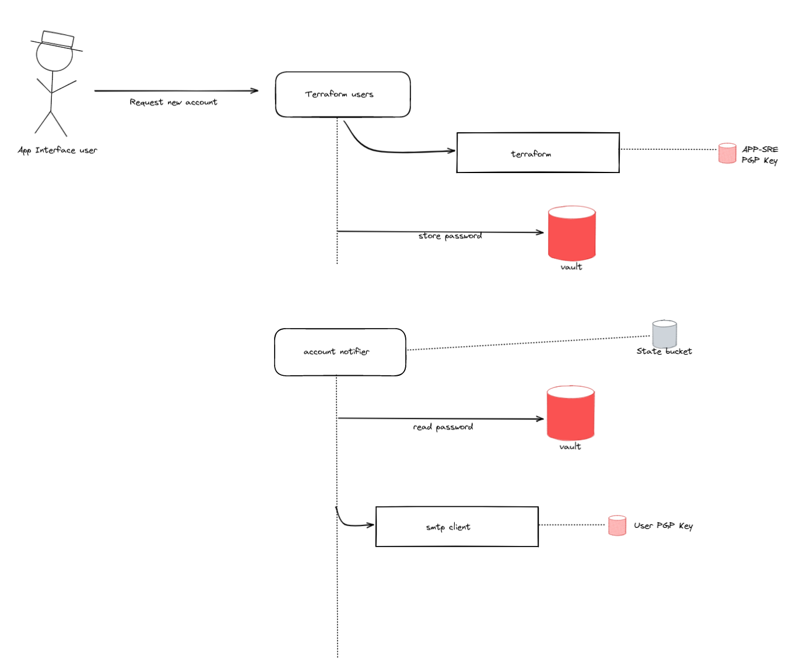

# Design document - aws login profile creation

## Author / Date

Jan-Hendrik Boll
October 2022

## Tracking JIRA

https://issues.redhat.com/browse/APPSRE-4706

## Problem statement

The Terraform AWS provider supports creating random passwords for login profiles on the creation of these. Conveniently terraform encrypts this password using a pgp key that can be passed in. We added some validation code (user-validator), that checks if pgp keys are usable and fails on keys, that do not comply with terraform imposed key standards (obsoleted key standard).
Additionally, if no PGP key is provided the password will be stored in the state file: https://github.com/hashicorp/terraform-provider-aws/blob/main/internal/service/iam/user_login_profile.go#L152
Thus we care for using a valid pgp key, but it's unlikely users care, cause the password here is a random one and we enforce the users to change it upon first login. So it's pretty common that they forget about it once their request (account provsioning) was settled.

Conclusion: PGP keys need validation. Different reasons for this:

* Terraform requires certain compliance due to its implementations
* Keys might have a restricted lifetime and expire

## Goals

* Terraform users integration is not crashing cause of invalid or expired PGP keys.
* Merge Request pipeline is not breaking cause of expired PGP keys
* Users get notified upon tried usage of invalid keys

## Proposal

Instead of using the pgp key provided by users directly in terraform, we can use a PGP Key maintaned by APP SRE for encrypting every login password. This password is then stored by the terraform-users integration in vault.

A second, to be built integration is then picking up this password and encrypts it with the user provided pgp key. It will then send it via e-mail to the user, as before done by terraform-users. By decoupling this from terraform we can leverage the latest pgp versions available and lift any restrictions opposed by the terraform implementation.



### Output 

We publish generated passwords via app-interface-output, so users can copy it from there. This is based on a qontract-reconcile cli command `terraform-users-credentials`, which reads the console URL and encrypted password from the terraform statefile. Since we switched to the APP SRE pgp key, these passwords can not be used anymore. Instead the new integration will write the encrypted password to the S3 state bucket, along with the console URL and Username. The output CLI command will read the information from that place instead of the statefile.

### Additional use cases

* This new integration can notify users about gpg expiration. Example: a user tries creating a login with an expired pgp key, the new integration can notify the users and send the password later, once a valid pgp key was provided. 
* We can use the new integration for secret sharing with user. We can add a new schema, that tracks vault secret sharing i.e.:
  ```
  ---
  $schema: /app-interface/secret-sharing.yml
  vault-secret:
    $ref: /services/vault.devshift.net/config/prod/devshift-net.yml
    secret:
      key:
      version:
  receiptiant: 
    $ref: /teams/abc/user/foobar.yml
  ```

## Alternatives

* Adding an expiration notifier: https://issues.redhat.com/browse/APPSRE-4706
* Use self hosted pastebin instead of pgp

## Milestones

* create new integration that can:
  * encrypt keys from vault and send them pgp encrypted to users
  * send notifications on failed encryption attempts and retry encryption
* update terraform-users to use app-sre pgp key and write secrets to vault
  * add a feautre toggle to accounts, that indicate if passwords should be sent encrypted or written to vault
* update account per account to the new behaviour
  * requires updating terraform statefile with new pgp key, most likely removal from state and import again