# Design doc: GlitchTip Integration

**Table of contents:**

[toc]

## Author/date

Christian Assing / September 2022

## Tracking JIRA

https://issues.redhat.com/browse/APPSRE-6260

## Problem Statement

GlitchTip is an error-reporting application and will replace the AppSRE-hosted Sentry instance. It's compatible with Sentry client frameworks, but [we can't reuse our Sentry integration](https://issues.redhat.com/browse/APPSRE-5503).

## Goals

Implement a qontract-reconcile integration with features similar to the sentry integration.

* Create/Delete organizations
* Create/Update/Delete teams and team members
* Create/Update/Delete projects
* Invite/Delete users to/from organizations
* Update user role

## Non-objectives

* Project migration from sentry to glitchtip
* Management of *Uptime Monitors*
* Management of *Alerts*

## Glitchtip

### End-User Workflow

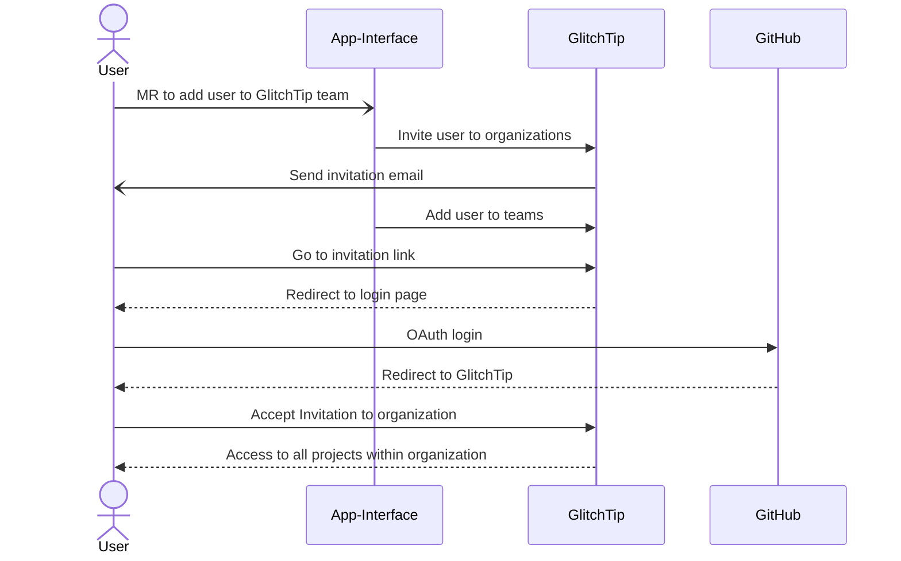

> :information_source: **Note**
>
> The GitHub OAuth Provider doesn't belong to AppSRE and does just the authentication part. Authorization is based on user [roles](#roles) within an organization
>
### Data structure

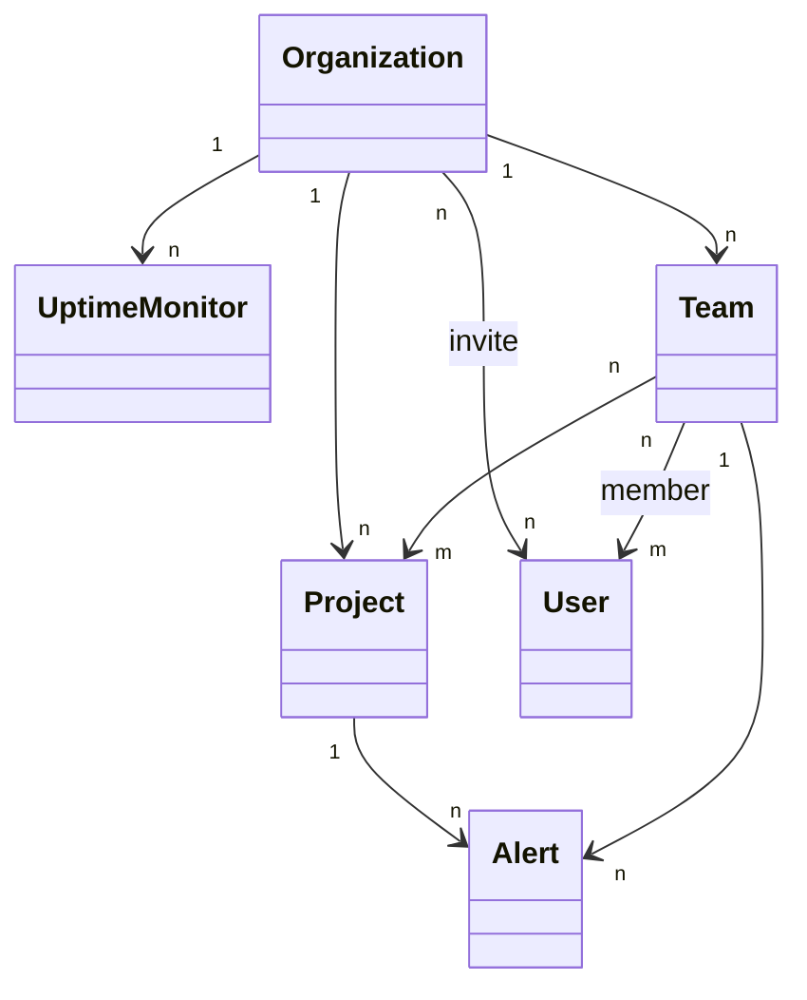

### Roles

User roles belong to an organization.
* **Member**: Members can view and act on events and have read access to most other data within the organization.
* **Admin**: An admin can create/update/delete teams and projects within the organization.
* **Manager**: Gains admin access on all teams and the ability to add and remove members.
* **Organization Owner**: Unrestricted access to the organization (data and settings). Can add, modify, and delete projects and members. Can create new organizations.

## Proposal

Introduce new glitchtip-related schemas.

**Instance**: Specifies a glitchtip installation

```yaml
---
$schema: /dependencies/glitchtip-instance-1.yml

labels: {}

name: <name of the instance>
description: <description of the instance>
consoleUrl: <url of the instance>

automationUserEmail: <email of automation user>
automationToken: <vault path to token>
```

**Organization**: Represents a glitchtip organization.

```yaml
---
$schema: /dependencies/glitchtip-organization-1.yml

labels: {}

name: <name of the organization>
description: <description of the organization>
instance:
  $ref: <path to the glitchtip instance>
```

> :warning: **Warning**
>
> *name* attribute must be unique!

**Team**: Represents a glitchtip team.

```yaml
---
$schema: /dependencies/glitchtip-team-1.yml

labels: {}

name: <name of the team>
description: <description of the team>
```

> :warning: **Warning**
>
> *name* attribute must be unique within an organization!

Enhance **/access/role-1.yml**:

```yaml
glitchtip_roles:
- organization:
    $ref: <path to the glitchtip organization>
  role: <role; default 'member'>

glitchtip_teams:
- $ref: <path to glitchtip team>

```

Enhance **/app-sre/app-1.yml** with a *glitchTipProjects* section:

```yaml
---
$schema: /app-sre/app-1.yml
...
glitchTipProjects:
- name: <name of the project>
  description: <description of the project>
  platform: <project language [optional]>
  teams:
  - $ref: <path to the glitchtip team>
  organization:
    $ref: <path to the glitchtip organization>
```
> :warning: **Warning**
>
> project *name* attribute must be unique within an organization!

Glitchtip uses URL *slug* as a path parameter and [generates the *slug* attribute](https://github.com/django-extensions/django-extensions/blob/a6b72b34f992299b6642284cffa1ae89874618fa/django_extensions/db/fields/__init__.py#L93) at the object creation time. The best would be to keep names unique to identify objects easily.

## Workflows

### Get Current State

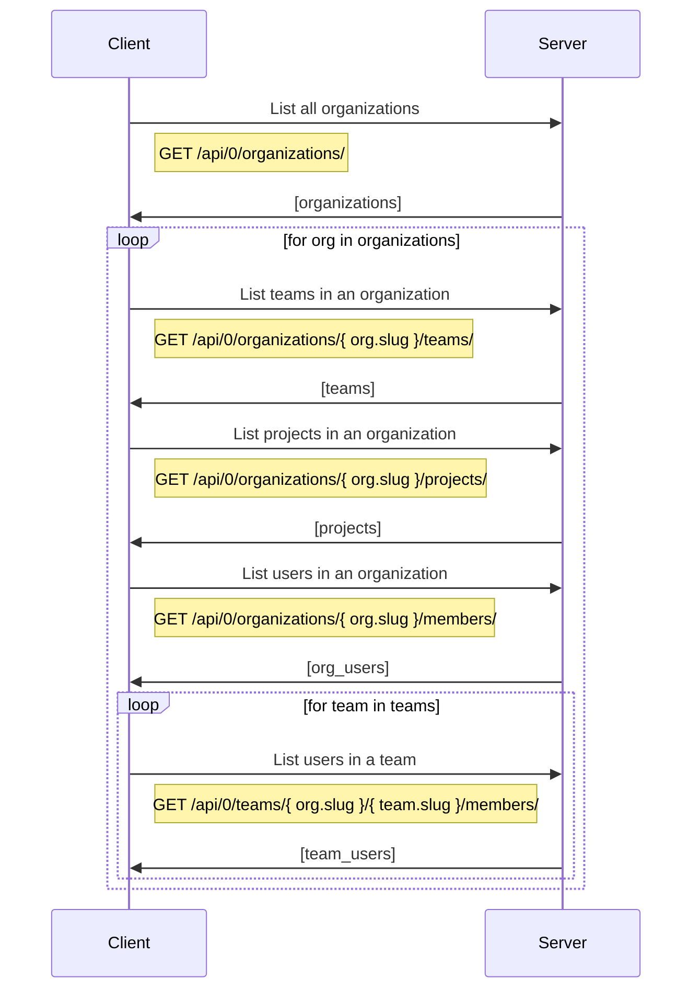

The result is this data structure
```python

class User:
    pk: int
    email: str
    role: str
    pending: bool

class Project:
    pk: int
    name: str
    slug: str
    teams: List[Team]

class Team:
    pk: int
    slug: str
    users: List[User]

class Organization:
    pk: int
    name: str
    slug: str
    projects: List[Project]
    teams: List[Team]
    users: List[User]


organizations = [
    Organization(
        projects=[
            Project(
                teams=[
                    Team(
                        users=[
                            User(),
                            ...
                        ]
                    ),
                    ...
                ]
            ),
            ...
        ]
        teams=[
            Team(
                users=[
                    User()
                ]
            ),
            ...
        ],
        users=[
            User(),
            ...
        ]
    ),
    ...
]
```

### Reconcile Organizations

**Creation**
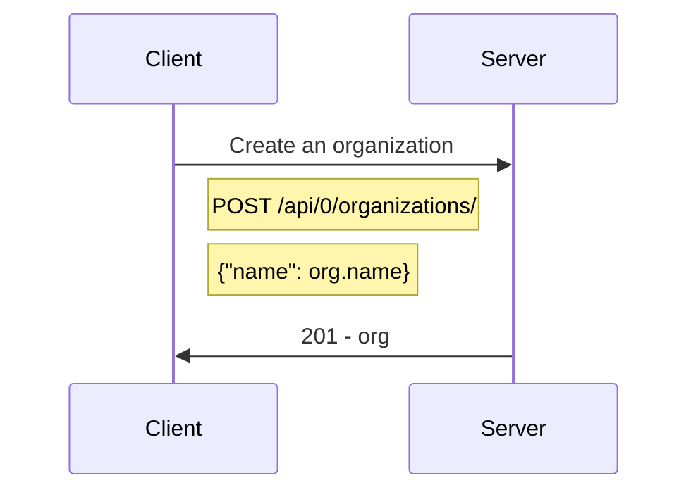

**Deletion**
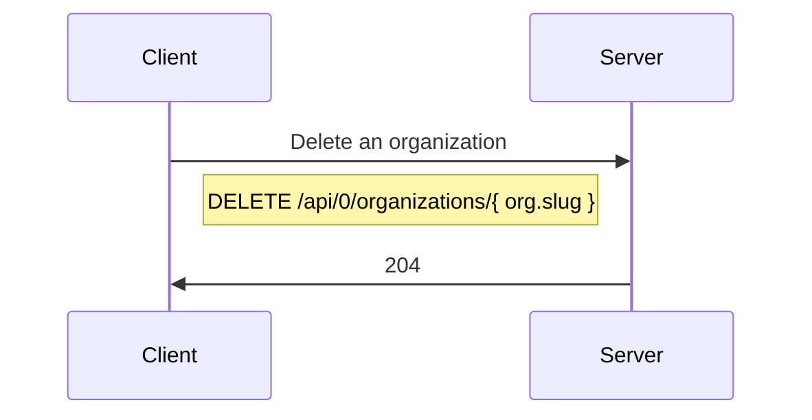

### Reconcile Teams

**Creation**
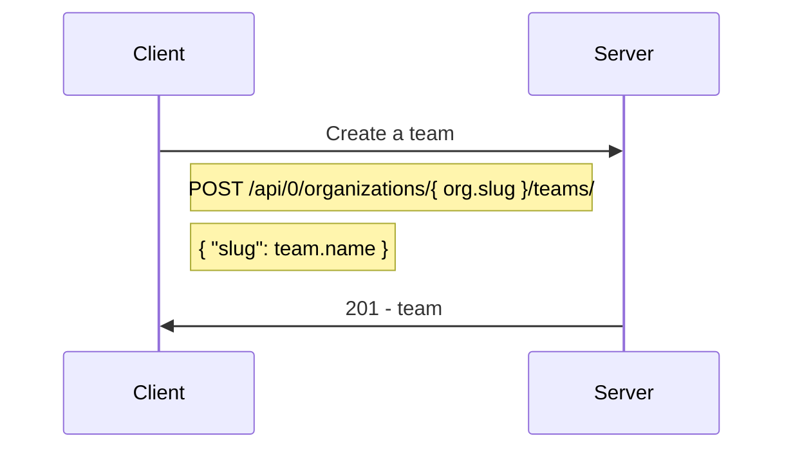

**Deletion**
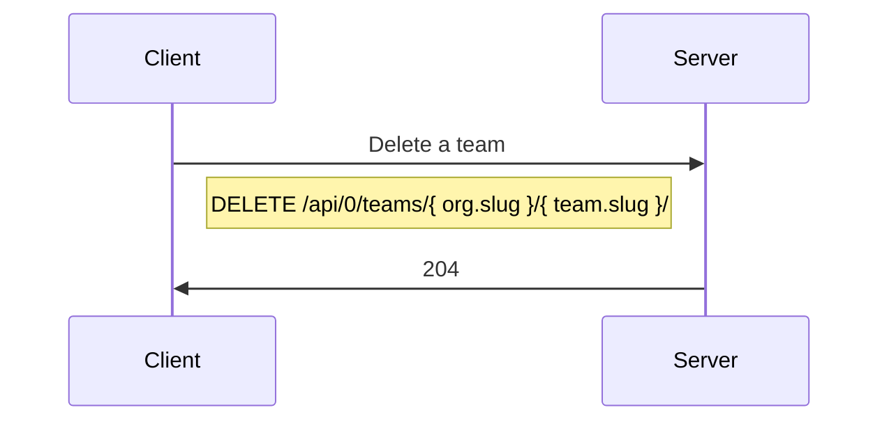

### Reconcile Projects

**Creation**
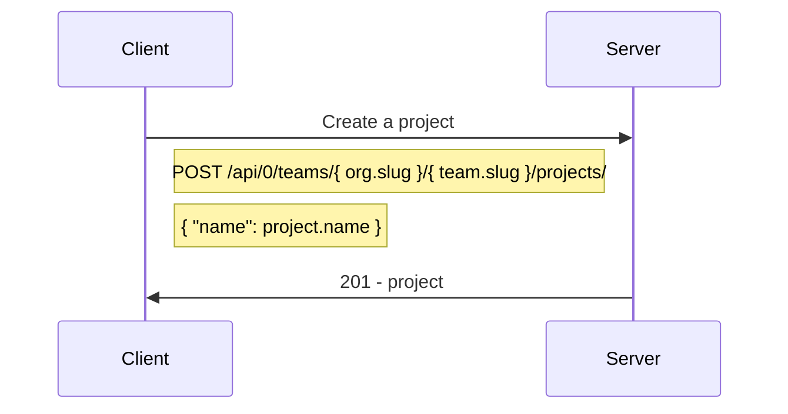

**Deletion**
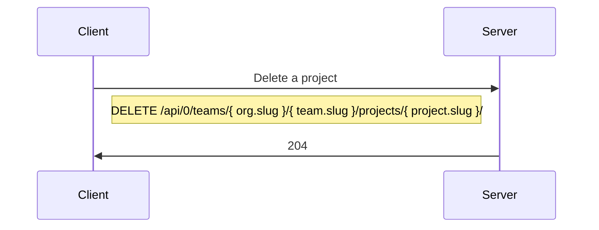

**Add to a team**
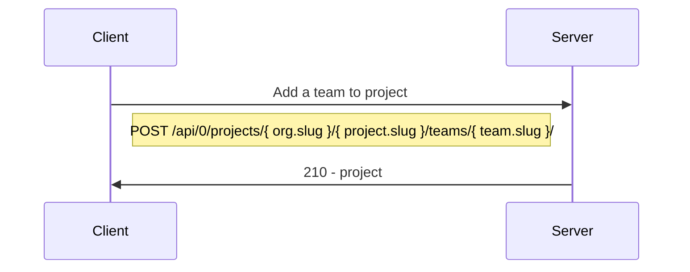
**Delete from a team**
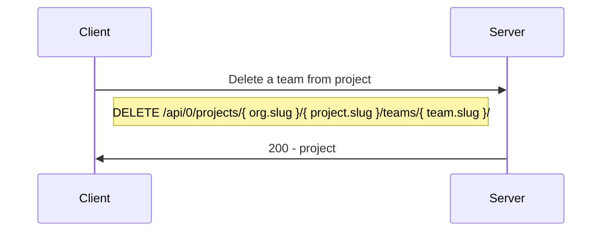

### Reconcile Users

**Invite a user to an organization**
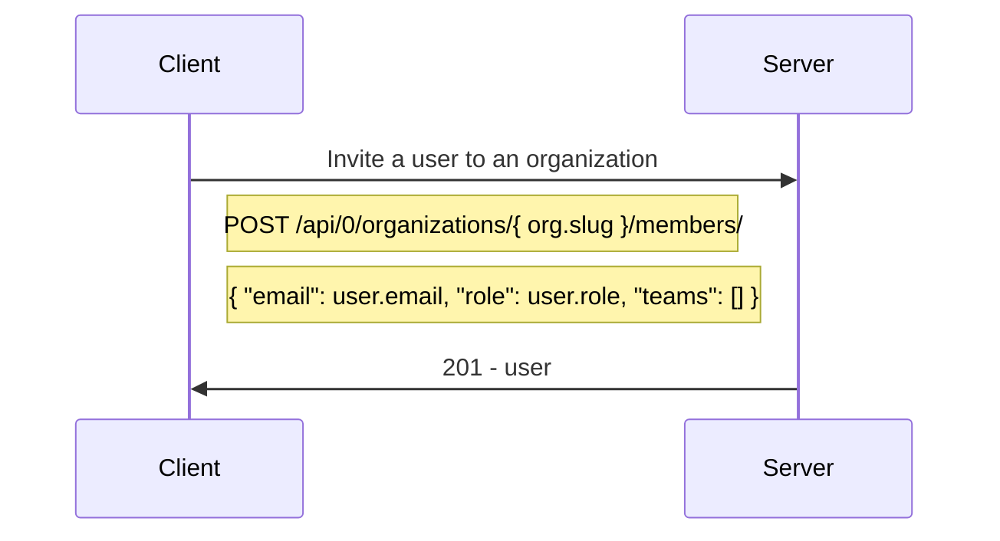

**Remove a user from an organization**
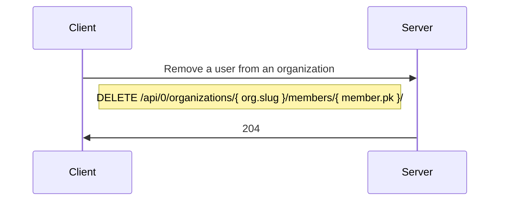

**Update user role**
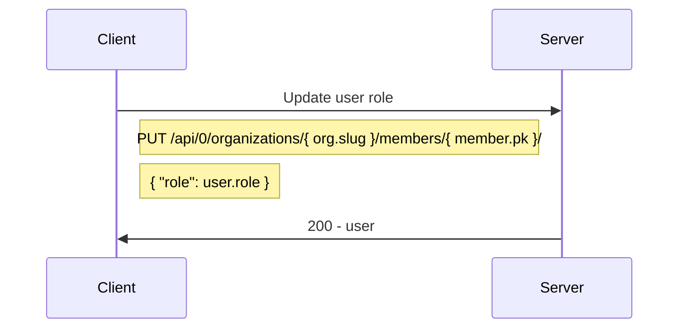

**Add a user to a team**
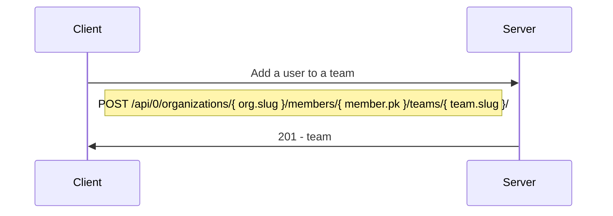

**Remove a user from a team**
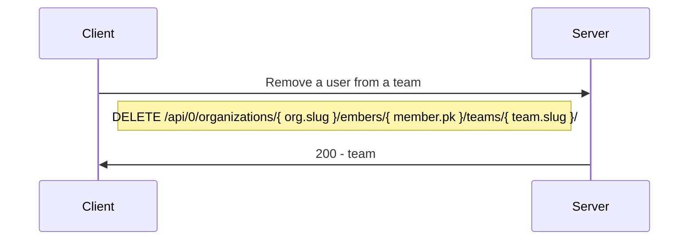


## Requirements

* automation user: a Django user with the owner role in an organization (e.g., appsre) and a token with all permissions except `event:***`
* `ENABLE_OPEN_USER_REGISTRATION = False`

## Notes

* The [API documentation](https://app.glitchtip.com/docs/) is not beloved. Use the force and read the [source](https://gitlab.com/glitchtip/glitchtip-backend) ;)
* The [frontend](https://gitlab.com/glitchtip/glitchtip-frontend) is not aware about user roles. It displays "create" buttons, but the user has no sufficient permissions.
* Glitchtip uses a mixture of pk's and slug's :(
* *Uptime monitors* don't have a permission model assigned. Every authenticated user can create uptime monitors.
