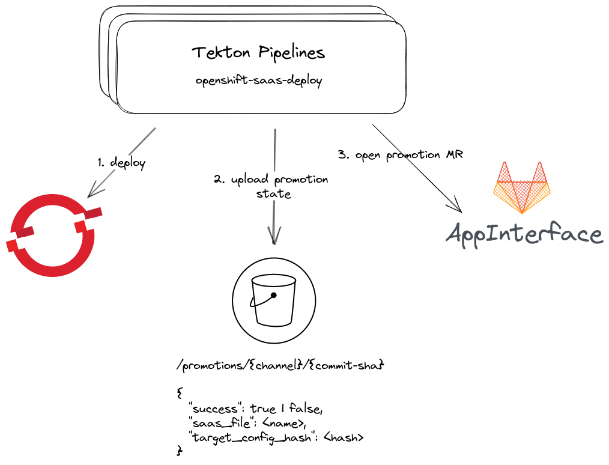
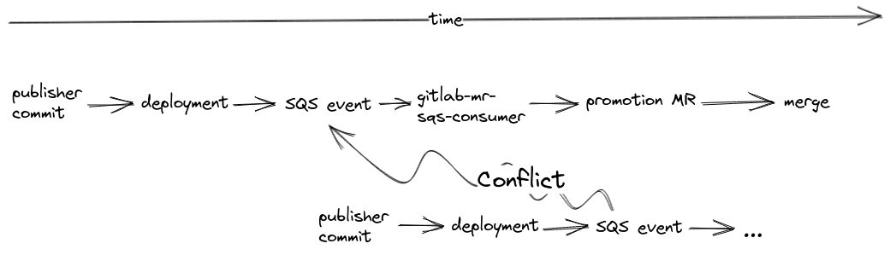
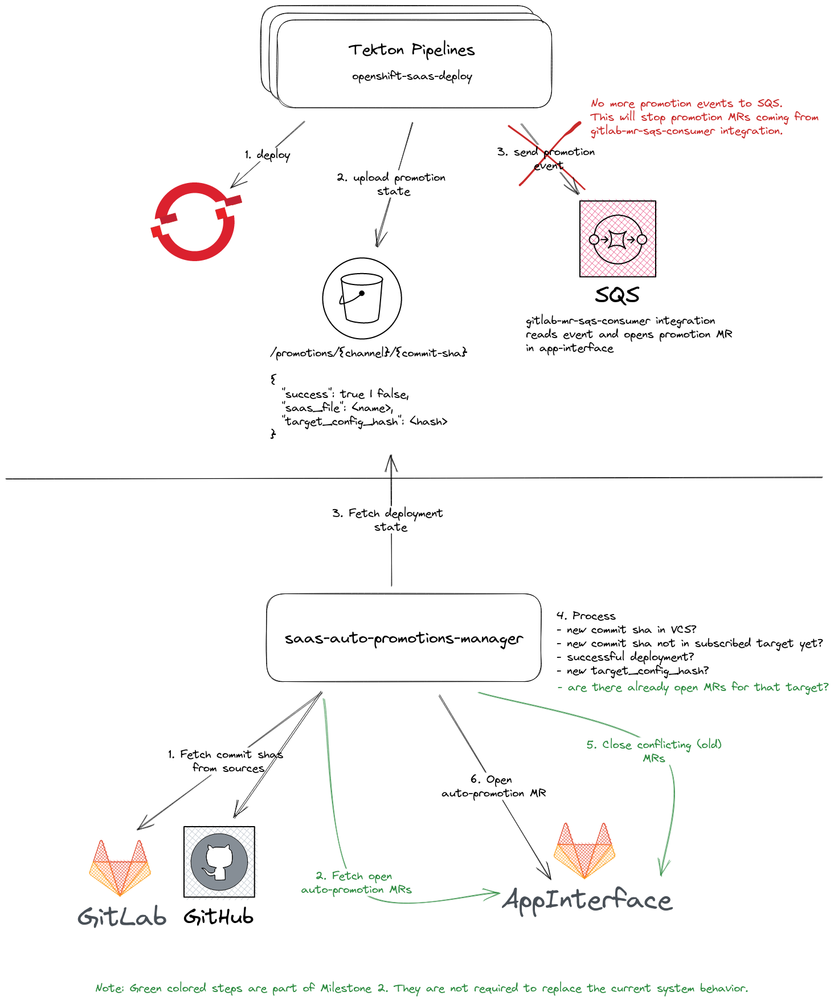

# Design document - SaaS Auto Promotions Manager Integration

[toc]

## Author / Date

Karl Fischer / March 2023

## Tracking JIRA

[APPSRE-6941](https://issues.redhat.com/browse/APPSRE-6941)

## Problem statement

We often see merge conflicts in auto-promotion MRs created by our devtools bot.

Auto promotion MRs are currently created after a tekton deployment pipeline successfully finished a deployment job. Tekton pipelines are not fully context aware, i.e., they do not know the current state of open MRs. Further, pipelines can potentially run in parallel, which makes it even harder to gain full context.

An auto promotion process can take some time and involve multiple MRs. If during that time another deployment happened in the publisher target, then a potentially parallel auto promotion process is started, resulting in MRs that have merge conflicts.

### Current Implementation

### Issue

The following timeline highlights how multiple parallel promotions can result in merge conflicts. In essence, a new promotion is triggered before a previous promotion finished for the same saas target. A promotion has to pass several steps: send to SQS, read from SQS, open MR, merge MR. Note, that the promotion data, i.e., the ref to update, is part of the SQS event. I.e., once the event is sent to SQS, it is prone to merge conflicts for subsequent promotions.

## Goals

* Solution to avoid merge conflicts in auto-promotions

## Non-Goals

* Do not replace current `saas-trigger-*` integrations. Solely focus on auto-promotions.
* Do not refactor `saasherder.py`

## Proposal

Create a new fully context aware integration: `saas-auto-promotions-manager` (SAPM).

We have a [PoC available](https://github.com/app-sre/qontract-reconcile/pull/3306) for this proposal.

SAPM is able to gather all context around auto-promotions:

- whats the commit sha of a saas file target ref?
- whats the new config hash of the parent saas?
- is there a successful deployment for a new commit sha?
- are there already open MRs for the subscribed target?

Based on that context, SAPM can decide:

1. Do we have to open a new auto-promotion MR?
2. Do we have to close old (now obsolete) auto-promotion MRs?

Further, we remove the auto-promotion event from `openshift-saas-deploy`. Without these events, `gitlab-me-sqs-consumer` will not receive any data to open auto promotion MRs anylonger.

### Proposed Implementation

The [current PoC](https://github.com/app-sre/qontract-reconcile/pull/3306) does not do any merge conflict management yet (see Milestone 1). It is a very simple single-threaded integration. The runtime is bound by the number of subscribed SaaS targets. Even though it only uses a single thread one run currently happens in < 1 minute for latest app-interface prod state. Threading will enhance runtime considerably, as we could easily query VCSs and S3 files in parallel, i.e., we have an easy path for scaling.

Further, SAPM is not required to hold state. It must anyways fetch real-world state directly from VCSs. 

Another positive aspect of SAPM is its extensibility. We will likely need more features/logic around SaaS auto promotions. SAPMs broader context and reconciled approach provide a good basis for upcoming challenges.

### Migration Path

In the first milestone, SAPM will simply replace the current auto-promotion mechanism. It will not handle merge conflicts yet. We must avoid creating merge conflicts when putting this integration into production. I.e., we must avoid having MRs opened by `openshift-saas-deploy` events and SAPM in parallel.

1. Announce to tenants that auto-promotions are disabled for a short window (roughly ~1h to be safe)
1. [disable sending promotion events](https://github.com/app-sre/qontract-reconcile/blob/c2f9f926a3bea60bf270e4fdee1b068ede5cccc1/reconcile/openshift_saas_deploy.py#L240) in `openshift-saas-deploy`
1. [remove AutoPromoter](https://github.com/app-sre/qontract-reconcile/blob/c2f9f926a3bea60bf270e4fdee1b068ede5cccc1/reconcile/utils/mr/__init__.py#L33) as MR type.
1. wait 10 minutes
1. wait until there are no more open auto-promotion MRs.
1. put SAPM into production

Step 2 ensures we do not send any new events. Step 3 ensures that any event from long-running tekton pipelines will not be handled, so we can neglect checking the SQS queue for any later events. We will instead implement the type `AutoPromoterV2` for SAPM MRs.

SAPM is able to conclude missing auto-promotions from real-world state, so no promotion will get lost with this approach - they are only delayed.

## Alternatives Considered

- leverage timestamps and shas from deployment state instead of querying VCSs directly. We decided against that because a timestamp does not guarantee a proper order of commits. (a pipeline might be very slow)

## Milestones

1. SAPM re-creates current behavior and replaces openshift-saas-deploy auto-promotion events.
2. After we consider SAPM stable enough, we extend it to manage all open MRs and avoid merge conflicts.
