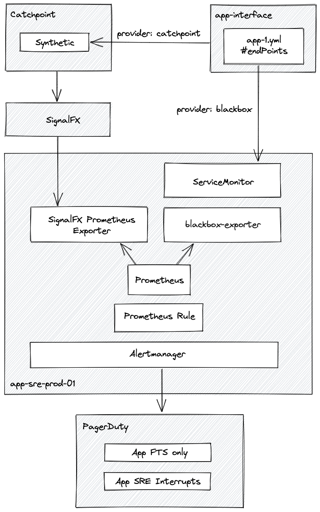

# Design doc: Service Endpoint Monitoring

## Author/date

Gerd Oberlechner / December 2021

## Tracking JIRA

https://issues.redhat.com/browse/APPSRE-4161

## Problem Statement
Currently, we don't have wide adoption for managed monitoring on service endpoints.

Some endpoints are monitored with blackbox-exporter as defined in `resources/observability/prometheus/prometheus-app-sre-additional-scrapeconfig.secret.yaml` and some tenants have their own monitoring defined outside of app-interface in tools like Pingdom or Catchpoint. While the latter are a powerful addition to the monitoring stack, they are problematic in their current form since AppSRE carries the pager for (some) of them while neither the monitoring nor the alerting definitions are part of any onboarding or SRE checkpoint process and changes can be done to them without AppSREs involvement.

## Goals
* Widen the adoption of edge monitoring for service endpoints by
  * mentioning it in the contract
  * anchoring it in the onboarding and SRE checkpoint process
  * documenting it in the dev-guidelines
* Integrate management of Catchpoint monitoring probes and their alerts into app-interface
* Streamline blackbox-exporter and Catchpoint monitoring check declaration

## Non-objectives
While the work proposed by this design document will lay ground work for automated update of status page components, this will not be addressed specifically here.

## Proposal

### General approach
We will enable tenants to activate service endpoint monitoring on all endpoints defined in `/app-sre/app-1.yml#endPoints`. Those endpoint definitions are not widely used in app-interface right now but [APPSRE-3989](https://issues.redhat.com/browse/APPSRE-3989) tries to make its use mandatory for `Route` based endpoints. At the same time, providing monitoring capabilities on endpoints will make it beneficial for tenants to also declare their non-`Route` based endpoints, e.g. api.openshift/*.

Endpoint monitoring must also be consideren during onboarding and SRE checkpoints. Our process definitions and checkpoint templates will be adapted to reflect this.

To enable monitoring on an endpoint, the schema for `/app-sre/app-1.yml#endPoints` will be enhanced to reference a newly created `/dependencies/endpoint-monitoring-provider-1.yml` schema. Such a provider establishes the context to check the URL defined in `/app-sre/app-1.yml#endPoints[*].url`. This context defines the tool to use for monitoring and additional information required to perform the check. For common cases, `/dependencies/endpoint-monitoring-provider-1.yml` objects should be reusable between endpoints (e.g. check the HTTP return code for `/app-sre/app-1.yml#endPoints[*].url`). For special cases, dedicated provider objects need to be created and maintained by the tenants (e.g. parse the JSON in the response body).

```yaml
---
$schema: /app-sre/app-1.yml
...
endPoints:
- name:
  url:
  monitoring:  <-- new
    provider:
      $ref: reference to a /dependencies/endpoint-monitoring-provider-1.yml
```

### Providers
The provider schema will be defined like this

* `name` - the name of the monitoring check
* `description`- description of the provider
* `provider` - the name of the monitoring tool that will be used to execute the check
* `timeout` - the timeout to wait for a check to finish, e.g. 30s (optional)
* `checkInterval` - the time period between checks, e.g. 1m

Similar to `/app-sre/pipelines-provider-1.yml`, the new schema `/dependencies/endpoint-monitoring-provider-1.yml` will be backed by multiple tools executing the monitoring. Different provider implementations can be specified with the `provider` field and will offer different feature sets along with different pros and cons. Depending on the `provider`, additional mandatory fields will be defined for the schema.

The resulting metrics will be available in Prometheus for dashboards and alerts.



#### blackbox-exporter provider
[blackbox-exporter](https://github.com/prometheus/blackbox_exporter) enables closedbox probing of endpoints. This provider should be used when a simple test on an HTTP status code and a single check location is sufficient.

The following additional fields are available in the schema, when `provider` is defined as `blackbox-exporter`:
* `blackboxExporter.module` - the blackbox exporter module to use for the check, e.g. `http_2xx`
* `blackboxExporter.namespace` - a reference to a namespace where the `ServiceMonitor` to drive the check will be deployed
* `blackboxExporter.exporterUrl` - the url of the blackbox-exporter (optional, defaults to a service named `blackbox-exporter` in the namespace referenced by `blackboxExporter.namespace`)

This provider deploys `ServiceMonitor` objects to the specified namespace, which will scrape blackbox-exporter with the provided `module` and the `url` from the endpoint definition. The resulting metrics are available in the Prometheus instance of the cluster referenced by the namespace and will have the following labels:

* `app` - the name of the enclosing `/app-sre/app-1.yml`
* `instance` -  the url that was probed - `#endPoints.monitoring.url` or `#endPoints.url`
* `endpoint` - the endpoint url the probed url belongs to - `#endPoints.url`

#### Catchpoint provider
[Catchpoint](https://portal.catchpoint.com) is a monitoring tool that should be used as endpoint checks when rich vantage point checks are required, e.g.

* execute checks from a wide range of hosts located in cloud provider regions globally
* HTTP checks and result processing with Javascript
* Selenium checks to simulate browser interaction

When the `catchpoint` provider is specified, a Catchpoint check is created via their API and additional fields can be used to refine the check:
* `catchpoint.module` - the type of test to execute, e.g. `javascript`, `selenium`, `http_2xx`
* `catchpoint.script` - the script to execute as a test when checkType is `javascript` or `selenium`

The Catchpoint metrics, that describe the results of the monitoring checks, are forwarded to [SignalFX](https://redhat.signalfx.com) and can be accessed with an API. Direct metric access on Catchpoint is not feasible because their API has very restrictive rate limiting. In a [recent spike](https://issues.redhat.com/browse/APPSRE-4163), a Prometheus exporter has been build to make SignalFX metrics scrapable by Prometheus. While this metric data path relies on robust APIs (Catchpoint and SignalFX/Splunk are partners), its length and number of involved components bears a risk. To mitigate the risk, the data path needs to be closely monitored. The resulting metrics will be available in Prometheus and will have the same labels as defined for blackbox-exporter.

Reading the [AppSRE Catchpoint Guide](https://gitlab.cee.redhat.com/service/app-interface/-/blob/master/docs/app-sre/catchpoint.md) will provide more insights about Catchpoint checks and how they are created.


## Examples
In this section, a couple of monitoring scenarios are being described along with the corresponding configuration in `app-interface`.

### HTTP response code checking with reusable provider
When a service endpoint URL from `/app-sre/app-1.yml#endPoints.url` should be checked on its HTTP response codes, a reusable provider definition can be referenced in the `monitoring` section.

```yaml
---
$schema: /app-sre/app-1.yml
...
endPoints:
- name: yak-shaving-production-endpoint
  description: this is where Yaks get shaved no matter what
  url: https://yak-shaving.redhat.com
  monitoring:
    provider:
      $ref: /dependencies/monitoring/blackbox-exporter-status-code.yml
```

In this case, the monitoring provider needs no additional context besides the provided URL, which makes the provider declaration reusable. Since this scenario is quite simple, blackbox-exporter will suffice as a provider and the corresponding provider definition will look like this.

```yaml
$schema: /dependencies/endpoint-monitoring-provider-1.yml
...
name: blackbox-exporter-status-code
description: Checks a URL for HTTP 2xx status codes via blackbox-exporter
provider: blackbox-exporter
blackboxExporter:
  namespace:
    $ref: /services/observability/namespaces/app-sre-observability-production.yml
  module: http_2xx
```

### HTTP response code from multiple hosts with dedicated URL

After we activated monitoring for https://yak-shaving.redhat.com in the last example, we decided to implement a dedicated monitoring endpoint. Therefore we add the /status URL as additional endpoint and move the monitoring to it.

```yaml
---
$schema: /app-sre/app-1.yml
...
endPoints:
- name: yak-shaving-production-endpoint
  description: this is where Yaks get shaved no matter what
  url: https://yak-shaving.redhat.com
- name: yak-shaving-production-status-endpoint
  description: monitoring endpoint for yak-shaving service
  url: https://yak-shaving.redhat.com/status
  monitoring:
    provider:
      $ref: /dependencies/monitoring/blackbox-exporter-status-code.yml
```

### JavaScript check
In this example a JavaScript based check is used to extract the health information from the response payload.

```yaml
---
$schema: /app-sre/app-1.yml
...
endPoints:
...
- name: yak-shaving-production-status-endpoint
  description: monitoring endpoint for yak-shaving service
  url: https://yak-shaving.redhat.com/status
  monitoring:
    provider:
      $ref: /services/yak-shaver/monitoring/yak-mood-monitoring.yml
```

```yaml
$schema: /dependencies/endpoint-monitoring-provider-1.yml
...
name: yak-mood-monitoring
description: Checks the status endpoint of the yak-shaving service
provider: catchpoint
catchpoint:
  module: javascript
  script: |
    open("{{ url }}")
    var res = Catchpoint.extract('resp-content','(?s).*')
    data = JSON.parse(res);
    assert(data.yak_mood === "happy");

```

## Alternatives considered
The [route-monitor-operator](https://github.com/openshift/route-monitor-operator) was considered as a way to declare endpoint checks. But since the operator runs within the cluster where the routes reside, the resulting monitoring metrics would not really represent a real outside view.

## Milestones

### Phase 1
* Introduce the schema changes
* Implement the blackbox-exporter provider
* Provide reusable blackbox-exporter based `endpoint-monitoring-provider-1.yml` definitions
* Migrate endpoint checks from `resources/observability/prometheus/prometheus-app-sre-additional-scrapeconfig.secret.yaml` to `endpoint-monitoring-provider.yml` where it makes sense
* Provide documentation

After phase 1, tenants can use blackbox-exporter based endpoint monitoring in `/app-sre/app-1.yml#endPoints` and can define alerts based on the resulting metrics.

### Phase 2
* Implement the Catchpoint provider
* Build the metric data path from Catchpoint to Prometheus
* Provide documentation

After Phase 2, tenants can define Catchpoint based endpoint monitoring in `/app-sre/app-1.yml#endPoints` and can define alerts based on the resulting metrics.

### Phase 3
* Incorporate endpoint monitoring into the onboarding and SRE checkpoint processes
* Make the declaration of `/app-sre/app-1.yml#endPoints` mandatory for `Route` management via app-interface
