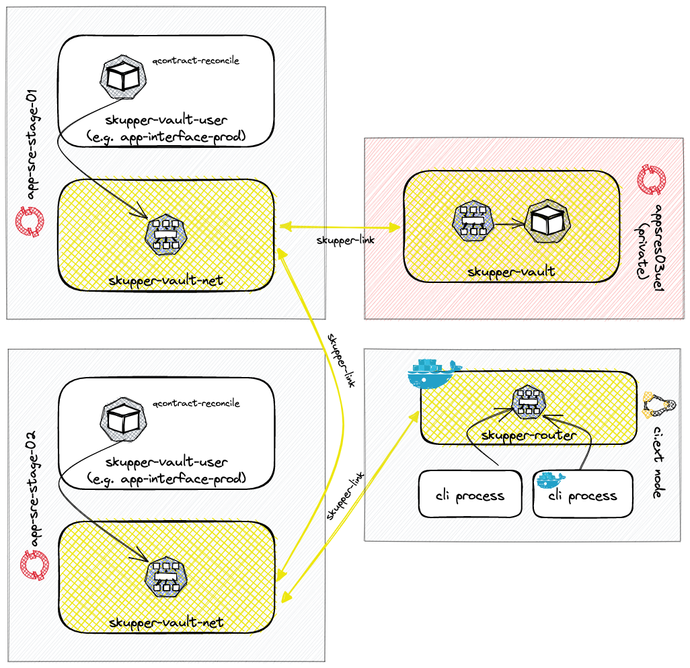
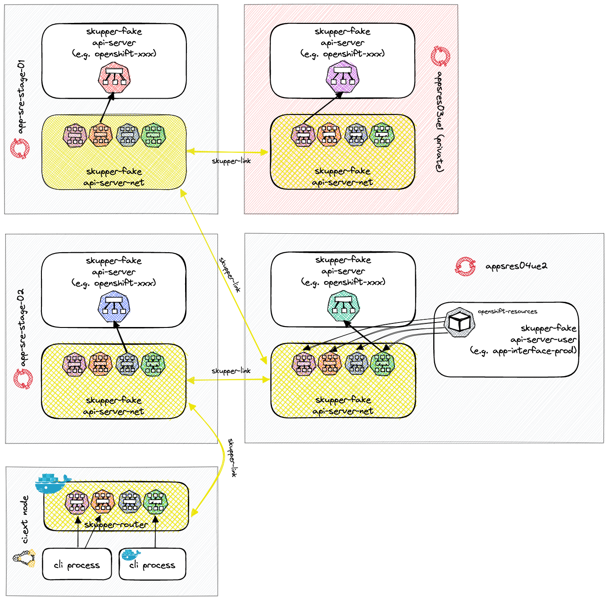

<font size="100">Skupper Network</font>

---
Table of contents:

[toc]


## Author/date
Christian Assing - September 2022

## Tracking JIRA
https://issues.redhat.com/browse/APPSRE-6122


## Problem Statement
There are many cases where cross-service connectivity is needed. When the services are collocated or accessible on the internet, it's not an issue, but it can be very hard in other cases.

There are several services, products and concepts available, which may solve parts of the problems, but those come with additional costs:

* Most of them need proper management of CIDR blocks (e.g., VPC peerings, VPNs), which don't scale.
* Others depend on a specific cloud provider service or feature (e.g., VPNs).
* Or can't be used on Kubernetes or can only be used on Kubernetes
* Require additional hardware or require administrative privileges to be consumed or deployed
* Must be deployed cluster-wide and can't be deployed based on service needs (all or nothing)

## Goal
This POC aims to show how Skupper networks could be deployed on our clusters to 'link' namespaces together and publish/consume services over that network.


## Skupper Introduction

[Skupper](https://skupper.io) is a service interconnect implemented using [AMQP](https://en.wikipedia.org/wiki/Advanced_Message_Queuing_Protocol). It enables secure communication across Kubernetes clusters without VPNs or special firewall rules.

It allows spawning an 'application' network, abstracting the underlying network subtleties and letting apps connect by name and port. Once Skupper sites (namespaces) are interconnected, Skupper will route the traffic to wherever the service resides. It also provides load balancing/failover on all instances fulfilling the service.


* [Skupper Intro Video](https://www.youtube.com/watch?v=BZvd51ALPa8)
* [Skupper Overview](https://skupper.io/docs/overview/index.html)

A Skupper network could allow:
* Grafana to reach private clusters prometheus without peerings
* ci.ext node to connect Vault, hosted on a private cluster, without peerings
* Bastions/backplane - access to private clusters by authorized staff
* Cross-cloud service connectivity
* Qontract-reconcile integrations reaching remote/private clusters without peerings

### Features

* No changes to your existing application required
* No administrator privileges required
* Transparent HTTP/1.1, HTTP/2, gRPC, and TCP communication
* Communicate across clusters without exposing service ports on the internet
* Inter-cluster communication is secured by mutual TLS
* Dynamic load balancing based on service capacity
* Cost- and locality-aware traffic forwarding
* Redundant routes for high availability in the face of network failures


### Skupper Components

Skupper consists of 3 components (kubernetes deployments) which are deployed in a namespace without any administration permissions:

* **Site-Controller**
  * Deploys other Skupper components
  * Is an alternative to the [Skupper Operator](https://skupper.io/docs/operator/index.html)
  * Configured via `configmap/skupper-site`

* **Service-Controller**
  * Deployment created by **site-controller**
  * Monitors `Services`, `Deployments`, `Statefulsets`, and `Daemonsets` for skupper annoations
  * Creates and updates Skupper `Services`

* [**Router**](https://github.com/skupperproject/skupper-router)
  * Deployment created by **site-controller**
  * Is a high-performance, lightweight AMQP 1.0 message router.
  * This is the Skupper network and it's exposed either via *load-balancer* or openshift *Route*


### Security

#### Router
Skupper securely connects your services with TLS authentication and encryption. In a Skupper network, the connections between Skupper routers are secured with mutual TLS using a private, dedicated certificate authority (CA). Each router is uniquely identified by its own certificate.


A Skupper site is either an **edge** or a **non edge** site (see [skupper connectivity](https://skupper.io/docs/overview/connectivity.html); site-config `edge: true | false`). The difference is that an **edge** site does not accept connections from other skupper sites; therefore, the router doesn't need to be accessible. Perfect for private clusters with limited public-faced ports. All links initiated outgoing to the related skupper sites, e.g., on private cluster appsres03ue1:

```shell
$ oc status
In project skupper-vault on server https://api.appsres03ue1.5nvu.p1.openshiftapps.com:6443
...

$ oc get svc
NAME                     TYPE        CLUSTER-IP       EXTERNAL-IP   PORT(S)    AGE
skupper                  ClusterIP   172.30.95.59     <none>        443/TCP    6d22h
skupper-router-console   ClusterIP   172.30.231.221   <none>        443/TCP    6d22h
skupper-router-local     ClusterIP   172.30.24.190    <none>        5671/TCP   6d22h
vault                    ClusterIP   172.30.18.96     <none>        8080/TCP   2d23h

$ oc get route
No resources found in skupper-vault namespace.

$ skupper status
Skupper is enabled for namespace "skupper-vault" with site name "appsres03ue1-skupper-vault" in edge mode. It is connected to 2 other sites (1 indirectly). It has 1 exposed service.
```

On **non-edge** site, the router can be exposed either via *load-balancer* or *Openshift route*, e.g. on public cluster app-stage-01 via *load-balancer*:

```shell
$ oc status
In project skupper-vault-net on server https://api.app-sre-stage-0.k3s7.p1.openshiftapps.com:6443
...

$ oc get svc
NAME                     TYPE           CLUSTER-IP       EXTERNAL-IP                                                              PORT(S)                           AGE
...
skupper-router           LoadBalancer   10.120.103.165   a44a110cf2fab4e2dab924bfb10f3e6a-701031945.us-east-1.elb.amazonaws.com   55671:30317/TCP,45671:30157/TCP   20d
...

```

#### Service Access Control

Skupper has a built-in [Policy system](https://skupper.io/docs/policy/index.html) (needs **cluster-admin**) to specify granular permissions. With a CR `SkupperClusterPolicy` (**not namespaced**) you've complete control over various aspects of the skupper networks, e.g.:
* Which resources are allowed to be exposed
* Allow skupper connection to specific hostnames only
* Permit or deny incoming links from other skupper sites

On a cluster itself, Skupper works well with **Kubernetes network policies**, and access to a Skupper service can be controlled with them. Exposing a service via Skupper doesn't mean it's widely accessible.

#### Service Sync

The `service-sync` option in the `configmap/skupper-site` controls the creation of skupper service in the skupper network. You've to enable it in the source namespace, to expose a service, and you can't create a skupper service manually on the remote sites. To have fine-grained control of which service is accessible from which namespace, you have to use `SkupperClusterPolicy`.

## POC Spike Architecture

Everything is deployed via [app-interface](https://gitlab.cee.redhat.com/service/app-interface/-/blob/222a8aa1/data/services/skupper-cassing/app.yml) without any admin permissions.
Connecting the Skupper sites was done [manually](#site-connections).

### Use Case 1 - Vault

Showcase running a Vault instance on a private cluster and consuming it from everywhere.
See it in action via [Skupper Console](https://skupper-skupper-vault-net.apps.app-sre-stage-0.e9a2.p1.openshiftapps.com)



Namespaces:
  * *skupper-vault*:
    * Running a [fake vault HTTP application](http://github.com/chassing/http-stub).
    * This namespace is also a Skupper site and exposes the Vault service.
  * *skupper-vault-user*:
    * Not Skupper site and doesn't run any skupper related things
    * Running a fake Vault client (`curl`) and consuming exposed Vault service (from either *skupper-vault* or *skupper-vault-net* ) allowed via network policy
  * *skupper-vault-net*:
    * This namespace is a Skupper site and connected to another site
    * Exposes Vault service to local cluster granted via network policies
  * *skupper-router*
    * Not a namespace! It is a docker container running on a Linux box as part of the Skupper gateway
    * Exposes the Vault service on a port on the local machine
    * ```shell
      $ oc login $PUBLIC_CLUSTER
      $ skupper gateway init --type docker
      $ skupper gateway forward vault 8080
      ```


### Use Case 2 - OpenShift API Server

Showcase accessing OpenShift API servers running on public and private clusters from everywhere.
See it in action via [Skupper Console](https://skupper-skupper-fake-api-server-net.apps.app-sre-stage-0.e9a2.p1.openshiftapps.com)



Namespaces:
  * *skupper-fake-api-server*:
    * Running a [fake HTTP api-server](http://github.com/chassing/http-stub).
    * This namespace mimics the original openshift api-server namespace and doesn't host any Skupper components
  * *skupper-fake-api-server-net*:
    * Is a Skupper site and connected to other skupper sites.
    * Exposes a Skupper service which forwards to the local api-server, similar to [Service type externalName](https://kubernetes.io/docs/concepts/services-networking/service/#externalname)
  * *skupper-fake-api-server-user*:
    * Not Skupper site and doesn't run any skupper related things
    * Running a fake api-server consumer (`curl) and consuming exposed api-server services (from *skupper-fake-api-server-net* ) allowed via network policy
  * *skupper-router*
    * Not a namespace! It is a docker container running on a Linux box as part of the Skupper gateway
    * Exposes the api-server services on ports on the local machine

### Site connections

Connecting Skupper sites was done manually. In the future, a qontract-reconcile integration should manage that.
These steps have been taken to create the Skupper vault service network.

1. Create a connection-token for app-sre-stage-01:
   ```shell
   $ oc login <app-sre-stage-01>
   $ oc project skupper-vault-net

   $ cat << __EOF__ | oc create -f -
   apiVersion: v1
   kind: Secret
   metadata:
     name: site-token-app-sre-stage-01-skupper-vault-net
     labels:
       skupper.io/type: connection-token-request
   __EOF__
   $ oc get secret site-token-app-sre-stage-01-skupper-vault-net -ojson | jq 'del(.metadata.namespace,.metadata.resourceVersion,.metadata.uid) | .metadata.creationTimestamp=null' > site-token-app-sre-stage-01-skupper-vault-net.json
   ```
1. Create a skupper site connection from private cluster *appsres03ue1* to the public cluster *app-sre-stage-01* by importing the connection-token.
   ```shell
   $ oc login <appsres03ue1>
   $ oc project skupper-vault
   $ oc create -f site-token-app-sre-stage-01-skupper-vault-net.json
   ```
1. Verify site connection [optionally]
   ```
   $ skupper status
   Skupper is enabled for namespace "skupper-vault" with site name "appsres03ue1-skupper-vault" in edge mode. It is connected to ...
   ```
1. Create a skupper site connection from public cluster *app-sre-stage-02* to the public cluster *app-sre-stage-01* by importing the connection-token.
   ```shell
   $ oc login <app-sre-stage-02>
   $ oc project skupper-vault-net
   $ oc create -f site-token-app-sre-stage-01-skupper-vault-net.json
   ```
1. Verify site connection [optionally]
   ```
   $ skupper status
   Skupper is enabled for namespace "skupper-vault-net" with site name "app-sre-stage-02-skupper-vault-net" in interior mode.
   It is connected to 2 other sites (1 indirectly). It has 1 exposed service.
   The site console url is:  https://skupper-skupper-vault-net.apps.app-sre-stage-0.e9a2.p1.openshiftapps.com
   ```
1. Connect your local machine (or ci.ext) to the public cluster *app-sre-stage-02* and forward the fake api-server *appsres03ue1* skupper service
   ```shell
   $ oc login <app-sre-stage-02>
   $ oc project skupper-vault-net
   $ skupper gateway init --type docker
   $ skupper gateway forward appsres03ue1 8080
   $ curl localhost:8080
   "api-server-appsres03ue1 on api-server-appsres03ue1-6594486f9f-jndl8"%
   ```

## Possible app-interface integration

Enhance `/openshift/namespace-1.yml` schema and add a `skupper` section and a new `skupper-1.yml` schema, e.g.:

```yaml
$schema: /openshift/namespace-1.yml
...
skupper:
  $ref: .../my-skupper.yml
  policies:
  - $ref: .../my-skupper-network-policy.yml
  # to set local skupper options, e.g. limits, replicas
  config:
    ...
```

and

```yaml
$schema: /XXX/skupper-1.yml

identifier: ...
# default configs. can be enhanced/overridden in the namespace.
config:
  ...

```

 Given that, an integration can automatically:

* Install a specific skupper version (*site-controller*, *service-account*, ...) into all related namespaces in all associated clusters.
* Create `skupper-site` configmaps.
  * Adapt default settings with the `config` sections
  * Set `edge: true` for private clusters
* Create connection-tokens and spawn skupper connections by considering that a private cluster doesn't allow incoming connections.
* A PR check can verify that we don't create overlapping Skupper networks or setups with some security concerns

## Troubleshooting

CLI:
* skupper debug events
* skupper network status
* skupper debug service appsres03ue1


via browser (Oauth!):
https://skupper-skupper-fake-api-server-net.apps.appsres04ue2.n4k3.p1.openshiftapps.com/DATA


## Limitations/Bugs/Notes

* A namespace can be part of precisely one skupper site. No overlapping skupper networks
* Service names must be unique in a Skupper network!
* `console-ingress: route` -> no Skupper console route
* Setting `ingress: route` site-controller creates route w/o restart
* reset router statistics: `oc rollout restart deploy/skupper-router`
* Router restart will interrupt Skupper services!!
* The router console doesn't display the consuming pod's origin namespace
* [No support](https://groups.google.com/g/skupper/c/YyGOHPj-5MA) for `DeploymentConfigs`, but they can be used by annotating the services.
* Changes to `configmap/skupper-site` won't apply to existing `skupper-router` and `skupper-service-controller` deployments. You've to remove them manually and restart the `site-controller`
* Due to its nature of wrapping TCP packages into AMQP messages, we expect higher latency on skupper-exposed services.
  For now, we don't have enough experience and benchmarks to judge this; therefore, currently, it should be for non-latency critical applications only.


## Latency

See [blackbox exporter](https://grafana.app-sre.devshift.net/goto/CjROdFDVk?orgId=1) to compare the differences between skupper and non-skupper exposed prometheus services.

***Statistics (2022-11-07 based on last 24 hours)***:

> :information_source: **Note**
>
> blackbox exporter is running on app-sre-prod-01 (app-sre-observability).


app-sre-prod-01 (us-east-1):

| **Service**                       | **encrypted**      | **Average Probe Duration** |
| --------------------------------- | ------------------ | -------------------------- |
| customer prometheus (**skupper**) | :x:                | 8.85 ms                    |
| customer prometheus (**native**)  | :white_check_mark: | 17.0 ms                    |
| cluster prometheus (**skupper**)  | :white_check_mark: | 19.3 ms                    |
| cluster prometheus (**native**)   | :white_check_mark: | 17.2 ms                    |

app-sre-prod-03 (us-east-1):

| **Service**                       | **encrypted**      | **Average Probe Duration** |
| --------------------------------- | ------------------ | -------------------------- |
| customer prometheus (**skupper**) | :x:                | 9.25 ms                    |
| customer prometheus (**native**)  | :white_check_mark: | 17.5 ms                    |
| cluster prometheus (**skupper**)  | :white_check_mark: | 21.3 ms                    |
| cluster prometheus (**native**)   | :white_check_mark: | 20.2 ms                    |

appsrep05ue1 (us-east-1):

| **Service**                       | **encrypted**      | **Average Probe Duration** |
| --------------------------------- | ------------------ | -------------------------- |
| customer prometheus (**skupper**) | :x:                | 10.5                       |
| customer prometheus (**native**)  |                    | not reachable              |
| cluster prometheus (**skupper**)  | :white_check_mark: | 24.3 ms                    |
| cluster prometheus (**native**)   |                    | not reachable              |

The differences between skupper vs. native are negligible, except HTTP vs. HTTPS, which is coherent.

## Open Topics

* HTTPS and certificate validation, see also [Skupper TLS with Prepopulated Certificates][skupper-prepopulated-Certificates]
* Protocols: tcp vs http vs http2
* router ingress: loadbalancer vs route

## Alternatives

* [Chisel](https://github.com/jpillora/chisel): a fast TCP/UDP tunnel, transported over HTTP, secured via SSH

## Milestones

1. [ ] Implement Skupper for Grafana -> Prometheus connections and gain more experience
   1. [x] Monitor interruptions during cluster upgrades
   1. [x] Measure metrics via *blackbox-exporter*. See results in [Latency](#latency) section
1. [ ] Go/No go decision for the usage of skupper within Red Hat in general
1. [ ] Design document for a skupper qontract-reconcile integration
1. [ ] Implementation of integration

## Links

* [Patricks Skupper Test](https://gitlab.cee.redhat.com/patmarti/skupper-tests/-/tree/main/)
* [Skupper Annotations](https://github.com/skupperproject/skupper/blob/master/api/types/types.go#L138-L141)
* [Skupper Documentation](https://skupper.netlify.app/skupper/latest/index.html)
* [Skupper Examples](https://skupper.io/examples/index.html)
* [Skupper Google Group](https://groups.google.com/g/skupper)
* [Skupper TLS with Prepopulated Certificates][skupper-prepopulated-Certificates]
* [Red Hat Application Interconnect](https://access.redhat.com/documentation/en-us/red_hat_application_interconnect/1.0)

[skupper-prepopulated-Certificates]: https://docs.google.com/document/d/1dtdyCkM_Mjhu0EiFVc7OWhztk4MINnoZwjOtnvBN85Q/edit#heading=h.4kh30u4x81mm
