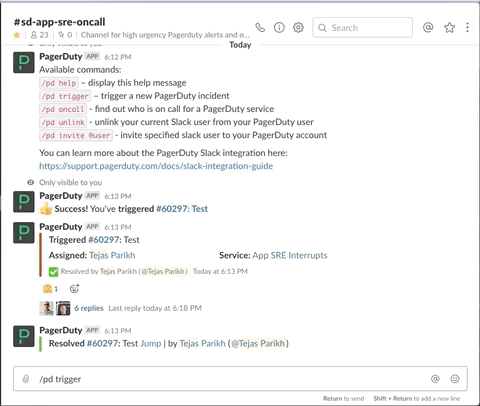

# Paging AppSRE OnCall

AppSRE team provides round the clock support for services it manages. During business hours in EMEA & NASA, AppSRE team is available on Slack. For high severity and critical issues when the team is offline, you can get hold of the AppSRE on-call person using the PagerDuty integration in the [#sd-app-sre-oncall](https://app.slack.com/client/T027F3GAJ/CKN746TDW) Slack channel.

**Incidents should only be triggered for high severity issues impacting service availability and/or with customer visible impact. Do NOT trigger incidents for the development environment or to get an MR merged unless that MR needs to be merged to resolve an ongoing production service degradation.**

**In the event AppSRE is paged for something that oncall determines is NOT a high severity issue, no immediate action will be taken.**

To trigger an incident, type `/pd trigger` in the [#sd-app-sre-oncall](https://app.slack.com/client/T027F3GAJ/CKN746TDW) slack channel. You will get a `Create New Incident` popup.
1. Select `RedHat` account.
1. Select `App SRE Interrupts` as `Impacted Service`.
1. `Assign To` should be `empty`. (Incident will be assigned to oncall on rotation)
1. `Title` should be set to service that is having issues.
1. `Description` should have a brief note about the issue and contact information such as slack channel, etc.

If PagerDuty slack integration is not working, a page can also be triggered by sending a mail to `app-sre-interrupts@redhat.pagerduty.com`.

For non-emergency and during regular business hours, you can reach AppSRE team in [#sd-app-sre](https://app.slack.com/client/T027F3GAJ/CCRND57FW) slack channel or by emailing us at sd-app-sre@redhat.com.

Notes:

1. Please update [this blog post](https://mojo.redhat.com/groups/service-delivery/blog/2020/03/19/paging-appsre-oncall) if these instructions change.
2. Update [this](https://docs.google.com/document/d/1WDfSDuV8jCRzTzEYRFnq8qQXgmqZMTKYJPLrGfTBfvQ/edit) doc if needed.
