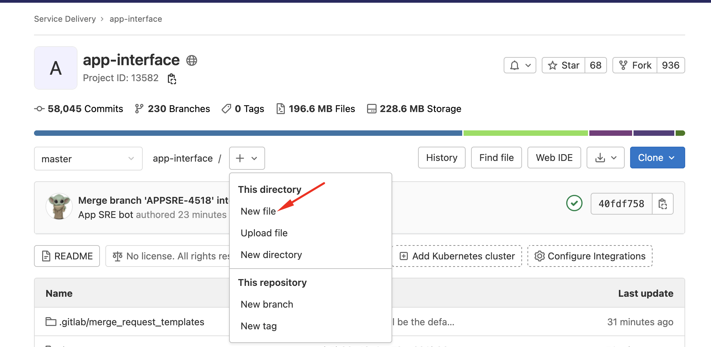
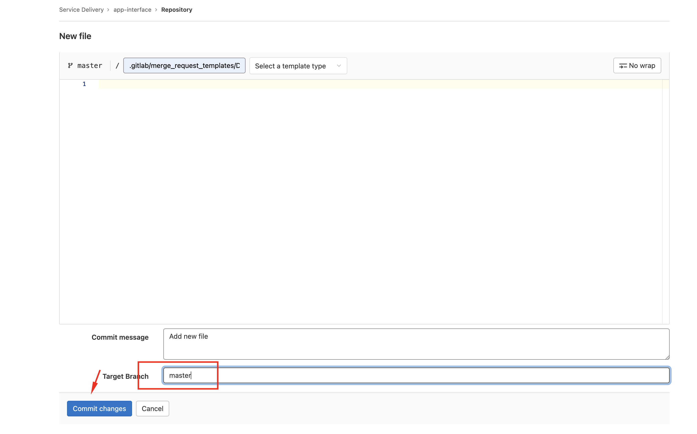

### Adding a default Merge Request template for GitLab
* Create the `.md` file under `.gitlab/merge_request_templates` directory; Name the file `Default.md` if you want this template to be the one appear when everyone creates an MR;
* Got to your repository's default branch and select +, then select New file;

* In the File name text box, enter .gitlab/merge_request_templates/mytemplate.md, where mytemplate is the name of your MR template. Commit to your default branch.

* Testing this change by tempting to create a new MR.
