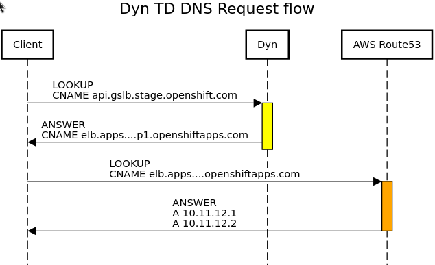

# Integration - Dyn Traffic Director

[TOC]

## Overview

The Dyn Traffic Director integration provides AppSRE the means to create and update Dyn Traffic Director services and manage their response pool records.

[Dyn Traffic Director docs](https://help.dyn.com/manage-and-configure-traffic-director/)
* *Note: We do not normally interract with the Dyn Management Console. The above docs are provided as a reference and fallback*

At the moment we are only using the basic Dyn Traffic Director features of returning resource records in a round robin way

There is a desire to add support for Monitors which will be worked out in [APPSRE-4271](https://issues.redhat.com/browse/APPSRE-4271)

## Architecture

DNS request flow when using Dyn's Traffic Director to resolve a cluster's routers DNS



## Metrics and Dashboards

The Dyn Traffic Director integration does not expose any particular metrics at this time

Overall runtime performance of the integration can be observed as part of the [AppSRE Integrations dashboard](https://grafana.app-sre.devshift.net/d/Integrations/integrations?orgId=1)

## Troubleshooting

### Access

[Dyn Management Portal](https://manage.dynect.net/)

Credentials to the Dyn Management Portal can be found in Vault at https://vault.devshift.net/ui/vault/secrets/app-sre/show/creds/dyn

The 2FA TOTP code can be retrieved from Vault under path `totp/app-sre/code/sd-app-sre@dyn`. **However at this time the TOTP secrets engine cannot be viewed via the Vault UI**

```sh
vault login -method=oidc -address=https://vault.devshift.net
vault read totp/app-sre/code/sd-app-sre@dyn
```

## SOPs

No specific SOP at this time

## Known Issues

No known issues at this time
