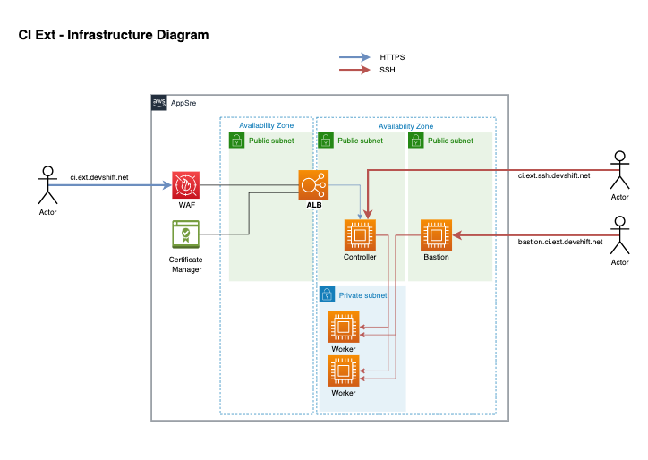

# Jenkins CI Ext Load Balancing / WAF

[TOC]

## Overview

The aim of this document is to expose to up-to-date frontend architecture for Jenkins ci.ext along with useful information.

## Architecture



## Load Balancing & WAF

The main access to jenkins is through an Application load balancer (ALB) secured by an AWS Web Application Firewall (WAF). This ensures that the Jenkins interface is protected against web application vulnerabilities such as Cross Site Scripting (XSS), SQL injections and others.

AWS provides a set of managed rule groups to protect backends against reported vulnerabilities like OWASP's published flaws. These rulesets are updated periodically with new definitions, we will need to check our configuration and update it
with new rulesets, etc.

As we are securing a jenkins controller, which has an adminsitration panel and we are using integrations to do the configuration, the WAF configuration could be a bit tricky as there are some rules that need to be allowed. As an example,
JJB do POST requests with large xml payloads to manage the job definitions. This could be detected as XSS attack by the WAF if the pertinent rule is not disabled[1]

On the ALB site, HTTPS is managed with the `ci.ext.devshift.net` certificate issued by Digicert. The certificate has been uploaded to Certificate Manager and is referenced in the ALB. **We will need to
update this certificate in Certificate Manager and in the Jenkins Controller when a new one is issued.**

[1]. Rules are not disabled in AWS WAF, are set as ONLY_COUNT. This way rules just log the match but does not block the requests.

### Logging

WAF Logs are stored in cloudwatch logs under `aws-waf-logs-ci-ext` loggroup. To monitor the BLOCKED requests or activity in general we can leverage `Cloudwatch log insights` to query the full loggroup. As an example, to filter all BLOCKED requests
go to `CloudWatchLogs -> Logs Insights`. Select the `aws-wag-logs-ci-ext` loggroup and do this query. Alternatively, the WAF Console have a Tab with the same functionality.

```text
fields @timestamp, @message
| filter @message like "BLOCK"
| sort @timestamp desc
| limit 20
```

### Access logging

Access logging can be enabled in the ALB if needed but are disabled by default.

### Observability

- WAF Rules have a Cloudwatch metric for every rule, in the WAF WebACL console, there is a chart with the WAF activity such as Counted_Requests, BlockedRequests etc per Rule.
- The ALB have the commont load balancing metrics such as number of requests, status codes, etc. In the EC2 Console under Load balancers -> ci.ext

## Troubleshooting

The worst thing that could happen is that WAF blocks legit requests for some reason (new plugin, jenkins update, etc.). If that happens the WAF will return a 403 error to the client and a block will be logged
both in the logs and in the metrics. To solve that, the affected rule needs to be set as `Count only`. The terraform manifest has a local section with all the rules, uncomment the affected rule to set it as COUNT_ONLY
and do the terraform plan/apply.

## IaC Resources

All the components are managed as IaC with terraform [HERE](https://gitlab.cee.redhat.com/app-sre/infra/-/tree/master/terraform/app-sre/ci.ext-alb)
