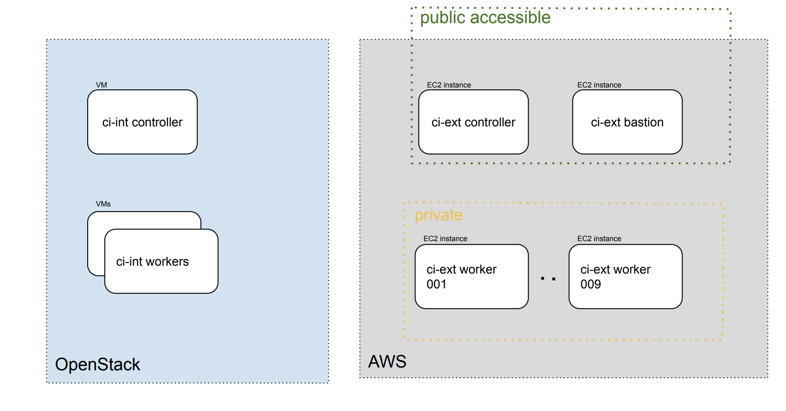

# Jenkins

[TOC]

## Overview

Currently we have two Jenkins https://ci.int.devshift.net/ and https://ci.ext.devshift.net/(usually referred as ci-int and ci-ext), hosting and running CI pipelines that are both serving App SRE and as our service to tenants. ci-int can only be accessed through VPN, while ci-ext is public accessible(through Red Hat SSO).

## Architecture





## Troubleshooting

Prerequisite: Make sure you can ssh into Jenkins workers by first following all the ssh set up in [AAA doc] (https://gitlab.cee.redhat.com/service/app-interface/blob/master/docs/app-sre/AAA.md), then test it by running `ssh ci-int-jenkins-slave-01-app-sre` for example. Note that we use bastion as jump box to access ci-ext worker. A common error is having different username in local than remote, in that case, add `User [yourremoteusername]` in your ssh config file. For example:
```
Host ci-ext-jenkins-slave-*
    ProxyCommand ssh -W %h:%p yourremoteusername@bastion.ci.ext.devshift.net
    # Change if different private key file:
    IdentityFile ~/.ssh/id_rsa
Host ci-int-jenkins-slave-*
    User     yourremoteusername
    Hostname %h.int.devshift.net
    # Change if different private key file:
    IdentityFile ~/.ssh/id_rsa
```

### Useful command lines:

`du -sh /* | sort -h`: Sort the folders by they disk space they take. 

`cd /tmp && rm -rf *`: Use only when it is necessary, this command free up space if disk is still full even after dangling containers and images were pruned.

`docker system prune`: Prune unused containers and images, usually freeing a lot of space.

## SOPs

* [Clean up worker disk space](/docs/app-sre/sop/jenkins-vda-storage.md)
* [General Jenkins SOP](/docs/app-sre/sop/jenkins.md)
* [General OpenStack SOP](/docs/app-sre/sop/openstack-ci-int.md)
* [Upgrading the OS](/docs/app-sre/sop/jenkins-os-upgrade.md)

## Known Issues

The workers disk space fills up from time to time despite [existing clean-up job](https://ci.int.devshift.net/job/jenkins-slaves-cleanup/2545/console). Tracked by [APPSRE-4725](https://issues.redhat.com/browse/APPSRE-4725).

## More information

[ci-int and ci-ext nodes Ansible playbooks](https://gitlab.cee.redhat.com/app-sre/infra/-/tree/master/ansible/playbooks)
[ci-ext infrastructure Terraform scripts](https://gitlab.cee.redhat.com/app-sre/infra/-/tree/master/terraform/app-sre/ci.ext)
[Full details on OS upgrades](jenkins-os-upgrade.md)
