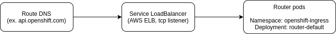

# OpenShift Ingress Routers

[TOC]

## Overview

The OpenShift ingress routers provide a method for exposing services externally (outside the cluster). The routers are managed by the [Ingress Operator](https://docs.openshift.com/container-platform/4.9/networking/ingress-operator.html) and services are exposed via [Routes](https://docs.openshift.com/container-platform/4.9/networking/routes/route-configuration.html).

## Architecture

The architecture of ingress routers is not well-documented in OSD docs at this time (as far as I can tell). Knowing the architecture can be useful when troubleshooting some issues, however.



Very simply, the `Route` DNS points to an AWS Classic ELB, which load balances the traffic to the router pods. Knowledge of the Classic ELB can be important, however, because it provides another layer of metrics for investigation purposes. For instance, there are the `SurgeQueueLength` and `SpilloverCount` metrics ([see AWS docs](https://docs.aws.amazon.com/elasticloadbalancing/latest/classic/elb-cloudwatch-metrics.html)), the latter being an indicator of clients seeing closed connections if the ingress router pods are overloaded.

More information about the `Service`, which is the ELB, can be found by running the following command on a cluster: `oc get svc -n openshift-ingress`

## Metrics and Dashboards

* [OpenShift Router Metrics (per cluster, per pod)](https://grafana.app-sre.devshift.net/d/kMh0vlEWk/openshift-router-metrics?orgId=1&refresh=5m)
  * This is an AppSRE dashboard highlighting some of the more important metrics exposed by router pods
* ELB metrics can be found in the OSD AWS account using the switch role link in [this document](https://gitlab.cee.redhat.com/service/app-interface-output/-/blob/master/ocm-aws-infrastructure-access-switch-role-links.md)

## Troubleshooting

### Most/All applications on a cluster have high latency / increased errors

All routes on an OSD cluster share the same ingress router by default. So, if there are issues with that router, you may see increased latency/errors in not just tenant services, but also Prometheus, OCP console, and other `Routes`.

1. Check the [OpenShift Router Metrics dashboard](#metrics-and-dashboards) for any increase in the number of sessions, HTTP response codes, etc. If there are elevated requests/connections, try to find the route associated with this increase, and reach out to the tenant to see if this increase in traffic is expected.
2. The steps below will focus on determining if the infra nodes / ingress routers are overloaded. These steps can be relevant whether the increase in traffic at the routers is expected or not.
3. Login to the affected cluster with the login command from the OCP console
4. Get the infra node names that are running the ingress router pods:\
   ```oc get pods -n openshift-ingress -o=jsonpath='{range .items[*]}{.spec.nodeName}{"\n"}{end}'```
5. Check the infra node CPU usage by looking for the node names above in the output of the command below. If the infra nodes have very high CPU usage, this could be affecting the ingress routers.\
   ```oc adm top nodes```
6. Check the OCP console dashboards (`Observe -> Dashboards`), specifically the `Kubernetes / Compute Resources / Node (Pods)` graph for increased CPU usage related to the router namespace (`openshift-ingress`)
7. Check the `Kubernetes / Networking / Cluster` dashboard, in the `Errors` section for signs of changes in dropped packets, or retransmitted packets. This might be a contributing factor to router ingress issues.
8. If the investigation above indicates that the routers are failing to meet the incoming requests, and the infra nodes are overloaded, see the [SOPs](#sops) section for scaling the infra nodes. If we otherwise suspect issues with the infra nodes, then it might be necessary to escalate to SRE-P (may need a general SOP for this).


## SOPs

* [Scaling infra nodes](/docs/app-sre/sop/scaling-osd-infra-nodes.md)

## OSD-specific considerations

This section attempts to cover cases where OSD might deviate from typical OCP operations.

### Scaling Ingress Routers

Some important notes on scaling the ingress router in OSD:

1. Increasing the number of ingress router pods cannot be self-serviced. This means that the default of 2 pods is not easily changed and SRE-P usually doesn't make exceptions. It's possible that this could change in the future with [NE-361](https://issues.redhat.com/browse/NE-361).
2. The infra nodes can be vertically scaled (to the next EC2 instance size). See the [SOPs](#sops) section for more information.

The original discussion with SRE-P can be found in [Slack](https://redhat-internal.slack.com/archives/CCX9DB894/p1640012063193800).

### Access Logging

Enabling access logging, like you can do in [OCP](https://docs.openshift.com/container-platform/4.9/networking/ingress-operator.html#nw-configure-ingress-access-logging_configuring-ingress), is not directly supported by SRE-P. While it can be done with cluster-admin, doing so **will result in the router pods being restarted, which can cause a momentary traffic disruption**.

**Note:** AppSRE has not enabled ingress router access logs on a production cluster in the past. Investigation is required to determine the additional resources that might be consumed by a busy router.

The original discussion with SRE-P can be found in [Slack](https://redhat-internal.slack.com/archives/CCX9DB894/p1640029687217400).

## Known Issues

### Overloaded routers affect tenant services as well as other infrastructure

It is worth knowing that overloaded routers / infra nodes can lead to a situation where multiple tenant services and infrastructure components can become unreachable. In an incident that involved [OCM degradation](https://docs.google.com/document/d/1wxXTiXLK8v7JuwOnm7Jte5-jU50qAhEljFTsIexM6Ho/edit#), not only were OCM services impacted, but team members were also having issues reaching Prometheus and the OCP Console, because that traffic also passes through the default OpenShift ingress routers on the cluster.

This might lead to further discussions about architecture in the future. It isn't good when production services are impacted, but it's even worse when the team is trying to troubleshoot and OCP console/Prometheus access is also affected.

### Path-based routes with the same hostname return the same certificate

This issue describes the scenario where there are multiple routes with the same hostname (path-based routes), and TLS certificates have been configured for each of them, but despite that only a single certificate is returned for all routes. This was discovered in the past when the certificate that was being used for all of the `Routes` was nearing expiration and there were issues with `openshift-acme`.

One example of this is `api.openshift.com` (stage shown below):

```
$ oc get route
NAME             HOST/PORT                 PATH                  SERVICES                     PORT    TERMINATION          WILDCARD
accounts-mgmt    api.stage.openshift.com   /api/accounts_mgmt    uhc-acct-mngr-envoy          <all>   reencrypt/Redirect   None
authorizations   api.stage.openshift.com   /api/authorizations   uhc-acct-mngr-envoy          <all>   reencrypt/Redirect   None
clusters-mgmt    api.stage.openshift.com   /api/clusters_mgmt    clusters-service-envoy       <all>   reencrypt/Redirect   None
gateway-server   api.stage.openshift.com                         gateway-envoy                <all>   edge/Redirect        None
job-queue        api.stage.openshift.com   /api/job_queue        job-queue-service            <all>   reencrypt/Redirect   None
service-logs     api.stage.openshift.com   /api/service_logs     ocm-service-log-envoy        <all>   reencrypt/Redirect   None
service-mgmt     api.stage.openshift.com   /api/service_mgmt     ocm-managed-services-envoy   <all>   reencrypt/Redirect   None
```

Each of these `Routes` have their own `spec.tls` configuration. By opening a shell in the ingress router pod, we can see the TLS configurations below:

```
sh-4.4$ grep ' api.stage.openshift.com' /var/lib/haproxy/conf/cert_config.map 
/var/lib/haproxy/router/certs/uhc-stage:service-mgmt.pem [alpn h2,http/1.1] api.stage.openshift.com
/var/lib/haproxy/router/certs/uhc-stage:service-logs.pem [alpn h2,http/1.1] api.stage.openshift.com
/var/lib/haproxy/router/certs/uhc-stage:job-queue.pem [alpn h2,http/1.1] api.stage.openshift.com
/var/lib/haproxy/router/certs/uhc-stage:gateway-server.pem [alpn h2,http/1.1] api.stage.openshift.com
/var/lib/haproxy/router/certs/uhc-stage:clusters-mgmt.pem [alpn h2,http/1.1] api.stage.openshift.com
/var/lib/haproxy/router/certs/uhc-stage:authorizations.pem [alpn h2,http/1.1] api.stage.openshift.com
/var/lib/haproxy/router/certs/uhc-stage:accounts-mgmt.pem [alpn h2,http/1.1] api.stage.openshift.com
```

The first certificate on the list will be the one that is used for all `Routes` that share the same hostname. This behavior is not obvious, which is why it has been documented here. A follow-up with OCP engineering will occur if existing documentation doesn't cover this scenario.

### Incorrect/default certificate returned by the ingress router (ex. *.apps.app-sre-prod-01.i7w5.p1.openshiftapps.com)

#### Problem
The ingress router can return the default certificate instead of the route-specific certificate during periods of transient network issues. This can result in a certificate mismatch that will prevent the affected clients from successfully calling the endpoint.

With a Python-requests client, the error might look like:

```python
HTTPSConnectionPool(host='app-interface.stage.devshift.net', port=443): Max retries exceeded with url: / (Caused by SSLError(CertificateError("hostname 'app-interface.stage.devshift.net' doesn't match either of '*.apps.app-sre-stage-0.k3s7.p1.openshiftapps.com', 'api.app-sre-stage-0.k3s7.p1.openshiftapps.com', 'rh-api.app-sre-stage-0.k3s7.p1.openshiftapps.com'",),) 
```

#### Explanation

The very high-level explanation is that the `inspect-delay` timeout in HAProxy, which is configured via `tlsInspectDelay` in the Ingress Operator, limits the time that HAProxy has to inspect the request and match rules for forwarding the request to a backend. For TLS connections, the TLS handshake needs to make enough progress to specify the hostname (via SNI) that the request should go to. If there are no rule matches from the TLS inspection before the request times out, then the request will go to the default backend (returning the default TLS certificate).

The most likely cause of this issue is transient networking issues between the client and ingress router. These sorts of issues are not rare in AWS, particularly for a single EC2 host, or a single AZ. As seen in APPSRE-1564, we were able to reproduce this issue by simulating packet loss at the client using `tc`. This slowed down the TCP and TLS handshake enough that it doesn't complete within the inspection window (`inspect-delay` timeout).

#### Options for fixing this issue

* `tlsInspectDelay` could be increased on the Ingress Operator, but this could leave us more suspectible to denial of service attacks (the client can send packets very slowly). So, in most cases this should probably be avoided.
* If we control the clients, we can implement retries on TLS failures
* Explore other options with #forum-network-edge or investigate other load balancer options that don't suffer from this same issue?

#### Other causes

@goberlec mentioned that he's also seen this issue in OCP as a result of overloaded router pods. This makes sense because in theory the ingress router itself being delayed could still impact the timeout.

From the findings in APPSRE-1564, we don't have any proof that this issue could be caused by HAProxy configuration reloads or that it is impacted by OpenSSL versions.

#### More information

* [RH Customer Portal article](https://access.redhat.com/solutions/5603871)
  * it states that this only affects Passthrough Routes, but [confirmed with #forum-network-edge that this affects all Routes](https://redhat-internal.slack.com/archives/CCH60A77E/p1642539370035300)
* Background information: APPSRE-1564
* [Configuration info for Ingress Operator](https://docs.openshift.com/container-platform/4.9/networking/ingress-operator.html#nw-ingress-controller-configuration-parameters_configuring-ingress) including `tlsInspectDelay`
* [HAProxy docs](https://cbonte.github.io/haproxy-dconv/1.8/configuration.html#4-tcp-request%20inspect-delay) for `inspect-delay`

