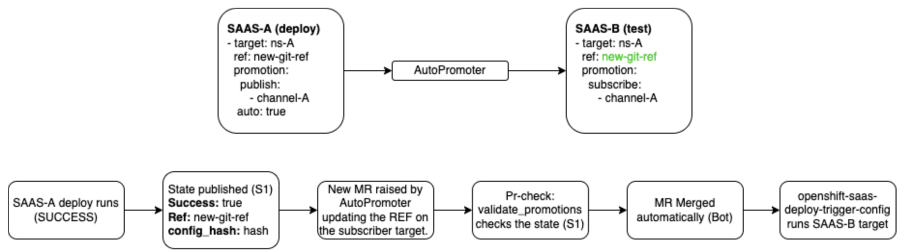
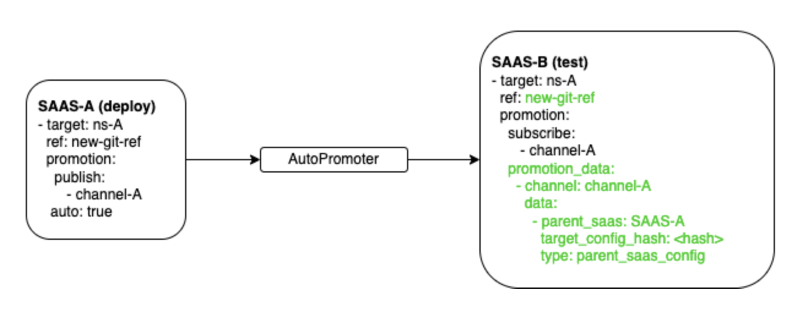
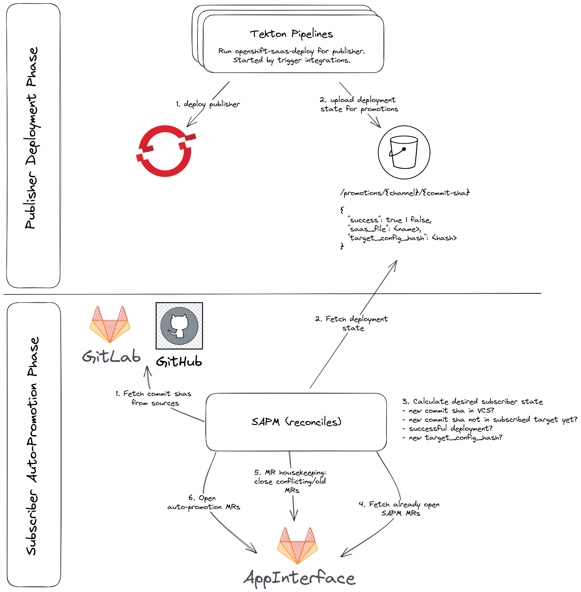

# CI/CD - Builds, Triggers, Deployments and Promotions

[toc]

The SAAS feature of app-interface is a highly customizable tool to drive CI/CD processes from source changes
to production rollouts.

This walkthrough will cover all basics of Jenkins Jobs for pr-checks and builds, deploy triggers, deployments and
promotions.

## SAAS files
Deployments in app-interface are defined in `saas` files (usually located in the services `cicd` directory in
app-interface) , e.g. [data/services/github-mirror/cicd/deploy.yaml](https://gitlab.cee.redhat.com/service/app-interface/-/blob/cdf9643470bfa54d9826b90e6ab78a79f52d2f39/data/services/github-mirror/cicd/deploy.yaml).
A `saas` file represents a software delivery chain for one or more targets.

The `resourceTemplate` section of a `saas` file defines what service manifests or templates should be deployed to which namespace
in which cluster. You can find more details about this
[here](https://gitlab.cee.redhat.com/service/app-interface/-/blob/master/docs/app-sre/continuous-delivery-in-app-interface.md)
where also automatically provided template parameters like IMAGE_TAG are described.

### Triggering a deployment
The magic of those targets begins when their deployment is triggered. The [docs](https://gitlab.cee.redhat.com/service/app-interface/-/blob/master/docs/app-sre/continuous-delivery-in-app-interface.md)
mention, that a deployment is triggered for changes on environments, saas files, resource templates or targets.

The base code for deployment triggering can be found in [openshift_saas_deploy_trigger_base.py](https://github.com/app-sre/qontract-reconcile/blob/master/reconcile/openshift_saas_deploy_trigger_base.py).
Different integrations use this base class with different trigger types for config changes, changes in code repos or
upstream jobs (e.g. jenkins image build). All integrations use ['saasherder.get_diff'](https://github.com/app-sre/qontract-reconcile/blob/f1b12fec8797b3f2f5fcaf50acf55841e60d7b6e/reconcile/utils/saasherder.py#L863)
to detect the changes they are looking for. [This code](https://github.com/app-sre/qontract-reconcile/blob/f1b12fec8797b3f2f5fcaf50acf55841e60d7b6e/reconcile/openshift_saas_deploy_trigger_base.py#L160)
then triggers an `openshift-saas-deploy` integration run in Jenkins (v1 saas files) or Tekton (v2 saas files).

#### Code changes, a.k.a. moving commits

##### The build part
On commits in a git repo, Jenkins (ci-ext) builds can be triggered to build images. A `jenkins-configuration`
manifest in app-interface can be declared to setup this chain from code changes (or PRs) to running jenkins job.
App-interface defines various templates to streamline this process. The [template](https://gitlab.cee.redhat.com/service/app-interface/-/blob/cdf9643470bfa54d9826b90e6ab78a79f52d2f39/resources/jenkins/global/templates.yaml#L18-32)
and [base template](https://gitlab.cee.redhat.com/service/app-interface/-/blob/cdf9643470bfa54d9826b90e6ab78a79f52d2f39/resources/jenkins/global/base-templates.yaml#L169-203) define how the
actual jenkins build job is created [here](https://ci.ext.devshift.net/view/github-mirror/job/app-sre-github-mirror-gh-build-master/).
Note how [`build_master`](https://gitlab.cee.redhat.com/service/app-interface/-/blob/cdf9643470bfa54d9826b90e6ab78a79f52d2f39/resources/jenkins/global/base-templates.yaml#L66-75) defines
that the `build_and_deploy.sh` script in the source repo is called to drive the build process.

An example can be found [here](https://gitlab.cee.redhat.com/service/app-interface/-/blob/master/data/services/github-mirror/cicd/build.yaml)
is executed, defining jobs for pr-checks and also builds on master branch updates.

##### The deployment part
Jenkins builds are not the only thing that can be triggered by git commits. The `openshift-saas-deploy-trigger-moving-commits`
integration is the qontract-reconcile entrypoint to detect changes in Github repos.
This [code](https://github.com/app-sre/qontract-reconcile/blob/f1b12fec8797b3f2f5fcaf50acf55841e60d7b6e/reconcile/utils/saasherder.py#L897)
is used to find out if there are new commits in the ref of a targets repo. Please note that this applies only to targets
* which have non-commit-sha refs (e.g. main)
* which have no upstream jobs defined - see Upstream Jobs
Previously observed commit SHAs per repository are stored as [state](https://github.com/app-sre/qontract-reconcile/blob/master/reconcile/utils/state.py).

Targets can specify, that they depend on a Jenkins build to be successful before a deployment can take place, e.g.
when the deployment required the freshly built image.

#### Upstream jobs
The `openshift-saas-deploy-trigger-upstream-jobs` integration is the entrypoint to detect if new jenkins builds exist as
defined in `target.upstream` and triggers a deployment as a result. For details see [this](https://github.com/app-sre/qontract-reconcile/blob/f1b12fec8797b3f2f5fcaf50acf55841e60d7b6e/reconcile/utils/saasherder.py#L974-L1060).

Again [state](https://github.com/app-sre/qontract-reconcile/blob/master/reconcile/utils/state.py) is used to store previously seen jobs.

#### Config changes
The `openshift-saas-deploy-trigger-configs` integration is the entrypoint to detect config changes for the saas file, the targets and
attached namespaces. [This code](https://github.com/app-sre/qontract-reconcile/blob/f1b12fec8797b3f2f5fcaf50acf55841e60d7b6e/reconcile/utils/saasherder.py#L1081-L1128)
detects any changes and will trigger deployments.

Again [state](https://github.com/app-sre/qontract-reconcile/blob/master/reconcile/utils/state.py) is used to store previously seen jobs.

### Deploying
When one of the mentioned deployment triggers did it's job, the `openshift-saas-deploy` integration is driving the
deployment process for a specific sass-file and environment combination.

The targets available in the `saas` file are processed by [fetching the current state](https://github.com/app-sre/qontract-reconcile/blob/2f32fa4dd2165a5eb286b3a675e4cf5485c48a3a/reconcile/openshift_resources_base.py#L499)
from OpenShift, the [desired state](https://github.com/app-sre/qontract-reconcile/blob/2f32fa4dd2165a5eb286b3a675e4cf5485c48a3a/reconcile/utils/saasherder.py#L702)
from Github based on `url` and `path` from the `resourceTemplate` and the `ref` from the target. The manifest files or templates from Github are processed with
the env variables provided in the `saas` file (and a couple of automatically provided ones) as described in
[app interface CD guide](https://gitlab.cee.redhat.com/service/app-interface/-/blob/master/docs/app-sre/continuous-delivery-in-app-interface.md).

With current state and desired state side by side in a [`ResourceInventory`](https://github.com/app-sre/qontract-reconcile/blob/2f32fa4dd2165a5eb286b3a675e4cf5485c48a3a/reconcile/utils/openshift_resource.py#L434)
object, any [difference can be applied to the target](https://github.com/app-sre/qontract-reconcile/blob/2f32fa4dd2165a5eb286b3a675e4cf5485c48a3a/reconcile/openshift_base.py#L461).

After the deployment, promotions defined in a targets `promotion.publish` settings are processed for the current commit sha.

### Promotion
A target can declare that the status of a deployment should be promoted to other targets. This can be
declared by specifying one or more promotion channels on the target with `promotion.publish`. Other targets can subscribe
to those channels with `promotion.subscribe` by specifying the same publish channel. This works between targets
of different `saas` files as well.

On promotion, the success of the current deployment is stored in the qontract-reconcile state
([see this](https://github.com/app-sre/qontract-reconcile/blob/f1b12fec8797b3f2f5fcaf50acf55841e60d7b6e/reconcile/utils/saasherder.py#L1207)).
This declares the current commit sha as either successful or failed for subscribed targets to read during their
`openshift-saas-deploy` run (see [validate_promotions](https://github.com/app-sre/qontract-reconcile/blob/5e170ef4b372f158b2c3e1d44afd198f78e0e81f/reconcile/openshift_saas_deploy.py#L131)).

**IMPORTANT NOTE:**
 * `validate_promotions` runs in the pr-check step when a MR is raised for a SAAS file. The MR will be merged only if `validate_promotions` ends successfully, which ensures that the publisher job has run successfully for the same `ref`.

It is important to understand, that publishing a successful deployment does not trigger a deployment for subscribed
targets. It just allows such deployments to happen if their `ref` moves to the same sha.

For automated promotion to happen, a target must subscribe with `promotion.auto: true`. In this case the publishing procedure creates a merge request on the `saas` file of the subscribed `target` to update the `ref` to the successful commit sha (see section about [auto-promotions](#auto-promotions)).

#### Automated Promotions with configuration changes
Saas deployment workflows via promotions are intented to work by updating the `ref` on its targets. Basically, when a job with an automatic promotion runs, a new merge request is raised updating the `ref` value in the subscribed Saas target. Once the merge request is merged, `openshift-saas-deploy-trigger-configs` will detect a change in the saas file and it will trigger the deployment jobs.

Note, that `AutoPromoter` refers to our [saas-auto-promotions-manager (SAPM)](#auto-promotions). 

This has an important drawback: we might want to run jobs when a configuration change is introduced in the SAAS target, independently of the `ref`.
e.g.: updating one of the `parameters` on a target will trigger a deployment on that target, but the automatic subscribed targets won't be triggered because the `ref` is not updated and the autopromotion MR will not have any change.

To solve this problem, the `promotion_data` section has been introduced. The idea is to track the configuration data of the publisher target on the subscribed targets by adding a computed hash of configuration in the promotion merge request. With this approach, any change introduced in the publisher target will change the subscriber target even if the `ref` is not updated. The configuration hash will differ, and the promotion merge request will have changes to promote.

`promotion_data` is a list of objects grouped by channel. Each channel comes from a single saas file and target, so it identifies which saas file and target is the data relative to.
Each object in `promotion_data` implements the `PromotionChannelData_v1` interface, by now just exists one implementation to store the `ParentSaasPromotion_v1` case explained before, but it could be extended with other data in the future. Check this qontract-schemas [commit](https://github.com/app-sre/qontract-schemas/commit/30fe5217d4d1c46ffbf1233e8c140702dbb3fac1) to view the full schema definition.

## Example delivery pipeline with triggers and promotions
All the described building blocks can be put together to build high sophisticated CI/CD pipelines. A good example
is [github-mirror](https://gitlab.cee.redhat.com/service/app-interface/-/tree/master/data/services/github-mirror/cicd),
so let's walk through the entire process when a new commit is merged to the github-mirror master branch.

The new commit in the master branch on Github is detected by the `openshift-saas-deploy-trigger-moving-commits` integration
and would usually result in an `openshift-saas-deploy` run for the github-mirror staging target because it references
the [master branch](https://gitlab.cee.redhat.com/service/app-interface/-/blob/master/data/services/github-mirror/cicd/deploy.yaml#L39).
But since the staging target also defines a reference to a jenkins job, it is the responsibility of the
`openshift-saas-deploy-trigger-upstream-jobs` integration to trigger the deployment after the jenkins job has been
finished. The jenkins job itself has been triggered via a webhook event from the merge into master in the Github
repo ([see this](https://gitlab.cee.redhat.com/service/app-interface/-/blob/master/data/services/github-mirror/cicd/build.yaml)).

The triggered `openshift-saas-deploy` integration run tries to figure out if a deployment is required by processing the
[github-mirror template](https://github.com/geoberle/github-mirror/blob/master/openshift/github-mirror.yaml) and comparing
it to the currently deployed resources in Openshift. Amongst various variables, the template also specified `IMAGE_TAG`
as a variable in the deployment. This variable is provided based on the first 7 digits of the commit sha. This means,
that the image tag changed and applying the changes to the Openshift namespace is required, which effectively triggers
the rollout of the new application pods.

If that went well, a promotion is published to the `github-mirror-stage-deploy-success-channel` channel. The corresponding
subscription can be found in [test.yaml](https://gitlab.cee.redhat.com/service/app-interface/-/blob/master/data/services/github-mirror/cicd/test.yaml#L41-46)
with an autopromotion defined. This results in the automatic update of the [ref](https://gitlab.cee.redhat.com/service/app-interface/-/blob/master/data/services/github-mirror/cicd/test.yaml#L35),
that is picked up by `openshift-saas-deploy-trigger-configs` integration and triggers the deployment of the
[acceptance tests](https://github.com/geoberle/github-mirror/blob/master/openshift/github-mirror-acceptance.yaml) into
the staging namespace.

If that went well, the successful acceptance test is promoted to the `github-mirror-stage-post-deploy-tests-success-channel`
channel, which is picked up by the production target ([see](https://gitlab.cee.redhat.com/service/app-interface/-/blob/master/data/services/github-mirror/cicd/deploy.yaml#L56-58))
because the autopromotion resulted in an updated `ref` ([see](https://gitlab.cee.redhat.com/service/app-interface/-/blob/master/data/services/github-mirror/cicd/deploy.yaml#L54)).

## Auto Promotions

Auto-promotions are managed by the [saas-auto-promotions-manager](https://github.com/app-sre/qontract-reconcile/tree/master/reconcile/saas_auto_promotions_manager) (SAPM). SAPM is a reconcile-based system. In each loop it ...

- ... checks the state of the publishers
- ... computes desired subscriber state
- ... opens merge requests for auto-promotions
- ... closes obsolete / conflicted merge requests (housekeeping)

Auto-promotions are a complex topic and more features are expected to be added in this area. We chose a reconcile based system because for now it is easier to maintain and to iterate on. Design doc and discussions around this approach can be found in [this design doc MR](https://gitlab.cee.redhat.com/service/app-interface/-/merge_requests/61204). The following illustrates the flow of auto-promotions:

