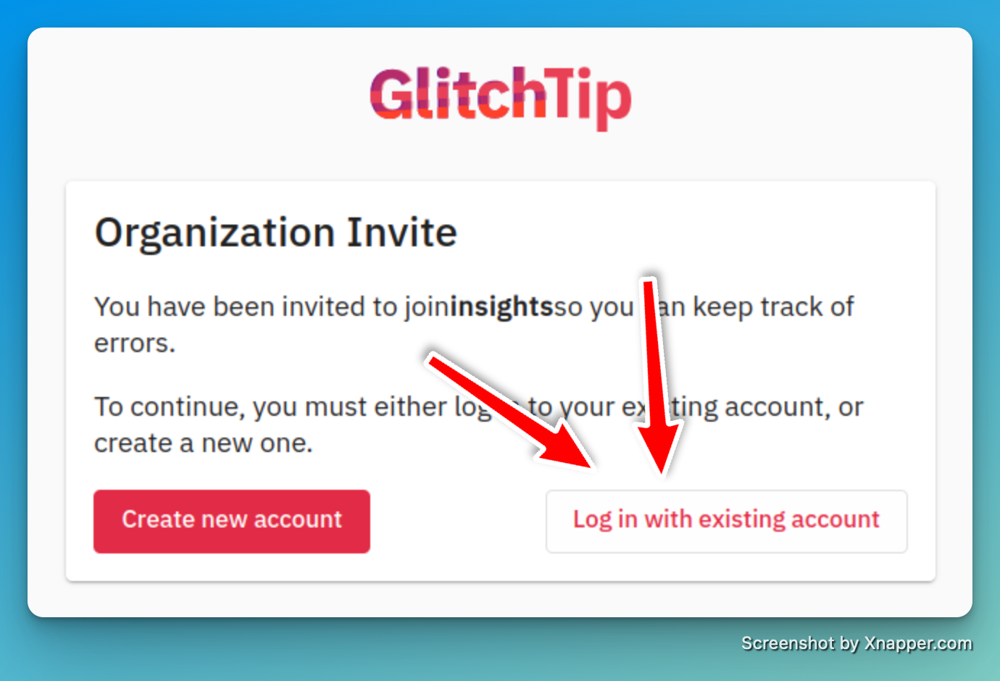

<font size=24> Glitchtip </font>
---

[toc]

# Onboarding new Glitchtip Instance

* Enter a shell into glitchtip pod of the new instance
* Create Django admin user for the admin webinterface
  ```shell
  /code$ python manage.py createsuperuser
  Email: sd-app-sre+glitchtip-admin@redhat.com
  Password:
  Password (again):
  Superuser created successfully.
  ```
  and store the credentials in [vault](https://vault.devshift.net/ui/vault/secrets/app-sre/show/creds/glitchtip-stage/admin)
* Enter django admin interface and create an [automation account](https://glitchtip.stage.devshift.net/admin/users/user/add/) `sd-app-sre+glitchtip@redhat.com` with a random password and enabled `Superuser status` flag. The password doesn't matter; the integration will use an API token later.
* [Create](https://glitchtip.stage.devshift.net/admin/organizations_ext/organization/add/) an `app-sre-init` organization. The integration needs a bootstrapping organization, and it will delete this organization as soon as other organizations are configured.
* Add the automation account to the `app-sre-init` organization by [creating an organization user](https://glitchtip.stage.devshift.net/admin/organizations_ext/organizationuser/add/). Choose `owner` as role!
* Finally, [create an API token](https://glitchtip.stage.devshift.net/admin/api_tokens/apitoken/add/) for the automation user and enable all scopes except `event:***`.
* Store the token in [vault](https://vault.devshift.net/)
* Create a new glitchtip-instance file (example [glitchtip-stage](data/dependencies/glitchtip/glitchtip-stage.yml)).

# Notes

The qontract-reconcile glitchtip integration manages organizations where the automation account (e.g., `sd-app-sre+glitchtip@redhat.com`) has the owner role! Glitchtip doesn't have the global admin concept; an organization's role handles the permissions. The integration can see other organizations and, therefore, can't control those.

# FAQ

## I'm logged in, but I can't see any organizations or projects. What should I do?

The user has to use the invitation link to join an organization. In Glitchtip itself, you don't see any open invitations.

## Create new account or log in with existing account?



**Log in with existing account**. Glitchtip is using Red Hat SSO as an authentication provider.
## I've clicked the invitation link, but I can't see any organizations or projects. What should I do?

Click it again and be sure that you're already logged in. If you're not logged in, you'll be redirected to the login page, and the original invitation link will be lost.

## I can't find the invitation email, or the link has expired. What should I do?

Ask a Glitchtip admin to resend the invitation by deleting your Glitchtip organization user (https://glitchtip.devshift.net/admin/organizations_ext/organizationuser/). The integration will recreate the organization user and resend the invitation.

## How can I login to the Glitchtip admin interface? (AppSRE only)

The Glitchtip admin interface is available at https://glitchtip.devshift.net/admin/. The credentials are stored in [vault](https://vault.devshift.net/ui/vault/secrets/app-sre/show/creds/glitchtip-production/admin).
