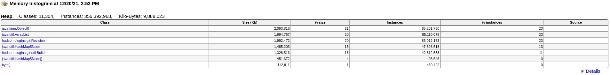
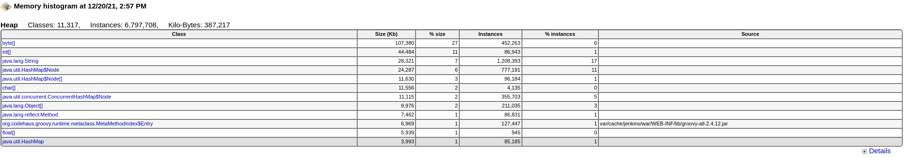

# SOP : Jenkins

[TOC]

---

# Instances

The Jenkins servers (nodes and controllers) are VMs running in
[AWS](https://console.aws.amazon.com/ec2/v2/home?region=us-east-1#Instances:search=ci.ext;sort=desc:instanceId),
in the app-sre account. You can check your default credentials in the
[app-interface output repo](https://gitlab.cee.redhat.com/service/app-interface-output/-/blob/master/terraform-users-credentials.md).

The configuration is documented in the
[infa](https://gitlab.cee.redhat.com/app-sre/infra) repo
[here](https://gitlab.cee.redhat.com/app-sre/infra/-/blob/master/ansible/hosts/host_vars/ci.ext.ssh.devshift.net).


# Alerts

## JenkinsHealthCheck

This checks the health score `jenkins_health_check_score` of the jenkins instance, which include the state of the nodes/workers.

A score below 1 do not necessarily mean there is an impact on the normal operations.

### Impact:

Variable

### Summary:

https://wiki.jenkins.io/display/JENKINS/Metrics+Plugin

### Access required:

Admin access to jenkins is required to troubleshoot this alert

### Steps:

Things to check:
- https://ci.int.devshift.net/metrics/currentUser/healthcheck?pretty=true or https://ci.ext.devshift.net/metrics/currentUser/healthcheck?pretty=true
- Nodes status:
  - Manage Jenkins -> Manage Nodes

- Nodes available disk space
  - Verify /tmp (/) 
  - Verify /var/lib/jenkins
    - Remove heapdumps if any(look for files with `.hprof` extension). Take backup on local machine if necessary.
  - Verify /var/lib/docker. Clean with `docker system prune -a`.
  - Duplicity backups cache can fill up in /root/.cache/duplicity
    - Clear old backups with: /backup/backup.sh remove-older-than 3M

## JenkinsDown

### Impact:

The jenkins controller isn't responding.


### Steps

* Try to ssh into the instance:

```shell
ssh ci.ext.ssh.devshift.net # ci-ext
ssh ci.int.devshift.net # ci-int
```

* Check if jenkins is running:
  ```shell
  sudo systemctl status jenkins
  ```
  `systemctl` should report `Active: active (running)`.

* If no jenkins processes are running, start them with:

  ```shell
  sudo systemctl start jenkins
  ```

* Check logs of the process:
  ```shell
  sudo journalctl -u jenkins
  ```

* If an out-of-memory situation is suspected, it's useful to look for
  OOM kills:
  ```shell
  sudo journalctl -k --since="<5 minutes before the alarm>" --until=now
  ```
* Check if there are any heapdumps in /var/lib/jenkins directory and analyze them for any memory issue.

## JenkinsNodeOffline

### Impact:

Degraded or even unavailable CI service. PR and MR checks fail,
tenants can't build new images of their applications.

### Summary:

A Jenkins executor is not responding to SSH and thus can't receive
jobs. The integration service is degraded.

### Access required:

See [the general openstack SOP](openstack-ci-int.md).

### Steps:

Reboot or restart all the affected nodes. Identify their names from
the alert, and then use `openstack server reboot --hard $server_name`.

If they don't come back, escalate to PSI. Cut a [Service Now
ticket](https://redhat.service-now.com/help?id=sc_cat_item&sys_id=4c66fd3a1bfbc4d0ebbe43f8bc4bcb6a)
-- yes, really. Mark impact as 3, and urgency as 3 or 2.

---

## JenkinsExecutorSaturation

### Impact:

TODO

### Summary:

TODO

### Access required:

TODO

### Steps:

TODO

---

## JenkinsJvmMemoryStarvation

### Impact:

Unreliable CI service. PR and MR checks fail,
tenants can't build new images of their applications.

### Summary:

Jenkins controller using too much of RAM, after OOM event service might be unreliable
We need to restart the service at least

### Access required:

Admin access to Jenkins controller's Web-UI

### Steps:

- Check if it's really a problem - visit https://ci.int.devshift.net/monitoring?part=heaphisto
Pay attention if bottom line before table shows near to limit usage of RAM

- Check if 'hudson.plugin.git.*' object is present and bigger than a few MegaBytes. 
- Image for reference showing the problem 
- If it's big then need to execute [script](https://plugins.jenkins.io/git/#plugin-content-remove-git-plugin-buildsbybranch-builddata-script)
- Image for reference showing the remediation 
- If necessary perform [heapdump](jenkins-heapdump.md) to analyze JVM memory usage. 

Note: running script also trims down disk usage by removing git revisions' builddata from all builds stored on controller and its backups

---

## JenkinsJvmCPUStarvation

### Impact:

TODO

### Summary:

TODO

### Access required:

TODO

### Steps:

TODO

---

# Restarting Jenkins

There are several methods of restarting Jenkins, depending on severity of problems with service:

## Safe restart

Use systemd as you would with any other service:

``` shell
sudo systemctl restart --no-block jenkins
```

This will let all ongoing jobs finish before restarting the
daemon. Any new jobs that are about to be created will be in a
queue and the queue will resume once the restart is completed.
Jenkins jobs can take up to 15 minutes. If the restart doesn't
complete within 20 minutes, systemd will kill Jenkins and any leftover
jobs (which were stuck in some Java loop anyways).

**NOTE:** If you forget `--no-block` your terminal will be stuck for a
long time! You can press control+C to get back to the prompt.

## On a hurry

You can kill Jenkins directly:

``` shell
sudo systemctl kill jenkins -s TERM
```

Please note, doing this will lose track of any ongoing jobs.

## Trust the key

After you restart Jenkins, you will need to allow the node you are
updating to trust the key. You can do this through the Jenkins GUI by
selecting on the node and on the left hand side there will be an
option to trust the key. This is a one-time process and the option
will go away upon acceptance.

## Rebooting the controller

* `systemctl reboot` will reboot the controller after letting all jobs
  finish.
* `systemctl reboot -f` will reboot the controller killing all ongoing
  jobs.
* `systemctl reboot -f -f` will perform an unclean shutdown. It is the
  equivalent of yanking the power cord and connecting it again.
---
