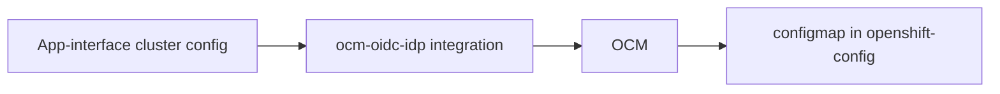
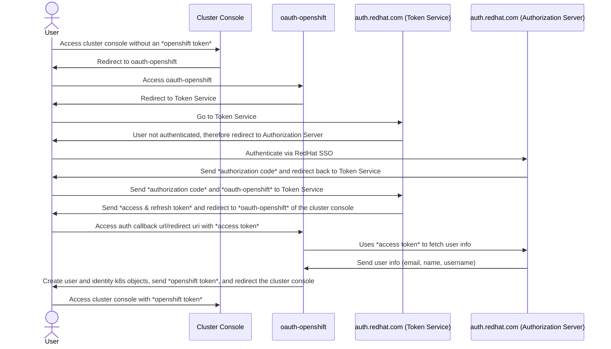
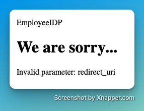

# OpenID Connect (OIDC) Identity Provider (IDP)

This SOP describes all critical information about OpenShift cluster logins via OpenID Connect (OIDC), primarily via auth.redhat.com as an identity provider (IDP).

**Table of contents:**

[toc]

## Architecture

### ocm-oidc-idp integration

The ocm-oidc-idp integration configures the OpenShift cluster to use auth.redhat.com as an OIDC IDP. The integration takes the `cluster-1.yml#auth` section in app-interface (e.g., [appsres03ue1](https://gitlab.cee.redhat.com/service/app-interface/-/blob/master/data/openshift/appsres03ue1/cluster.yml#L17)).




See [Configuring an OpenID Connect identity provider](https://docs.openshift.com/container-platform/4.11/authentication/identity_providers/configuring-oidc-identity-provider.html) what OCM configures under the hood.

### Cluster login flow via OIDC for an unauthenticated user



## How to order a SSO client (profile)?

You can find the official **Identity & Access management** documentation in [the source](https://source.redhat.com/groups/public/identity-access-management/identity__access_management_wiki/how_to_get_sso_for_your_application_or_vendor).

Order a new SSO auth.redhat.com client via a [ServiceNow ticket](https://redhat.service-now.com/help?id=sc_cat_item&sys_id=33995e691b4809587f9bfc8f034bcb2e) and fill out the following fields:

* **Is this SSO enablement for a vendor?:** No
* **Please select the Application Name**: App-SRE Auth
* **Business Owner**: Maor Friedman
* **Authentication initial URL**: https://console-openshift-console.apps.XXX.openshiftapps.com
* **Technical Point-of-Contact**: Your Name
* **Client ID / Entity ID**: app-sre-cluster-CLUSTER_NAME
* **Primary Identifier Key**: Username
* **User Attributes**: name (first name + last name), email, preferred_username
* **Vendor Documentation**: https://docs.openshift.com/container-platform/4.11/authentication/identity_providers/configuring-oidc-identity-provider.html
* **SSO Protocol**: OIDC (OpenID Connect)
* **What environments are you interested in using for SSO**: Production
* **Flow Used**: Authorization Code
* **Access Type**: public
* **Redirect URLs?**: https://oauth-openshift.apps.XXX.p1.openshiftapps.com/oauth2callback/redhat-app-sre-auth

This manual task will be replaced by the [dynamic client registration feature](https://issues.redhat.com/browse/ITIAM-4261) in the future.

## Common issues

### Missing email, name, or username

Login with your user on the CLI (`oc`) and verify your user identity:

```bash
$ oc login ...
$ oc whoami
USERNAME

$ oc get user USERNAME -ojson | jq '.identities'
[
  "redhat-app-sre-auth:XXXX"
]

$ oc get identity "redhat-app-sre-auth:XXXX" -oyaml
apiVersion: user.openshift.io/v1
extra:
  email: cassing@redhat.com
  name: Christian Assing
  preferred_username: cassing
kind: Identity
metadata:
  creationTimestamp: "2022-11-21T07:44:04Z"
  name: redhat-app-sre-auth:6e9e2cd0-8562-4373-95ca-b72b763d36c3
  resourceVersion: "465655741"
  uid: 857f9365-f89f-441e-8942-ef06837d6f2e
providerName: redhat-app-sre-auth
providerUserName: 6e9e2cd0-8562-4373-95ca-b72b763d36c3
user:
  name: cassing
  uid: 20928f3b-8a92-4f5b-a390-0ae482f77094
```

To debug issues with the OIDC claims (user attributes), first, you must increase the log level of the `oauth-openshift` service in the `openshift-authentication` namespace. The `authentications` openshift operator manages this deployment.

> :warning: Cluster admin permissions required
>
> Obtain cluster admin permissions via [OCM](https://console.redhat.com).

```bash
$ oc project openshift-authentication
$ oc patch authentications.operator.openshift.io/cluster --type=merge -p '{"spec": {"logLevel": "TraceAll"}}'
```

Verify that all user attributes (claims) are available:

```bash
$ oc project openshift-authentication
# try a login via webui
$ stern --tail 10 oauth -i claim
oauth-openshift-699d95964b-gzdz4 oauth-openshift I0112 10:22:17.306003       1 openid.go:195] openid claims:
map[string]interface {}{
    "acr":"1",
    "aud":"app-sre-cluster-appint-ex-01",
    "auth_time":1.673518936e+09,
    "azp":"app-sre-cluster-appint-ex-01",
    "cn":"Christian Assing",
    "displayName":"Christian",
    "email":"cassing@redhat.com",
    "email_verified":false,
    "exp":1.673519237e+09,
    "family_name":"Assing",
    "given_name":"Christian",
    "iat":1.673518937e+09,
    "iss":"https://auth.stage.redhat.com/auth/realms/EmployeeIDP",
    "jti":"...",
    "name":"Christian Assing",
    "preferred_username":"cassing",
    "session_state":"...",
    "sub":"...",
    "typ":"ID",
    "username":"cassing"}
```
`email`, `name`, `preferred_username` are the default claim names required by the `ocm-oidc-idp` integration (see [cluster-1.yml](https://github.com/app-sre/qontract-schemas/blob/main/schemas/openshift/cluster-1.yml#L83) how to configure them)

### WebUI login fails with "Invalid parameter: redirect_uri"



The error is an invalid `redirect_uri` in the SSO client (profile). The redirect URI must be the `Auth callback URL` value in the **Access control/Identity provider** tab in [OCM](https://console.redhat.com).
