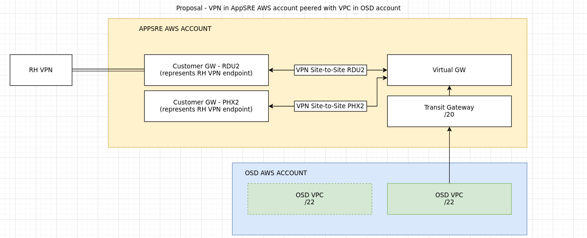

# How to setup a private & internal (behind the VPN) OSD cluster

## Background

As part of an ongoing effort to derisk ci-int, we are migrating workloads to an internal OSD cluster (connected to the RedHat VPN). This SOP explains how to set up such a cluster.

## Purpose

This SOP relies on information gathered in [OSD Setup Guide for Internal Workload Clusters](https://docs.google.com/document/d/1g4grYZJRNcIiObC3QdUTnGtJGSHN51keX4D_5P1QVUE).

Design diagram:

source: https://app.diagrams.net/#G1Q-vXyYAhdDksZiIqZnRFBQjTYefrGkWH

Previous work that resulted in this SOP:
- https://issues.redhat.com/browse/APPSRE-3026
- https://issues.redhat.com/browse/APPSRE-3261
- https://projects.engineering.redhat.com/browse/NET-1249
- https://projects.engineering.redhat.com/browse/NET-1292

## Process

### Adding firewall rules

1. If you need to access additional ports you can create a ticket for internal targets here: https://netsec.corp.redhat.com/
2. This site also provides a simulation, that let's you verify if a firewall change is required.
3. In order to create a new rule use the "ACL Ticket Form", you need the application codes:
   * Main Application Code: OSIO-002
   * Soure: OSIO-002
   * Destination: ASRE-001
4. Example ticket: https://redhat.service-now.com/help?id=rh_ticket&table=sc_req_item&sys_id=7b798c60db71c954c4db45e8139619ca

### VPN setup - one time

1. Open a ServiceNow ticket with IT Operations to be assigned a CIDR block in which OSD clusters will be provisioned.
    * Example: https://redhat.service-now.com/surl.do?n=RITM0870263
1. The CIDR block that was assigned for AppSRE is `10.29.80.0/20`. We have broken it up to be able to provision 4 * /22 clusters:
    - 10.29.80.0/22 (10.29.80.0 - 10.29.83.255) - appsres03ue1
    - 10.29.84.0/22 (10.29.84.0 - 10.29.87.255) - appsrep05ue1
    - 10.29.88.0/22 (10.29.88.0 - 10.29.91.255) - unused
    - 10.29.92.0/22 (10.29.92.0 - 10.29.95.255) - unused
1. Create a Transit Gateway, Customer Gateways, Site-to-site connections and more AWS resources as required.
    * Note: already implemented in https://gitlab.cee.redhat.com/app-sre/infra/-/tree/master/terraform/app-sre/app-sre-ci
    * AWS docs: https://docs.aws.amazon.com/vpc/latest/tgw/tgw-vpn-attachments.html#create-vpn-attachment
    * OSD docs: https://docs.openshift.com/dedicated/4/cloud_infrastructure_access/dedicated-aws-vpn.html
    * Red Hat internal DNS servers: https://source.redhat.com/personal_blogs/internal_dns_servers
1. Download the VPN configurations in Juniper SRX format and provide them to IT Operations.

### OSD cluster setup

1. Follow the [cluster onboarding SOP](/docs/app-sre/sop/app-interface-onboard-cluster.md) to create a cluster.
    * Note: the cluster should be private _and_ internal
    * Note: use one of the unused CIDR blocks mentioned in the VPN section above
1. Once the cluster is created, add a `peering` section with the `account-tgw` provider to create all required attachments to the Transit Gateway created in the VPN setup (depends on an `awsInfrastructureAccess` section already merged).
    * Example: https://gitlab.cee.redhat.com/service/app-interface/-/blob/c6738f53b71748f1accd72aa31f0fc84aa09f4a8/data/openshift/appsrep05ue1/cluster.yml#L62-71
    * Docs: https://gitlab.cee.redhat.com/service/app-interface/-/blob/master/docs/app-sre/sop/app-interface-tgw-attachments.md
1. Update the DNS operator to add routing to internal Red Hat resources (`openshift-dns` namespace file).
    * Example: https://gitlab.cee.redhat.com/service/app-interface/-/blob/c6738f53b71748f1accd72aa31f0fc84aa09f4a8/data/openshift/appsrep05ue1/namespaces/openshift-dns.yaml
    * OSD docs: https://docs.openshift.com/dedicated/4/networking/dns-operator.html

That's it! We now have a private OSD cluster that can reach the Red Hat VPN!
