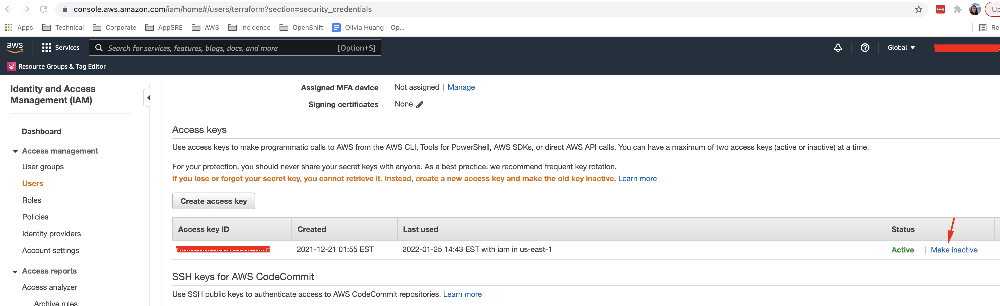
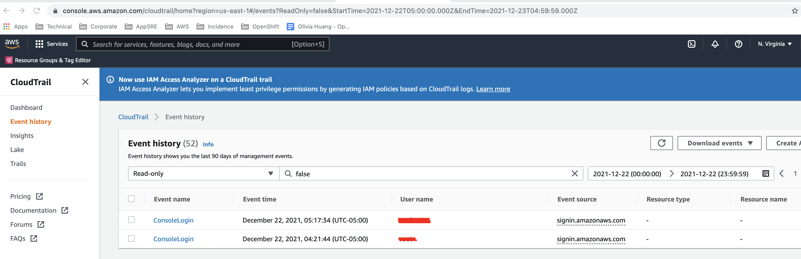
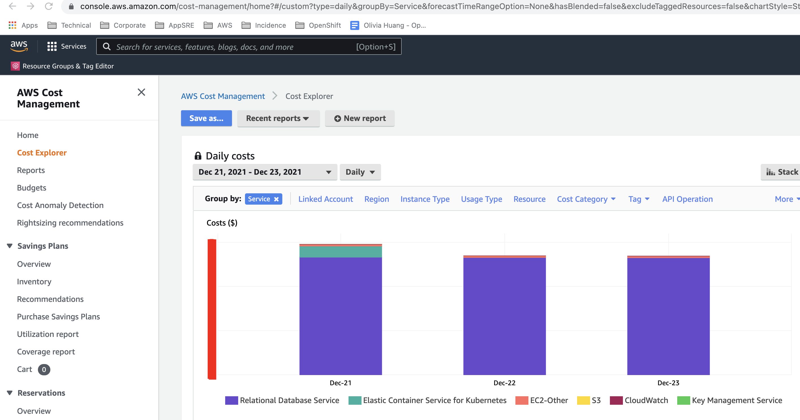

[toc]

# When an AWS Access Key is Exposed

Since the chance of malicious behavior happening increases very fast as every moment passes when a key is exposed on the internet, the action of deactivating/deleting the leaked key should be one of the first things that happens. However, even though the below steps are numbered by priority, it is not mandatory that they are performed in the exact sequence, for example, feel free to involve InfoSec or create a Slack channel before you check unsanctioned resources.

It is also not expected that you perform all the steps by yourself, please feel free to include AppSRE IC, on-call or any team member who is available. Contact us at [#sd-app-sre](https://coreos.slack.com/archives/CCRND57FW) slack channel.


1. Make the key inactive or delete the key: 
 
To delete exposed users' keys go here: https://console.aws.amazon.com/iam/home#security_credential.

2. Start a dedicated Slack thread or channel and request team members to join.

3. Identify the unsanctioned access and delete it: Check CloudTrail logs for unsanctioned activity such as the creation of unauthorized IAM users, access keys, login profiles, policies, roles or temporary security credentials.  Please keep in mind that unauthorized activity can occur in any region. You can revoke temporary credentials by following instructions outlined here: https://docs.aws.amazon.com/IAM/latest/UserGuide/id_credentials_temp_control-access_disable-perms.html#denying-access-to-credentials-by-issue-time.
  

4. Identify the unsanctioned resources and delete them: Check CloudTrail logs to review your AWS account for any unauthorized AWS usage, such as unauthorized EC2 instances, Lambda functions or EC2 Spot bids. 
You can also use the [AWS billing dashboard](https://console.aws.amazon.com/billing/home#/bill) and cost explorer to find out if there is a spike in specific service cost after the exposure of the key.
Contact Alexey Shvarev <ashvarev@redhat.com>, Guillaume Pont <gpont@redhat.com> or Jonathan Beakley <jbeakley@redhat.com> if you need help with getting access to billing.
  

5. Involve InfoSec and SD SRE Security team: Send an email to infosec@redhat.com and sd-sre-security@redhat.com explaining the situation . You can use this [Email template](../boilerplates/security-compromised-aws-key-email-template.txt). This will result in a SNOW ticket to be created.

6. Discuss with InfoSec: Evaluate the situation, and delete the AWS account if necessary.
 
7. Cosmetic cleanup (optional): If the leak happened in GitHub and InfoSec requested this, you might need to clean up the commit history, this [post](https://docs.github.com/en/authentication/keeping-your-account-and-data-secure/removing-sensitive-data-from-a-repository) can be helpful. If you still see web pages containing the commit despite the commit being removed, contact [GitHub support](https://support.github.com/contact) to request them to perform a garbage collection to clean the cache.

For further information, please reference:
 * [Service Delivery Organizational Guideline](https://source.redhat.com/groups/public/openshiftplatformsre/wiki/security_osdv4_security_practices)
 * [AppSRE Generic Incident Process](https://gitlab.cee.redhat.com/service/app-interface/blob/master/docs/app-sre/incident-process.md)

# Digging through CloudTrail events using AWS CLI

It may be more user friendly to sift through CloudTrail Events using terminal utilities such as grep, awk, jq

Here are some readymade commands to help find what we're looking for

```shell
# Login to AWS or use the --profile option to use local credentials

# Extract all events between --start-time and --end-time as json
# Timestamps can be of various formats, but YYYY-MM-DD HH:MM:SSZ works and specifies UTC
# We also filter by Access Key ID (option --lookup-attributes can be omitted or changed as desired)
# Output will be written to trail.json
aws --profile some-account --region us-east-1 cloudtrail lookup-events \
  --start-time "2022-08-09 15:30:00Z" \
  --end-time "2022-08-09 15:35:00Z" \
  --lookup-attributes AttributeKey=AccessKeyId,AttributeValue=AWS_ACCESS_KEY \
  --output json \
  | tee trail.json

# How many events did we extract?
$ jq '.Events | length' trail.json
5825

# Filter interesting fields
$ jq -r '.Events[].CloudTrailEvent | fromjson | [.eventTime, .userIdentity.accessKeyId, .eventSource, .eventName, .sourceIPAddress, .userAgent] | @tsv' trail.json

# Find all unique IP addresses (and count them)
$ jq -r '.Events[].CloudTrailEvent | fromjson | .sourceIPAddress' trail.json | sort | uniq -c | sort -nr

# Find all events for a specific IP
$ jq -r '.Events[].CloudTrailEvent | fromjson | select(.sourceIPAddress == "10.113.158.42") | [.eventTime, .userIdentity.accessKeyId, .eventSource, .eventName, .sourceIPAddress, .userAgent] | @tsv' trail.json

# Find all unique userAgents
$ jq -r '.Events[].CloudTrailEvent | fromjson | .userAgent' trail.json | sort | uniq -c | sort -nr

# Find specific AWS events (ex: ListBuckets)
$ jq -r '.Events[].CloudTrailEvent | fromjson | select(.eventName == "ListBuckets") | [.eventTime, .userIdentity.accessKeyId, .eventSource, .eventName, .sourceIPAddress, .userAgent] | @tsv' trail.json
```
