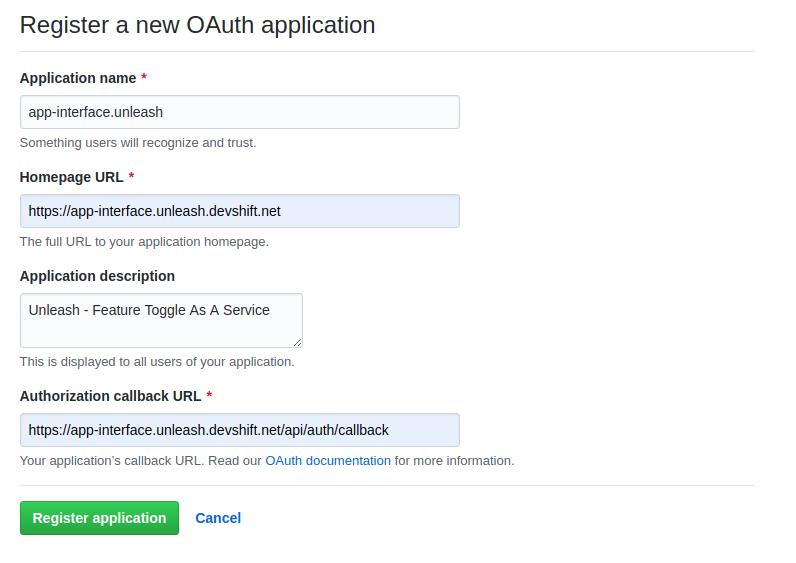

# Unleash Deployment

This document describes how to deploy the requested
[Unleash](https://github.com/app-sre/unleash) instance using App Interface.

Tenants will request an instance of Unleash according to:
[https://gitlab.cee.redhat.com/service/dev-guidelines/blob/master/unleash.md]()

## Architecture

Unleash is deployed as a regular Service/Deployment to the `unleash` Namespace
in the OpenShift Cluster. It consumes three Secrets:

- [Configuration Secret](#configuration-secret)
- [Database Access Secret](#database)
- [Client Access Token Secret](#client-access-token-secret)


Clients can access Unleash using the Web UI, that authenticates users against
Github (validating the Organization and the Team) or via client API, using the
Client Access Token.

## Naming Conventions

Considering that the Unleash instance will be created in the `unleash`
Namespace and for a given application, the naming convention used throughout
this document will always relate the Unleash instance to the application. Some
examples:

- `path: <secret>/unleash/<application-name>-config`
- `output_resource_name: <application-name>-unleash-rds`
- `path: <secret>/unleash/<application-name>-token`

This convention allows the Unleash Namespace for given Cluster to have
multiple Unleash instances, each serving different applications running on the
same Cluster.

Similarly, the URL for the Unleash instance will be:

```
https://<application-name>.unleash.devshift.net
```

## Github Configuration

Create a new Github OAuth application:
[https://github.com/settings/applications/new]() and fill the details of the
new Unleash application. Example:



**NOTE:** The `Authorization callback URL` is always the instance URL followed
by `/api/auth/callback`.

After clicking `Register application`, you will be given the `Client ID`
and the `Client Secret`. Those values will be placed in the
[Configuration Secret](#configuration-secret) described ahead.

## Github Org/Team

Users will be given access to the Unleash instance via Github ORG/TEAM.

For that, create a new `<application-name>.yml` file in the `unleash`
[permissions directory](https://gitlab.cee.redhat.com/service/app-interface/tree/master/data/dependencies/unleash/permissions),
containing:

```yaml
---
$schema: /access/permission-1.yml

labels: {}

name: <application-name>-unleash
description: <application-name> unleash instance access

service: github-org-team
org: app-sre
team: <application-name>-unleash
```

And add that permission to the proper team `role` (tenants are expected to
inform the team/users in the JIRA ticket).

## Namespace

All Unleash instances are deployed to a dedicated `unleash` namespace. The
Cluster will be chosen by the AppSRE Team, according to application consuming
the instance.

The `app-sre-prod-01` already has an `unleash` Namespace. If you're going to
create the new Unleash instance in that Namespace, you can skip this section.

To create the Unleash namespace in a given Cluster, add the Namespace
manifest `<cluster-name>.yml` to the namespaces directory of the
Unleash service:
[https://gitlab.cee.redhat.com/service/app-interface/tree/master/data/services/unleash/namespaces]()

The Namespace manifest will initially contain:

```yaml
---
$schema: /openshift/namespace-1.yml

labels: {}

name: unleash
description: namespace for unleash

cluster:
  $ref: /openshift/<cluster>/cluster.yml

app:
  $ref: /services/unleash/app.yml

managedTerraformResources: true

managedResourceTypes:
- Route
- Secret
```

Replace `<cluster>` with the directory to the cluster configuration.

**NOTE:** More settings will be included to this Namespace in the next
sections.

## Configuration Secret

The Unleash instance expects an OpenShift Secret in the Namespace containing:

- `GH_CLIENT_ID`: The Github client ID, acquired from the OAuth application
  registration (see the [Github Configuration](#github-configuration) section
  for details).
- `GH_CLIENT_SECRET`: The Github client secret, acquired from the OAuth
  application registration (see the "Github Configuration" section for
  details).
- `GH_CALLBACK_URL`: The Unleash callback page -
  https://<unleash-instance-domain>/api/auth/callback
- `ADMIN_ACCESS_TOKEN`: The Bearer token to access the Unleash Admin API
  directly. We recommend using the bash command `uuidgen` to generate the
  token.
- `SESSION_SECRET`: The secret to secure the client session. We recommend
  using the bash command `uuidgen` to generate the secret.

Go to [https://vault.devshift.net/ui/vault/secrets/app-sre/list/unleash/]()
and create a secret called `<application-name>-config`.

Then add it to the Namespace:

```yaml
openshiftResources:
...
- provider: vault-secret
  path: app-sre/unleash/<application-name>-config
```

## Database

Each instance of Unleash requires an independent PostgreSQL Database. To create
one, add this section to the Unleash Namespace:

```yaml
terraformResources:
...
- provider: rds
  account: <aws-account>
  identifier: <unique-rds-identifier>
  defaults: /terraform/resources/unleash/rds-1.yml
  output_resource_name: <application-name>-unleash-rds
```

## Client Access Token Secret

This secret contains:

- `CLIENT_ACCESS_TOKEN`: The Bearer token to access the Unleash Client API
  directly. We recommend using the bash command `uuidgen` to generate the
  token.

Go to [https://vault.devshift.net/ui/vault/secrets/app-sre/list/unleash/]()
and create a secret called `<application-name>-token`.

The secret will be exposed both to the Unleash Namespace and to the tenants
application Namespace (tenants are expected to inform the application Namespace
in the JIRA ticket):

```yaml
openshiftResources:
...
- provider: vault-secret
  path: app-sre/unleash/<application-name>-token
```

**IMPORTANT:** Make sure to add the `vault-secret` resource also to the
Namespace of the application consuming the Unleash instance.

## Route

Expose the Unleash instance with an OpenShift Route and add the `route`
resource to the Unleash Namespace:

```yaml
openshiftResources:
...
- provider: route
  path: /<cluster>/unleash/<application-name>.route.yaml
```

The `host` value of the `Route` spec shall be
`<application-name>.unleash.devshift.net`. You have to arrange to get that
sub-domain created.

Route example:
[https://gitlab.cee.redhat.com/service/app-interface/blob/master/resources/app-sre/unleash/app-interface.route.yaml]()

## Deployment

To deploy Unleash to the Namespace, add a target to the `resourceTemplates`
section in the
[Unleash SaaS file](https://gitlab.cee.redhat.com/service/app-interface/blob/master/data/services/unleash/cicd/saas.yaml):

```yaml
resourceTemplates:
- name: unleash
  url: https://github.com/app-sre/unleash
  path: /openshift/unleash.yaml
  hash_length: 7
  targets:
  ...
  ...
  - namespace:
      $ref: /services/unleash/namespaces/<application-name>-unleash.yml
    hash: <commit-hash>
    parameters:
      identifier: <application-name>
      configSecret: <application-name>-config
      databaseSecret: <application-name>-unleash-rds
      tokenSecret: <application-name>-token
      org: <github-org>
      team: <github-team>

```

That will create the Unleash Deployment and Service in the Namespace using the
Unleash version pin-pointed by the `<commit-hash>`.

Parameters:
- `identifier`: The application name, used to name the Deployment and the
  Service.
- `configSecret`: The configuration secret name as defined in the
  [Configuration Secret](#configuration-secret) section.
- `databaseSecret`: The `output_resource_name` as defined in the
  [Database](#database) section.
- `tokenSecret`: The token secret name as defined in the
  [Client Access Token Secret](#client-access-token-secret) section.
- `org`: The Github Organization that the Web UI users have to be member of in
  order to access this Unleash instance, as defined in the
  [Github Org/Team](#github-org/Team) section.
- `team`: The Github Team that the Web UI users have to be member of in order
  to access this Unleash instance, as defined in the
  [Github Org/Team](#github-org/Team) section.
