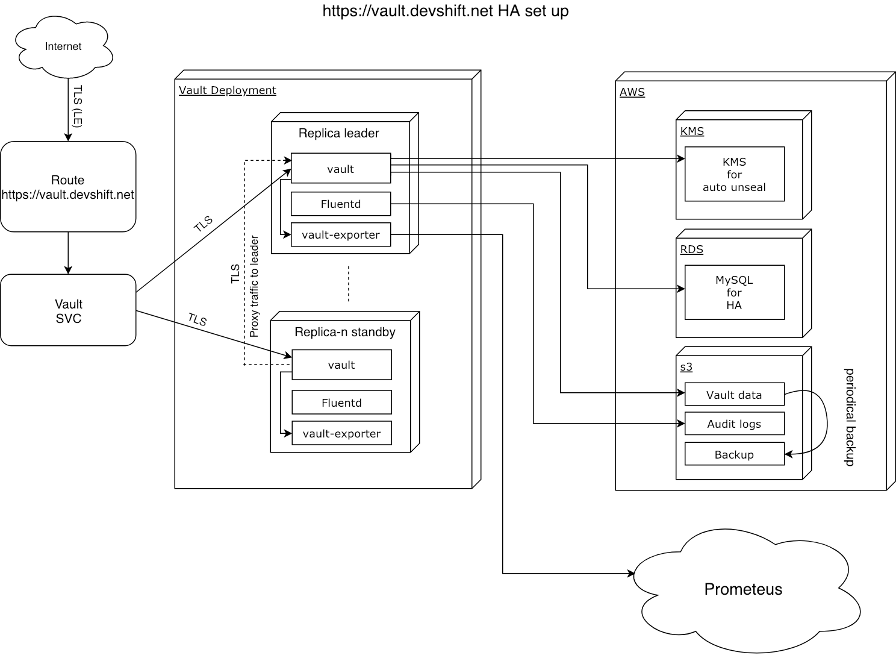

# vault.devshift.net
https://vault.devshift.net is deployed on [app-sre](<https://console.app-sre.openshift.com/console/project/vault-prod/>) cluster<br>
[vault openshift template](<https://gitlab.cee.redhat.com/service/vault-devshift-net/blob/master/openshift-vault.yaml>)<br>
[vault saas repo](<https://gitlab.cee.redhat.com/service/saas-vault-devshift-net>)<br>

It is registered in CMDB as [ASRE05](https://redhat.service-now.com/nav_to.do?uri=%2Fsc_req_item.do%3Fsys_id%3D2fc2cdbedbc30110c31ec7a6059619c7%26sysparm_stack%3Dsc_req_item_list.do%3Fsysparm_query%3Dactive%3Dtrue).

## vault.devshift.net architecture


Vault buckets names:
- prod:
  - app-sre-vault-prod (main storage bucket)
  - app-sre-vault-audit-prod (audit bucket)
  - app-sre-vault-backup-prod (backup bucket)
- stage:
  - app-sre-vault-stage (main storage bucket)
  - app-sre-vault-audit-stage (audit bucket)
  - app-sre-vault-backup-stage (backup bucket)

## Vault seal/unseal
https://vault.devshift.net is using auto-unseal feature with [AWS KMS](<https://aws.amazon.com/kms/>)<br>
[vault auto-unseal config ref](<https://gitlab.cee.redhat.com/service/vault-devshift-net/blob/master/openshift-vault.yaml#L167-172>)

## Vault HA storage
https://vault.devshift.net is using MySQL DB as HA storage deployed on [AWS RDS](<https://aws.amazon.com/rds>)<br>
[vault HA storage config ref](<https://gitlab.cee.redhat.com/service/vault-devshift-net/blob/master/openshift-vault.yaml#L155-161>)<br>
[Vault MySQL storage backend docs](<https://www.vaultproject.io/docs/configuration/storage/mysql.html>)<br>
Note that MySQL will only store HA related resources, likes locks, etc, but no Vault secret data, that is stored in S3 as explained in the following section.

## Vault storage
https://vault.devshift.net is using [AWS S3](<https://aws.amazon.com/s3>) bucket for as a storage backend<br>
[vault storage config ref](<https://gitlab.cee.redhat.com/service/vault-devshift-net/blob/master/openshift-vault.yaml#L149-154>)<br>
[Vault S3 storage backend docs](<https://www.vaultproject.io/docs/configuration/storage/s3.html>)

## Vault audit logs
Vault is very strict to audit logs and to make sure that every transaction is logged vault will fail transaction if writting audit entry is failed,
that is why we've decided to not use kibana or any other syslog backends and write audit logs to the local file and then use [fluentd](<https://github.com/fluent/fluentd>) to persist logs on aws s3 bucket in background.<br>
Every https://vault.devshift.net pod replica running [fluentd](<https://github.com/fluent/fluentd>) container that persists vault audit logs from mounted volume to s3 bucket.<br>
[fluentd config ref](<https://gitlab.cee.redhat.com/service/vault-devshift-net/blob/master/openshift-vault.yaml#L178-206>)<br>

## Vault Backup
Despite the fact that AWS S3 storage backend has very high durability we still want to have periodical backups to be able to restore/rollback vault data that might be deleted by accident.
So Vault backups are managed with simple openshift cronjob that simply sync every `12h` state of vault s3 storage bucket to another s3 bucket for backups in separate folder structured by dates.<br>
[vault backup cronjob config ref](<https://gitlab.cee.redhat.com/service/vault-devshift-net/blob/master/openshift-vault.yaml#L314-362>)

## Restore Vault backup
Restoring vault from backup is very simple operation since we are using s3 bucket as storage backend, all we need to do is sync desired version from backup bucket to the actual storage bucket.
ex: `aws s3 --profile vault-prod sync s3://app-sre-vault-backup-prod/backup/vault/2019/02/01/12-00/ s3://app-sre-vault-prod`

since `aws s3 sync` will only copy newer files, if changes were made in Vault since the backup was taken, these changes should be safe during restore. This can be very good or very bad, depending on the changes that were made.

To restore Vault from scratch:
1. Scale Vault to 0 replicas.
2. Delete the contents of the backend storage S3 bucket.
3. Restore the contents according to the above instructions.
4. Scale Vault to previous number of replicas.
5. You may need to logout of Vault and login again.

## Upgrade vault
To upgrade Vault version please submit MR against [saas-vault-devshift-net](<https://gitlab.cee.redhat.com/service/saas-vault-devshift-net/blob/master/vault-devshift-net-services/vault-devshift-net.yaml#L16>)<br>

#### Upgrade process

1. Check upgrade recommendations in https://www.vaultproject.io/docs/upgrading/index.html.
2. Upgrade the stage instance
3. Validate that the following works as expected (or make required modifications):
    - vault-manager integration (use `dry-run`)
    - slack-usergroups integration (make sure required secrets exists in the stage instance, use `dry-run`)
    - sample Jenkins job which accesses a secret in Vault (modify the Vault url field and execute manually)
4. Announce upgrade at least 2 days in advance (sd-org, devtools-saas)
5. Backup the prod instance
6. Upgrade the prod instance
7. Repeat step 3

## Vault configuration automation with app-interface and vault-manager
vault.devshift.net is entirely managed via [app-interface](https://gitlab.cee.redhat.com/service/app-interface/blob/master/README.md#manage-vault-configurations-via-app-interface) using [vault-manager](https://github.com/app-sre/vault-manager) reconcile tool.

## Vault monitoring
Every https://vault.devshift.net pod replica running [vault-exporter](<https://github.com/app-sre/vault-exporter>) container that exposes vault healt metrics in prometheus format.<br>
[vault-exporter config ref](<https://gitlab.cee.redhat.com/service/vault-devshift-net/blob/master/openshift-vault.yaml#L264-282>)<br>
[vault prom alerting rules](<https://gitlab.cee.redhat.com/service/vault-devshift-net/blob/master/alerts.yaml>)<br>

Also vault.devshift.net is monitored by [zabbix](https://zabbix.devshift.net:9443/zabbix/latest.php?fullscreen=0&hostids%5B%5D=14442&hostids%5B%5D=15078&application=&select=&filter_set=Filter)

## SSL certs for vault stage and prod
We have deployed ACME instance for both stage and prod vault projects so SSL certs are generated automatically.<br>
For more info please read https://github.com/tnozicka/openshift-acme/tree/master/deploy/letsencrypt-live/single-namespace

## Vault failover to another cluster
In case of major cluster outage vault could be relocated to another cluster in order to restore service. Here is a list of actions that should be performed:<br>
1. create a namespace on new cluster `oc new-project vault-prod`
1. select vault project `oc project vault-prod`
1. create vault resources from vault-locker:
    - check out https://gitlab.cee.redhat.com/app-sre/vault-locker
    - apply the following resources from https://gitlab.cee.redhat.com/app-sre/vault-locker/-/tree/master/vault/DR:
        - vault-prod.route.yaml
        - vault-tls.secret.yaml
        - vault.secret.yaml
1. setup a local copy of app-interface:
    - clone the app-interface git repository: `git clone https://gitlab.cee.redhat.com/service/app-interface`
    - update data/app-interface/app-interface-settings.yml from `vault: true` to `vault: false`
        * this will make your local app-interface able to run without getting information from vault
    - create a directory called `config` in the root of the repository.
    - from the vault-locker repository, get the qr-config.vault-dr.toml file: `./show.sh vault/DR/qr-config.vault-dr.toml.gpg`
    - place the file in the `config` directory.
        * if deploying vault to a different cluster:
            - update the cluster reference to the new cluster in the vault namespace file:
              ```yaml
              cluster:
                $ref: /openshift/<cluster_name>/cluster.yml
              ```
            - if missing, add the `[app-sre.creds.kube-configs.<cluster_name]` section with a `token` key containing the app-sre-bot's SA token (the token is obtained by logging into the cluster and executing `oc -n dedicated-admin sa get-token app-sre-bot`).
    - in app-interface run `make server`.
1. deploy vault and openshift-acme:
    * run the following command:
    ```shell
    docker run --rm \
        --network host \
        -v $PWD/config:/config:z \
        quay.io/app-sre/qontract-reconcile:latest \
        qontract-reconcile --config /config/qr-config.vault-dr.toml \
        openshift-saas-deploy \
        --saas-file-name saas-vault \
        --env-name App-SRE-production
    ```
        * Note: the `config` directory is the one containing `qr-config.vault-dr.toml`.

1. switch DNS to the new cluster lb https://gitlab.cee.redhat.com/dtsd/housekeeping/blob/master/dns/devshift.net.zonefile.txt#L35 ask @pbergene or @jchevret

## Using Vault from Ansible
We can store secrets in Vault, and consume them from Ansible. The interface between Ansible and Vault is implemented by this module:
https://docs.ansible.com/ansible/2.5/plugins/lookup/hashi_vault.html

See an example [here](https://gitlab.cee.redhat.com/dtsd/housekeeping/blob/cd5ea5c39ea1d90ebcf26e138564844a01b1d9b1/ansible/hosts/host_vars/ci.int.devshift.net#L13):

```yaml
duplicity_gpg_id: "{{ lookup('hashi_vault','secret=app-sre/ansible/host_vars/ci.int.devshift.net:duplicity_gpg_id auth_method=approle')}}"
```

In order to be able to use this you require:

1. `pip install hvac`
2. Export the following vars: `VAULT_ROLE_ID`, `VAULT_SECRET_ID`, and `VAULT_ADDR` which can be obtained from the [env](https://vault.devshift.net/ui/vault/secrets/app-sre/show/creds/ansible-reader-role-creds) here.

Note: Python can only see these variables if you `export VAULT_SECRET_ID` in your bashrc or similar.

If you see errors related to hvac not found, try installing ansible from ansible.com instead. There are known problems with Fedora 30 and ansible in modular repos

That Vault approle has access to anything under `app-sre/ansible`. A good practice to follow is to mimic the Ansible file structure, so you can use `host_vars`, etc.

# Vault User Guide
## Initial Login
- Login to GitHub
- Go to Settings
- Go to Developer Settings
- Create [Personal Account Token](https://help.github.com/articles/creating-a-personal-access-token-for-the-command-line/), with org:read access
- Copy access token
- Browse to https://vault.devshift.net/ui/vault/auth?with=github
- Apply token
## Set up CLI
- Download Vault CLI https://www.vaultproject.io/downloads.html and unzip to a binath path
- Set env var: export VAULT_ADDR="https://vault.devshift.net/"
- Login: vault login -method=github using your github access token
- Test listing key names: vault list devtools-osio-ci
## Set a secret
vault kv put foopath1/foopath2/fooname @data.json
or
echo -n "asecret" | vault kv put foopath1/foopath2/fooname value=-
or
echo -n '{"value":"asecret"}' | vault kv put foopath1/fooname -
## Get a secret
vault kv get foopath1/foopath2/fooname

## Login to Vault when GitHub is down
We use GitHub as the authentication method for Vault for user access.  Different automations use the AppRole authentication method, so if GitHub is down - they are not affected.

As an App SRE team member, if you urgently require to login to Vault while GitHub is down, follow these steps:

1. Clone the vault-locker repository:
```
$ git clone git@gitlab.cee.redhat.com:app-sre/vault-locker.git && cd vault-locker
```
2. Decrypt the App SRE backup credentials file:
```
$ ./show.sh vault/app-sre-backup-creds.json.gpg
```
3. Login to Vault using these credentials:
```
$ export VAULT_ADDR=https://vault.devshift.net
$ vault write auth/approle/login role_id=<role_id> secret_id=<secret_id>
```
4. After logging in, find the `token` key in the output. Use this token to login to Vault using the Token authentication method.

## Recycle Vault RDS password

This SOP explains the process of recycling the Vault RDS DB password.

0. Perform a backup according to the above instructions.
1. Update the Vault secret containing the Vault configuration secrets:
    - stage: https://vault.devshift.net/ui/vault/secrets/app-interface/show/app-sre-stage/vault-stage/vault
    - production: https://vault.devshift.net/ui/vault/secrets/app-interface/show/app-sre/vault-prod/vault
2. Submit a MR to app-interface to update the vault-secret to the new version:
    - stage: https://gitlab.cee.redhat.com/service/app-interface/blob/master/data/services/vault.devshift.net/namespaces/vault-stage.yml#L41
        * example: https://gitlab.cee.redhat.com/service/app-interface/merge_requests/4321
    - production: https://gitlab.cee.redhat.com/service/app-interface/blob/master/data/services/vault.devshift.net/namespaces/vault-prod.yml#L41
        * example: https://gitlab.cee.redhat.com/service/app-interface/merge_requests/4323
3. After the Secret was updated, update the password using terraform (init, plan, apply):
    - stage: https://gitlab.cee.redhat.com/app-sre/infra/tree/master/terraform/app-sre/vault-staging
    - production: https://gitlab.cee.redhat.com/app-sre/infra/tree/master/terraform/app-sre/vault-production
4. Rollout a new version of Vault:
    - stage: https://console-openshift-console.apps.app-sre-stage-0.k3s7.p1.openshiftapps.com/k8s/cluster/projects/vault-stage/workloads
    - production: https://console-openshift-console.apps.app-sre-prod-01.i7w5.p1.openshiftapps.com/k8s/cluster/projects/vault-prod/workloads

## Recycle Vault AppRole secret_id

This SOP explains the process of recycling an AppRole's secret_id.

1. Destroy the AppRole's desired secret_id: https://www.vaultproject.io/api-docs/auth/approle#destroy-approle-secret-id

Example: `vault write -f auth/approle/role/<ROLE_NAME>/secret-id/destroy secret_id="<SECRET_ID>"`

Parameters:
- `<ROLE_NAME>`: the role name as defined in App-Interface. For example: [cico_approle](https://gitlab.cee.redhat.com/service/app-interface/-/blob/ab96e5ab6b01f5a8080e772bf3a32911322b96a1/data/services/vault.devshift.net/config/roles/approles/cico_approle-approle.yml#L7).
- `<SECRET_ID>`: the secret-id. This must be retrieved from a credential in Vault.

Note: If `<SECRET_ID>` is not available, the workaround is to destroy the approle entirely (`vault delete /auth/approle/role/<ROLE_NAME>`), wait for App-Interface to recreate it (you can poll by doing `vault read auth/approle/role/<ROLE_NAME>`), and then move on to the next step.

2. Generate a new secret_id: https://www.vaultproject.io/docs/auth/approle#configuration

Example: `vault write -f auth/approle/role/<ROLE_NAME>/secret-id`.

3. Update the matching secrets in Vault.

Make sure you include: `role_id` and `secret_id`.

## Generate Emergency Root Token

This vault instance currently does not have a root token. If one is needed during an emergency, it can be generated **using seal keys**.

The process is properly documented [here](https://learn.hashicorp.com/tutorials/vault/generate-root#use-one-time-password-otp), or by running `vault operator generate-root --help`.

Example generation:

```
$ vault operator generate-root -generate-otp
<OTP_TOKEN>

$ vault operator generate-root -init -otp="<OTP_TOKEN>"
Nonce         REDACTED
Started       true
Progress      0/3
Complete      false
OTP Length    26

# Repeat this command 3 times. The command will
# prompt for a seal key. Introduce 3 different seal keys.
$ vault operator generate-root -otp="<OTP_TOKEN>"
```

On the third iteration of the last command, the output will look like:

```
$ vault operator generate-root -otp="<OTP_TOKEN>"
Operation nonce: REDACTED
Unseal Key (will be hidden):
Nonce            REDACTED
Started          true
Progress         3/3
Complete         true
Encoded Token    <ENCODED_TOKEN>
```

Next step is to decode the token:

```
$ vault operator generate-root \
  -decode=<ENCODED_TOKEN> \
  -otp=<OTP_TOKEN>
<TOKEN>
```

The token returned above is the root token that can now be used to operate vault. Simply enter it after doing: `vault login`.

**NOTE**: After the emergency, please revoke the token by running: `vault token revoke <TOKEN>`.

## Reading Audit Logs

All audit log entries are structured like the following:
`<TIMESTAMP> s3.vault.audit <JSON>`.

In the JSON structure, you will see that `.client_token` and `.accessor` are actually obfuscated. Instead of logging the actual values, it logs the salted hmac-sha256 value.

In order to obtain the salted values, it must be done using the following command:
`vault write sys/audit-hash/file input=<TOKEN>`

That will output the hmac-sha256 value which can be found in the logs. This obviously works both for the token and for the accessor.
