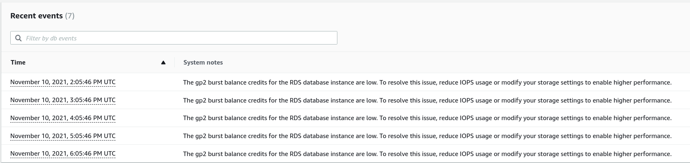

# Amazon Relational Database Service (RDS)

[TOC]

## Overview

[Relational Database Service (RDS)](https://aws.amazon.com/rds/) is a managed database offering from AWS. A number of AppSRE customers use this service to avoid the operations associated with managing your own database (backups, patching, high availability, etc.)

## SOPs

### Database Engine Upgrades

These SOPs cover database major and minor engine upgrades:

* [PostgreSQL major version upgrade](/docs/dba/postgresql-rds-instance-major-version-upgrade.md)
* [PostgreSQL minor version upgrade](/docs/aws/sop/postgresql-rds-instance-minor-version-upgrade.md)

### OS Upgrade

See [this doc](/docs/aws/sop/rds-os-upgrade.md) for applying mandatory OS upgrades in RDS, typically associated with security updates. 

## Troubleshooting

### General Resources

* [Connecting to database](/docs/dba/connect-to-postgres-mysql-database.md)
* [PostgreSQL handy queries](/docs/dba/Postgres-handy-queries.md)
* [MySQL handy queries](/docs/dba/MySQL-handy-queries.md)

### RDS Documentation

* [RDS Out of Storage (STORAGE_FULL)](https://aws.amazon.com/premiumsupport/knowledge-center/rds-out-of-storage/)

## Known issues

### High write latency without depleted burst balance

**Observations**

- High write latency (could be up to 100+ ms)
- Burst balance is not depleted (>0%)

**Summary**

Burst balance can be depleted on a single volume, or even on the Multi-AZ instance, without the burst balance metric reporting 0%.

**What to do**

If RDS events indicate burst balance is depleted:

- Open a [support ticket](#support) with AWS to investigate whether there is an issue with a specific volume, or possibly the Multi-AZ instance
- Work with the application team to find out why the write operations are happening at a higher rate than expected. Is there a background job that could be causing this? Can that job be stopped?
- Look at the baseline performance to figure out if it is regularly being exceeded, in which case the storage may need to be upgraded (IOPS baseline performance is based on storage capacity).

**Explanation**

The write latency metric in RDS is associated with the average time it takes to perform disk I/O operations. This is often elevated when the IOPS that are provisioned for the database are insufficient. If this is the case, you'll often see an elevated disk queue depth too (rough rule of thumb is >1 queue length for every 1000 IOPS).

AppSRE tenants commonly use `gp2` storage, which has a burst balance (see [short blog post](https://aws.amazon.com/es/blogs/database/understanding-burst-vs-baseline-performance-with-amazon-rds-and-gp2/) or [longer docs](https://docs.aws.amazon.com/AmazonRDS/latest/UserGuide/CHAP_Storage.html#CHAP_Storage.IO.Credits) for more info). There is an associated metric that indicates what percentage of the burst balance is available. This typically hovers around 100% if the storage has been provisioned properly.

During one outage, [APPSRE-4027](https://issues.redhat.com/browse/APPSRE-4027), the write latency metric increased 7-8x (over 100ms) **despite burst balance never dropping below 96% burst balance availability**. AWS support indicated that in this case the burst balance was depleted on a single volume on the multi-az instance. This is worth noting because if we relied on burst balance metrics alone, it would seem that it wasn't a burst balance issue.

What we can do in this scenario is check the recent events on the database. See the screenshot below:



**More information**

At the time that this entry is being added, we haven't heard back from AWS with respect to the root cause of this issue. See the information below for follow-up.

Internal ticket: [APPSRE-4036](https://issues.redhat.com/browse/APPSRE-4036) \
Account: insights-prod\
Case id: 9183343311

### Errors when applying storage updates

When a tenant increases the size of their RDS storage via the `allocated_storage` setting, an error similar to what is seen below might appear:

```
[terraform-resources] [some-aws-account - apply] Error: Error modifying DB Instance some-database: InvalidParameterCombination: Invalid storage size for engine name postgres and storage type gp2: 6490
```

Or if the tenant is using storage autoscaling and changed `max_allocated_storage`, you might see this instead:

```
[terraform-resources] [some-aws-account - apply] Error: Error modifying DB Instance some-database: InvalidParameterCombination: Invalid max storage size for engine name postgres and storage type gp2: 6500
```

These error messages are a bit vague, but there are a few things that you can check:

1. **[If storage autoscaling is disabled]**: Changes to `allocated_storage` [must be >= 10% larger](https://docs.aws.amazon.com/AmazonRDS/latest/UserGuide/USER_PIOPS.StorageTypes.html#USER_PIOPS.ModifyingExisting) than the current `allocated_storage` in app-interface.
2. **[If storage autoscaling is enabled]**: Changes to `allocated_storage` should be avoided because they're unnecessary. When changing `max_allocated_storage`, it must be increased by >= 10% of the current `AllocatedStorage` value **as reported by the AWS API**, for example as returned by: `aws --profile ACCOUNT_PROFILE rds describe-db-instances --db-instance-identifier DATABASE_NAME` - note that you cannot rely on the `allocated_storage` setting in app-interface because RDS automatically updates this value when storage autoscaling is enabled. This doesn't cause issues because Terraform ignores changes to `allocated_storage` as per [their documentation](https://registry.terraform.io/providers/hashicorp/aws/latest/docs/resources/db_instance#storage-autoscaling).
3. Ensure that you have not hit the limits of storage volume sizes in RDS. There are some notable exceptions that have lower limits, usually previous generation instances. See the "DB instance class" section of [this document](https://docs.aws.amazon.com/AmazonRDS/latest/UserGuide/CHAP_Storage.html#Concepts.Storage.GeneralSSD).

## Support

Support tickets can be opened in the AWS support console of the account that the RDS instance is deployed in.
