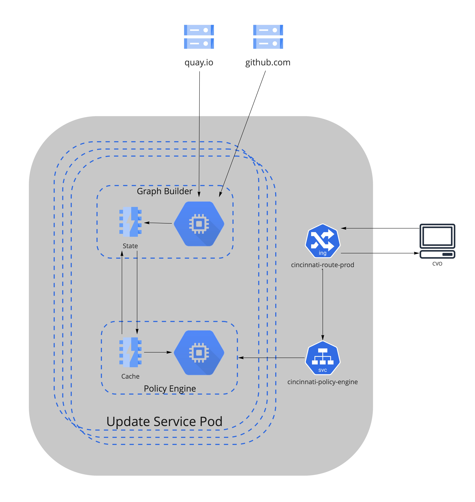

# Cininnati Architecture

## Service Description
Cincinnati is an update protocol designed to facilitate automatic updates. It describes a particular method for representing 
transitions between releases of a project and allowing a client to perform automatic updates between these releases.

Cincinnati uses a [directed acyclic graph][dag] (DAG) to represent the valid updates. Each node in the graph is a release 
payload and each edge is a valid transition.

## Components
There are a number of components that make up the Cincinnati update system. Most of these components implement a specified
interface, allowing alternate implementations of each component. An overview of each of the components is shown below in Figure 1.

<figure align="center">
  
  <figcaption>Figure 1: An overview of the relationships between the components within Cincinnati</figcaption>
</figure>

### Storage
The storage component is responsible for actually storing and hosting the release payloads. The storage implementation is
entirely up to this component and the hosting implementation will be coupled to the Graph Builder. 
Update service currently uses [quay.io] as the storage component.

### Graph Builder
The Graph Builder iterates over the release payloads hosted by the storage component and builds a DAG of the releases.
It is responsible for verifying that the graph described by the releases is acyclic and connected.

In order to avoid the Graph Builder from having to serve the full payloads, Cincinnati implementations may choose to
instead serve a modified payload which directs the client to download the full release payload directly from the storage
component. It is important to note that in these implementations, the Graph Builder should not generate these modified
payloads directly. Doing so would directly couple the Graph Builder to the client, which would make it difficult to
change the format of the modified payload in future versions while still supporting arbitrarily old clients.

There is no defined interface between the Graph Builder and storage since the Graph Builder will be specific to the
storage. There is, however, a [defined interface](#graph-api) between the Graph Builder and the Policy Engine.
This is to allow alternate implementations of the Policy Engine including the lack of an implementation altogether.

#### Removing Nodes
The process of removing nodes from the graph is not defined by Cincinnati. Instead, it is up to the implementation to
decide. For example, when using a Docker v2 Registry, a deleted node could be represented with a special label on the image.

### Policy Engine
Policy Engines are in charge of altering a client's view of the graph by applying a set of filters which are defined
within the particular Policy Engine instance. Both the input to and the output from Policy Engines is a graph, allowing
multiple Policy Engines to be chained together. The first Policy Engine in a chain will fetch its graph from the
Graph Builder and the last Policy Engine in a chain will serve the modified graph to the client.

Clients periodically query a Policy Engine for any updates they should perform. The Policy Engine uses the DAG from its
upstream source (e.g. a Graph Builder or another Policy Engine), information about the client which made the request,
and its internal policy to determine the next applicable updates for that particular client. It is up to the client to
ultimately decide which of the updates it is going to apply.

### Client
Cincinnati clients are the end consumers of the release payloads. The clients periodically query the Policy Engine for
updates and apply them if available.

## Routes
Cincinnati exposes its `/graph` and `/openapi` to public via host `ynkpvft2b33mrat.api.openshift.com`. 
Route with name `cincinnati-route-prod` is used for Production workloads and `cincinnati-route-stg` is used for
Stage workloads

## Dependencies
1. Update Service(Cincinnati) is currently hosted on `appsrep06ue2`.
2. Consumes data from `quay.io` to fetch all the releases. 
3. Edge recommendations are hosted on [github][cincinnati-graph-data].

## Service Diagram
<figure align="center">
  
  <figcaption>Figure 2: An overview of components, dependencies and network traffic for Cincinnati</figcaption>
</figure>

## Application Success Criteria
To serve update recommendations for OpenShift clusters reliably

## State 
Update Service currently depends on [quay.io] and [github.com][cincinnati-graph-data]

## Load Testing
The update service is being [load tested][cincinnati-load-testing] everytime a PR is opened in [upstream][cincinnati].

## Capacity: 
Currently, the Update Service has 2 cpu and 1.5Gb of memory for Graph Builder and 2 cpu and 2Gb of memory for Policy Engine.
The configuration can be found at [app-interface][cincinnati-app-interface]. According to estimates, the resources are 
enough for next 12 months. There might be bursts of period when more resources can be required based on the load. 

[dag]: https://en.wikipedia.org/wiki/Directed_acyclic_graph
[cincinnati]: https://github.com/openshift/cincinnati
[cincinnati-app-interface]: https://gitlab.cee.redhat.com/service/app-interface/-/blob/master/data/services/cincinnati/cicd/ci-int/saas.yaml
[cincinnati-load-testing]: https://github.com/openshift/cincinnati/blob/master/dist/openshift/load-testing.yaml
[cincinnati-graph-data]: https://github.com/openshift/cincinnati-graph-data
[quay.io]: https://quay.io/repository/openshift-release-dev/ocp-release
