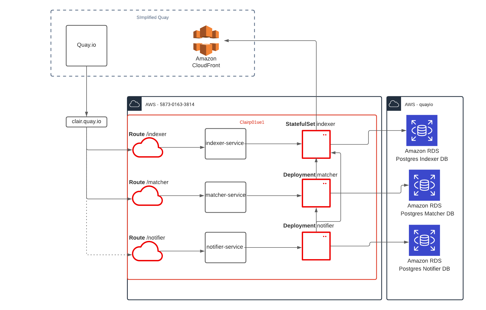
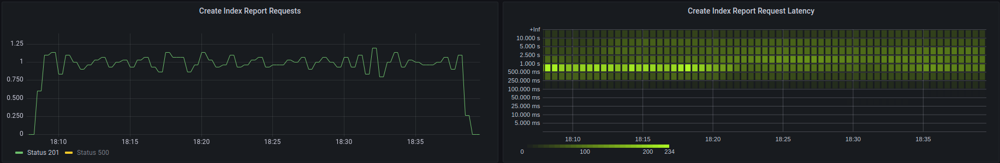
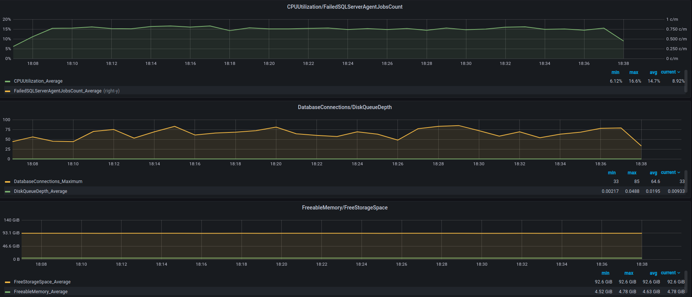
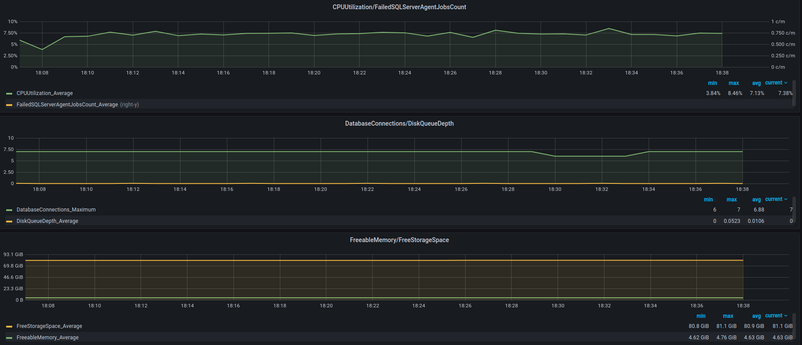
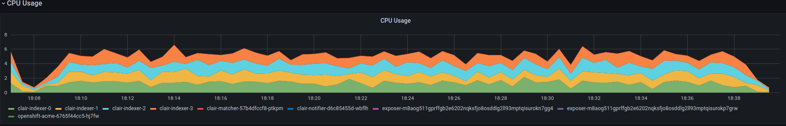
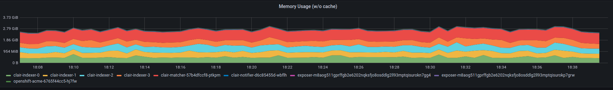

## Overview
* **Product**: Clair v4
* **Code**: [Clair](https://github.com/quay/clair), [Claircore](https://github.com/quay/claircore) 
* **Vendor**: AWS
* **Environment**: Staging / Production
* **Project Documentation**: https://quay.github.io/clair


## Service Description 
An architectural overview of Clair V4 and specific configuration options are detailed in the [Project Documentation](https://quay.github.io/clair/), this document details how Clair is deployed in an App Interface context. Clair v4 can be deployed in a number of different ways, for production and staging environments we have provisioned a distributed deployment. This means we have a Statefulset of Indexing pods and a Deployment for the other components (Matcher, Notifier), this allows the individual components to be scaled independently and will also lead to better transparency when debugging / optimizing.


## Components

### Indexer
Accepts requests to index a manifest and creates an index_report. Saves index report to its database. Retrieves index_report from its DB. Accepts delete requests for manifests (individual and bulk) and deletes them from its database.

### Matcher
Accepts requests for a vulnerability_report, requests the index_report from the Indexer and matches the index_report with the vulnerabilities in its database. Responsible for periodically updating the vulnerabilities in its database. Also responsible for garbage collecting older vulnerabilities from its database.

### Notifier
Responsible for generating notifications when new vulnerabilities affecting a previously indexed manifest enters the system. The notifier will send notifications via the configured mechanisms.

## Routes
All 3 components (Indexer, Matcher, Notifier) have associated Services and Routes, these Routes leverage the same host name (Quay does not distinguish between Clair’s components, it expects to find them all on the same domain, separate paths).

### Indexer
* **Route Location**: https://clair.quay.io/indexer 
* **Route Timeout**: 5m (haproxy.router.openshift.io/timeout)
* **Cookies disabled**: true (haproxy.router.openshift.io/disable_cookies)

### Matcher
* **Route Location**: https://clair.quay.io/matcher

### Notifier
* **Route Location**: https://clair.quay.io/notifier

## Service Diagram
**Fig 1**. Clair v4 Production Environment - Meta



**Fig 2**. Clair v4 Staging Environment - Meta


## Application Success Criteria

* Clair should be able to service all indexing requests from Quay without any requests being rate-limited.
* Newly pushed tags should be indexed by Clair in no more than 10 minutes.
* Clair should be able to respond in a timely manner to vulnerability report requests from Quay allowing for a responsive UI.

## State
### Database
Clair is backed by 3 RDS instances each containing 1 database instance named “clair” to back the 3 components.

**Indexer**

* **Definition**: [here](../../resources/terraform/resources/quayio-production/clair-indexer-rds-1.yml)
* **Backup Policy**: Daily, retention 30 days
* **Loss Impact**: In the event of total data loss all manifests would need to be re-indexed and no security information would be available to consumers. Re-indexing would take in the order of months.
* **Backup Impact**: In the event the current DB was lost, a new DB should be created from the latest backup snapshot. A day’s indexing work would be lost and any manifests submitted for indexing during that period would need to be re-submitted.

**Matcher**

* **Definition**: [here](../../resources/terraform/resources/quayio-production/clair-indexer-rds-1.yml)
* **Backup Policy**: Daily, retention 30 days
* **Loss Impact**: In the event of total data loss an update should be triggered by restarting the matcher pods. This will take ~10 mins and should bring the Matcher component back to functionality.
* **Backup Impact**: The DB can be safely restored from a backup but it’s easier to trigger an update as detailed above.

**Notifier**

* **Definition**: [here](../../resources/terraform/resources/quayio-production/clair-indexer-rds-1.yml)
* **Backup Policy**: Daily, retention 30 days
* **Loss Impact**: In the event of a total data loss all notification operations would be lost, a new DB should be created from the latest backup/snapshot.
* **Backup Impact**: A day’s worth of data loss means some notifications would not be delivered.


### Storage
**Indexer**

Each Clair Indexer pod is provisioned with a gp2 PVC that has 100GiB of capacity. The PVC is there to allow the indexer to download container layers for scanning and the large size is provisioned for added IOPS. **Loss of PVC data is a non-issue, the data is transient**. Other component’s pods do not need dedicated storage.

### Pods/CPU/Memory
Each Clair pod is provisioned with 2 CPU (2000 mCPU), 2GiB of Memory. Both requests and limits are set to the same values.


### Network
The Clair application is hosted behind the domain clair.quay.io. This is a public domain and is handled/configured by the AppSRE team.

### Interaction with Quay
**Indexer**

Quay identifies manifests that need to be scanned. Quay initiates a HTTP request per manifest to the Clair indexer pods to create an index_report for the manifest.
The manifest JSON that Quay submits to Clair contains download URLs for the layers (usually signed Cloudflare URLs) to allow Clair to download the layers and perform the static analysis.
Clair returns the index_report to Quay in the response of the same HTTP connection (no polling/multiplexing/websocket etc). The indexer route is configured with a 5 minute timeout to facilitate larger layer downloads and also explicitly disables cookies as the Quay client will route all traffic to the same pod if not.

**Matcher**

When a user loads a page of tags in Quay, Quay attempts to fetch the security information (known as the vulnerability_report) for each tag from Clair.
Quay will ask for the report by the manifest hash and Clair will initially get the index_report from the indexer and then perform matching with the report and the vulnerabilities in Clair's matcher database.


### Authentication
Quay and Clair share a PSK that Quay uses to create a JWT to authenticate every request. The PSKs for stage and production are stored in the [AppSRE Vault instance](https://vault.devshift.net/). 

## Load Testing

### Indexer
**Estimated workload**

We ran a backfilling process consisting of 4 Quay py3 pods with their security workers enabled submitting manifests to Clair v4 production. The 4 Quay pods submit manifests at a rate of 1 per second (0.25/second/Quay pod). Extrapolating that out to production, 40 Quay pods (currently 33 plus room for scaling) would mean 10 indexing requests / second.

Given the number of production instances (40) is 10x that of Staging (4), the benchmarking seeks to prove that Stage can handle at least 1 indexing request / second.

**Methodology**

[clair-load-tester](https://github.com/quay/clair-load-test) is Quay-independent. It generates manifests for popular images and submits them for indexing (it will also request the vulnerability report and delete manifest). It accepts a `--host` and `--psk` to allow you to load test separate environments as well as allowing you to specify a `--rate` and a `--timeout` for flexibility in testing.
Running the clair-load-tester pointing at stage with `--rate=1` and `--timeout=30m` and verifying with the [Clair grafana dashboard](https://grafana.app-sre.devshift.net/d/I1JBFlRnz/clair-v4) that indexing requests are being processed at 1 per second and referencing the [DB Grafana indexer dashboard](https://grafana.app-sre.devshift.net/d/AWSRDSdbi/aws-rds?from=now-30m&to=now&orgId=1&var-datasource=AWS+quayio-stage&var-region=default&var-dbinstanceidentifier=clair-indexer-stage) and the [RDS Grafana matcher dashboard](https://grafana.app-sre.devshift.net/d/AWSRDSdbi/aws-rds?from=now-30m&to=now&orgId=1&var-datasource=AWS+quayio-stage&var-region=default&var-dbinstanceidentifier=clair-matcher-stage).

**Results**
```json
{
  "total_index_report_requests": 1799,
  "total_vulnerability_report_requests": 1799,
  "total_index_report_latency_milliseconds": 8098653,
  "total_vulnerability_report_latency_milliseconds": 696237,
  "latency_per_index_report_request": 4501.752640355753,
  "latency_per_vulnerability_report_request": 387.0133407448583,
  "non_2XX_index_report_responses": 0,
  "non_2XX_vulnerability_report_responses": 0,
  "max_index_report_request_latency_milliseconds": 27901,
  "max_vulnerability_report_request_latency_milliseconds": 1583
}
```


**Databases**

DB Dashboards during load test:

_Indexer_

_Matcher_


| Component | Max CPU % (out of 2) | Ave CPU % (out of 2) | Min freeable Mem Gb (out of 8Gb) | Ave freeable Mem Gb (out of 8gb) | Max Conns | Ave Conns |
|-----------|----------------------|----------------------|----------------------------------|----------------------------------|-----------|-----------|
| Indexer   | 16.6                 | 14.5                 | 4.52                             | 4.63                             | 85        | 64.6      |
| Matcher   | 8.46                 | 7.13                 | 4.62                             | 4.76                             | 7         | 6.88      |

> Note: The stage DB specs are roughly half the size of production (`db.m6g.large` vs `db.m6g.xlarge`).

**Pods**

Pod metrics during the load test can be seen here:

 _CPU_


 _Memory_


> Note: Please see [load-testing SOP](sops/load-testing.md) for instructions on how to re-run load-test.

> Note: More extensive load testing was carried out to determine capacity requirements and the results can be viewed [here](https://docs.google.com/document/d/16nODx4tB1jcCyV0b7zXcXlrFi_lyD1OuPOpy-IOdBFk)

## Capacity
### Current Production
* **CPU**: 120 ((2 cpu x 40 indexers) + (2 cpu x 10 matchers) + (2 cpu x 10 notifiers))
* **Memory**: 120GiB ((2 GiB x 40 indexers) + (2 GiB x 10 matchers) + (2 GiB x 10 notifiers))
* **Storage**: 4TB (100 GiB x 40 indexers)


### Current Stage
* **CPU**: 12 ((2 cpu x 10 indexers) + (2 cpu x 1 matchers) + (2 cpu x 1 notifiers))
* **Memory**: 12GiB ((2 GiB x 4 indexers) + (2 GiB x 1 matchers) + (2 GiB x 1 notifiers))
* **Storage**: 400GiB (100 GiB x 4 indexers)

### Future Production (1 year prediction)
* **CPU**: 280 ((2 cpu x 80 indexers) + (2 cpu x 40 matchers) + (2 cpu x 20 notifiers))
* **Memory**: 280GiB ((2 GiB x 80 indexers) + (2 GiB x 40 matchers) + (2 GiB x 20 notifiers))
* **Storage**: 8TB (100 GiB x 80 indexers)

### Future Stage
* **CPU**: 12 ((2 cpu x 10 indexers) + (2 cpu x 1 matchers) + (2 cpu x 1 notifiers))
* **Memory**: 12GiB ((2 GiB x 4 indexers) + (2 GiB x 1 matchers) + (2 GiB x 1 notifiers))
* **Storage**: 400GiB (100 GiB x 4 indexers)
