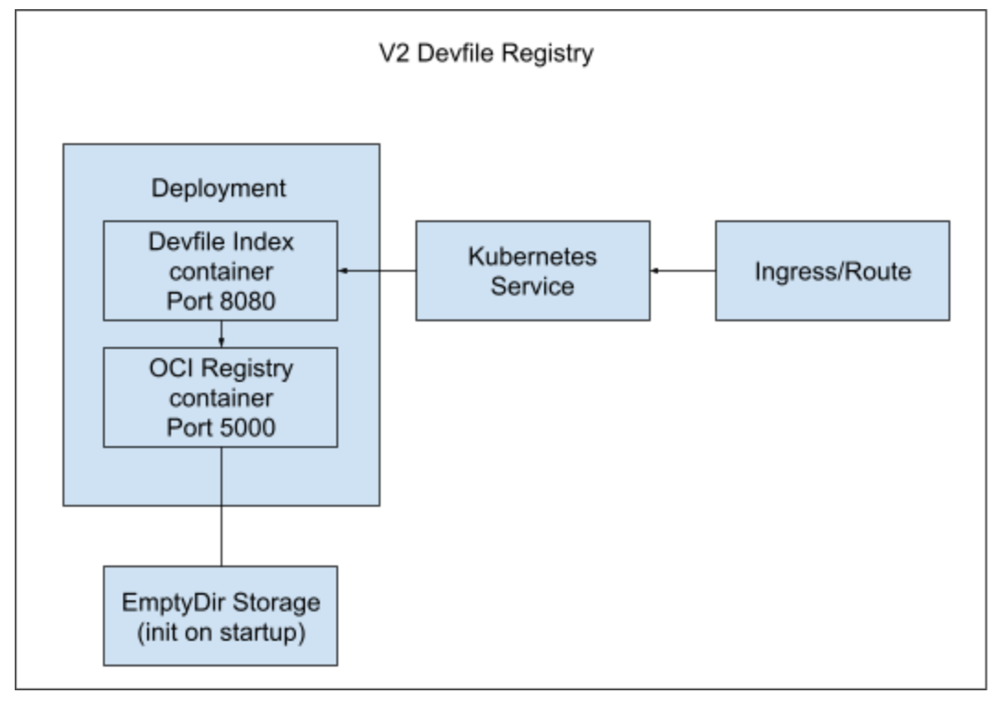
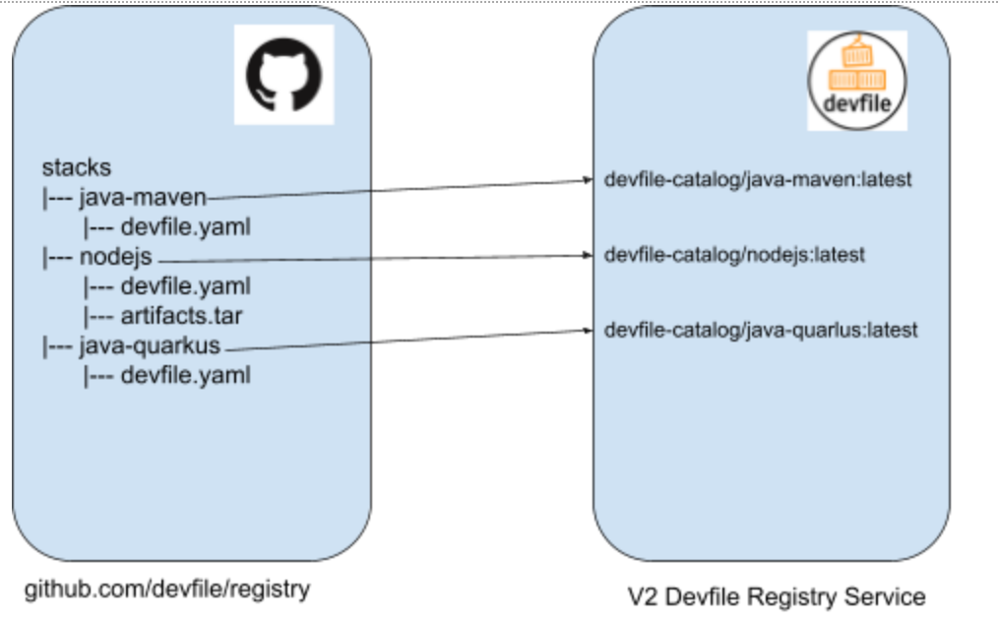

# Devfile Registry Architecture

**Note:** This document applies to both the community devfile registry (`devfile-registry`) and the Red Hat Product Devfile registry (`devfile-registry-redhat`), as their architecture is identical.

## Description

*This section is largely a summary of the design documents found at https://github.com/devfile/api/tree/main/docs/proposals/registry*

A devfile registry service provides a way to serve “devfile stacks” (a collection of files defining a cloud development workspace) to users, using an OCI-based registry server. The devfile registry index server sits in front of the OCI server and is responsible for bootstrapping the OCI registry with devfile stacks, then serves a basic UI, providing important metadata about each stack in the registry.

As mentioned above, the devfile registry service consists of two containers:

1) `oci-registry` An OCI registry container, based on the [reference implementation of an OCI registry](https://github.com/distribution/distribution). It stores/hosts the devfile stacks that are provided by the Devfile Registry service.

2) `devfile-registry-index` A simple REST API that serves important metadata about the devfile registry, as well as providing a basic UI. It's also responsible for bootstrapping the OCI registry with the devfile stacks.

A simple diagram outlining the Registry can be found below:

Each "build" of the devfile registry consumes devfile stacks from a given GitHub repository (for example https://github.com/devfile/registry or https://github.com/redhat-developer/devfile-registry), and each "stack" in the GitHub repository maps into a corresponding OCI resource:

## Exposed Routes

The following routes are exposed for each devfile registry:

`devfile-registry`:

- https://registry.devfile.io - Exposes the devfile registry UI, and the corresponding API for retrieving metadata about devfile stacks

- https://registry.devfile.io/v2 - Exposes the (read-only) devfile registry OCI registry server, providing APIs for tools to retrieve devfile stacks

`devfile-registry-redhat`:

- https://devfile-registry.redhat.com - Same as above.

- https://devfile-registry.redhat.com/v2 - Same as above.

## Base Functionality SOP

*A more in depth SOP can be found here: https://gitlab.cee.redhat.com/service/app-interface/-/tree/master/docs/devfile-registry/sop*

But in short, to verify the basic functionality for each devfile registry, the following can be done:

1. Visit either https://registry.devfile.io or https://devfile-registry.redhat.com in your browser.

2. Validate that devfile stacks are shown, like in the screen shot below. 

