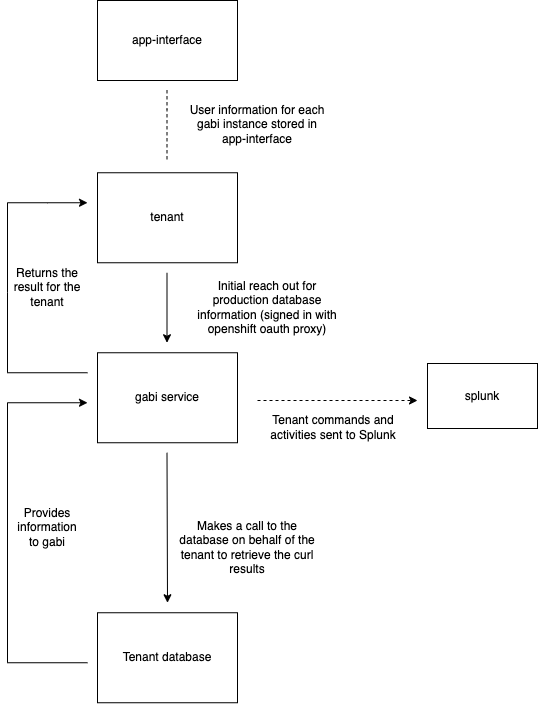

## Gabi Architecture

### Service Description

Gabi (go-auditable-db-interface) is a backend service that allows tenants to send a SQL command to their prod database through a POST request and will get the response back. The authorisation information is stored in `app-interface` and there is an integration within `qontract-reconcile` that is called `gabi-user-validator`. This creates a ConfigMap available to gabi with the authorised users; tenants can have multiple gabi instances targeting multiple databases. Each POST request is sent to Splunk in order to keep a record of the query for auditing purposes.

### Components

Each gabi deployment has the following components:
- Splunk: If Splunk is down or the Gabi instance cannot talk to Splunk for any reason, then the query cannot be tracked for auditing purposes. The tenant will not get the result of the query back, they will receive a Splunk error on their end instead.
- Gabi endpoint: If the Gabi endpoint for a particular database cannot be used then the tenant will not be able to perform SQL queries on their prod database and send that query to Splunk.
- Tenant database: If the tenant's database is unreachable then the Gabi instance will not allow the tenant to retrieve the query.

### Routes

Gabi endpoints usually follow this endpoint convention: `gabi_instance_name.cluster_name.cluster_id.p1.openshiftapps.com`, see within the [saas-gabi file](https://gitlab.cee.redhat.com/service/app-interface/-/blob/master/data/services/gabi/cicd/saas-gabi.yaml)

Example:
```
  - namespace:
      $ref: /services/dashdot/namespaces/app-sre-stage-01.yml
    ref: main
    upstream:
      instance:
        $ref: /dependencies/ci-ext/ci-ext.yml
      name: app-sre-gabi-gh-build-main
    parameters:
      HOST: gabi-dashdotdb-stage.apps.app-sre-stage-0.k3s7.p1.openshiftapps.com
      NAMESPACE: dashdot
      AWS_RDS_SECRET_NAME: dashdotdb-rds
      GABI_INSTANCE: gabi-dashdotdb
```

### Dependencies

Gabi is dependent on Splunk due to the fact that Gabi exists for auditing purposes. If Splunk is down or unreachable then app-sre is not able to audit the the SQL queries our tenants send to their prod databases, breaking infosec requirements.

### Service Diagram



### Application Success Criteria

Gabi is a service that allows queried database data to be auditable due to infosec requirements.

### State

N/A

### Load Testing

N/A

### Capacity

N/A
