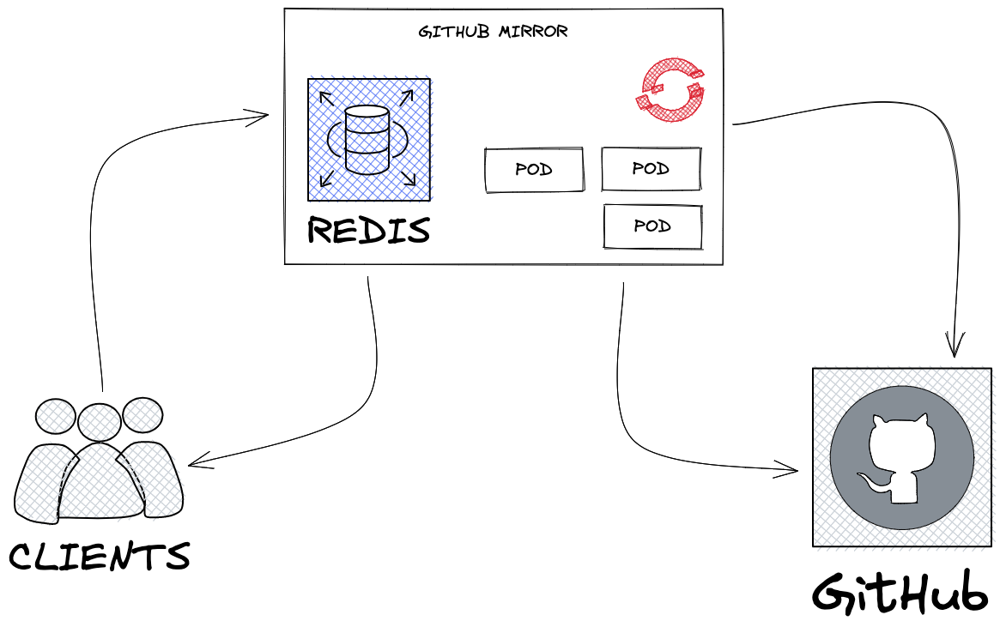

# Github Mirror Architecture

## Service Description
[Github Mirror](https://github.com/app-sre/github-mirror) GitHub API mirror that caches the responses and implements conditional requests.

With conditional requests, all the calls are forwarded to the Github API, but when the GitHub API replies with a 304 HTTP code, meaning that the resource has not changed, we serve the client with the previously cached response.

That reduces the number of API calls that consume quota, helping you not to hit the API GitHub API rate limit.

The mirror acts only on GET requests, by-passing other HTTP methods.

## Components

Github Mirror deployments has the following components:

 - Deployment
 - Route
 - Cache backend

## Routes

  - [https://github-mirror.devshift.net]() - Production
  - [https://github-mirror.stage.devshift.net]() - Staging

## Dependencies
Github Mirror cannot perform its primary function if either of the following systems are inaccessible:

* Github
* Redis (Cache backend)

## Service Diagram

## Application Success Criteria
Github Mirror goal is to cache responses that are not changed, and reduce the api calls made to Github and helping us to not hit the Github API limit.

## State
Cached requests are stored in a Redis backend, in case that the Redis is unavailable for any reason, Github Mirror won't be able to store the requests and the application won't work properly.

## Load Testing
N/A

## Capacity
N/A
