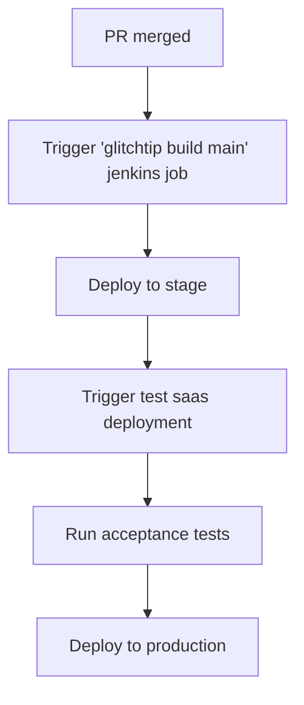

# Glitchtip

Glitchtip is an open-source error-tracking software and a fork of Sentry.

The production environment is available via https://glitchtip.devshift.net, and the staging environment (AppSRE only) is reachable via https://glitchtip.stage.devshift.net.

## Features

 * [Error Tracking](https://glitchtip.com/documentation/error-tracking)
 * [Organization and Project Management](https://glitchtip.com/documentation/uptime-monitoring)
 * [Sentry Client Integration](https://glitchtip.com/sdkdocs)
 * [Uptime Monitoring](https://glitchtip.com/documentation/uptime-monitoring)
 * [Integrations](https://glitchtip.com/documentation/integrations)

## End-User Documentation

The official end-user documentation is available at https://glitchtip.com/documentation, and how to integrate it into your application can be found in the [app-interface documentation](https://gitlab.cee.redhat.com/service/app-interface/-/tree/master#create-a-glitchtip-organization-dependenciesglitchtip-organization-1yml).

## The Architecture

The Glitchtip application consists of a web front-end, written in AngularJS, and a backend implemented in Python Django. PostgreSQL (AWS RDS) is the backend database, and elastic-cache (Redis on AWS) is the caching layer.
See [the Architecture Document](https://gitlab.cee.redhat.com/service/app-interface/-/blob/master/docs/glitchtip/architecture/architecture.md) for more details.

## Repositories

Glitchtip is composed of three repositories:

* Upstream [glitchtip-frontend](https://gitlab.com/glitchtip/glitchtip-frontend)
* Upstream [glitchtip-backend](https://gitlab.com/glitchtip/glitchtip-backend)
* [AppSRE Glitchtip](https://github.com/app-sre/glitchtip)

## CI/CD Pipeline

As soon as a PR is merged to the [`main` branch](https://github.com/app-sre/glitchtip), the CI/CD pipeline is triggered. The pipeline is defined in the [glitchtip saas](https://gitlab.cee.redhat.com/service/app-interface/-/blob/master/data/services/glitchtip/cicd/saas.yaml) and the [glitchtip test sass](https://gitlab.cee.redhat.com/service/app-interface/-/blob/master/data/services/glitchtip/cicd/test.yaml) in app-interface. The flow of the pipeline is as follows:

The acceptance tests are defined in the [glitchtip repo](https://github.com/app-sre/glitchtip/tree/main/acceptance) repository.

## SOPs

List of available SOPs

- [Prometheus Failed To Scrape GlitchTip Web](docs/glitchtip/sops/prometheus-failed-to-scrape-glitchtip-web.md)
- [glitchtip-availability](docs/glitchtip/sops/glitchtip-availability.md)
- [glitchtip-latency](docs/glitchtip/sops/glitchtip-latency.md)
- [load-testing](docs/glitchtip/sops/load-testing.md)
- [new-instance](docs/glitchtip/sops/new-instance.md)

## Django Admin Interface (AppSRE only)

Glitchtip allows administrators to manage the application via an admin web interface (Django admin interface).

| Environment | URL                                         | Credentials                                                                                                               |
| ----------- | ------------------------------------------- | ------------------------------------------------------------------------------------------------------------------------- |
| Production  | https://glitchtip.devshift.net/admin/       | [admin user in vault](https://vault.devshift.net/ui/vault/secrets/app-interface/show/app-sre/glitchtip/prod/users/admin)  |
| Staging     | https://glitchtip.stage.devshift.net/admin/ | [admin user in vault](https://vault.devshift.net/ui/vault/secrets/app-interface/show/app-sre/glitchtip/stage/users/admin) |

## Notes

The qontract-reconcile glitchtip integration manages organizations where the automation account (e.g., `sd-app-sre+glitchtip@redhat.com`) has the owner role! Glitchtip doesn't have the global admin concept; an organization's role handles the permissions. The integration can't see or access other organizations; therefore, it can't control those.

## Contact

Don't hesitate to get in touch with the AppSRE team via the [#sd-app-sre](https://redhat-internal.slack.com/archives/CCRND57FW) Slack channel.
