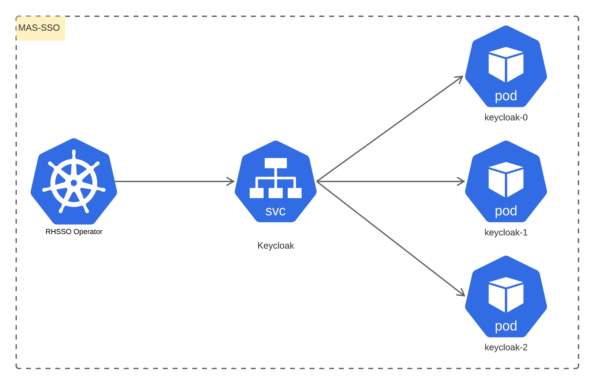
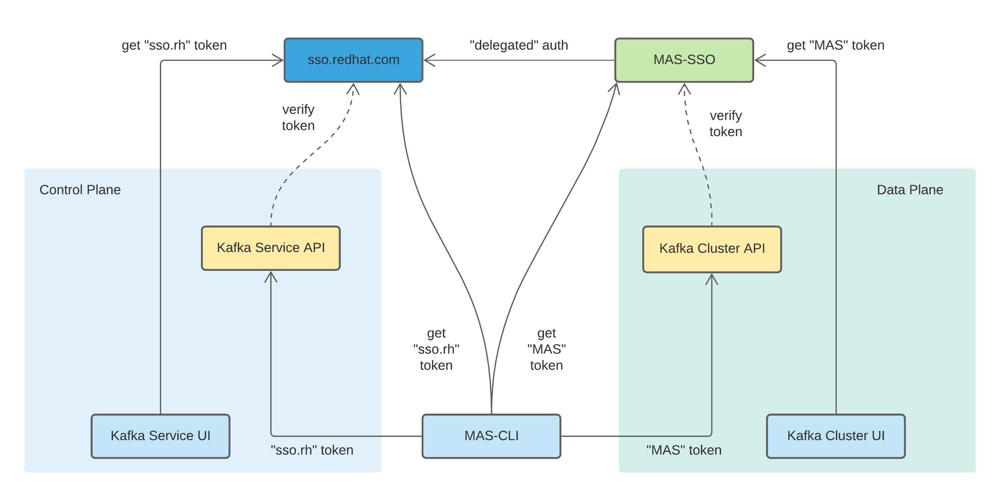
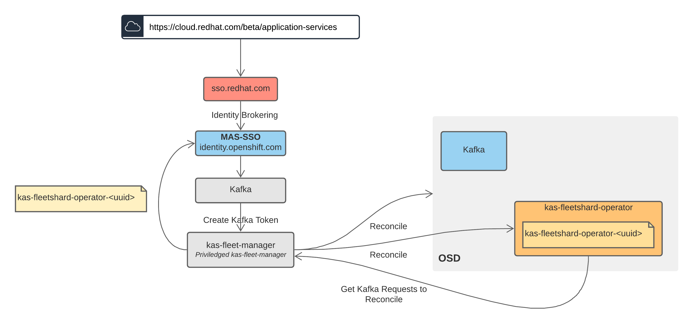
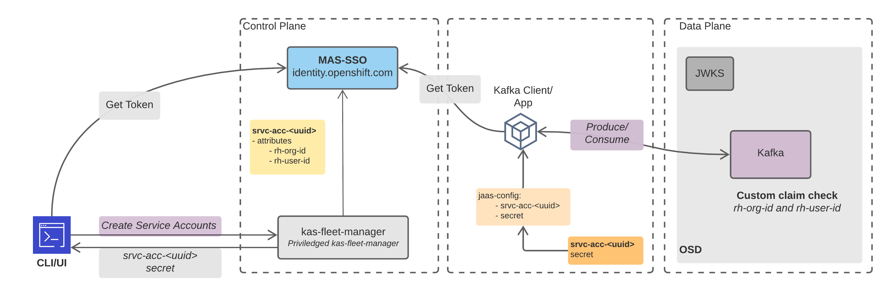

# Managed Application Service - Single Sign On (MAS SSO)

MAS (Managed Application Services) SSO (Single Sign On) provides authentication and authorization services for Managed Services.
It contains an RH-SSO operator that manages the Keycloak (RH-SSO) instances. The default deployment consists of 3 instances of Keycloak.
AWS RDS - PostgreSQL is used for persistent storage.




## MAS SSO Architecture



This is a simplified view of MAS SSO. It details its interaction with different components in the Managed Kafka ecosystem.
The `sso.redhat.com` is registered as an Identity Provider (IdP), this enables Red Hat customer users to interact with the Managed Kafka service.

- Managed Kafka Service Control Plane
  - Control Plane of the Kafka Service.
  - "Kas-Fleet-Manager (Kafka Service API) - Public API
  - Kafka Service UI - Terraforming of Kafka clusters, create/delete Kafka cluster
  
- Managed Kafka Service Data Plane
  - Kafka Cluster UI - This allows performing Kafka admin operations by requesting the Kafka cluster Admin API.
  - Kafka cluster Admin API - This allows performing Kafka admin operations 
    - ex: create/delete a topic

[Kas UI or Kafka Service UI](console.redhat.com/beta/application-services/openshift-streams/kafkas) and [CLI](https://github.com/redhat-developer/app-services-cli) perform authentication across `sso.redhat.com` and `MAS SSO`. They maintain two different tokens.
For the control plane, they would use sso.redhat.com token, and if they want to interact with the data plane MAS SSO token is used.

For an end-user/customer, Kafka Service UI & Kafka Cluster UI are same. First, they will see the Kafka Service UI: which will allow terraforming the Kafka instance & once it is ready. Kafka Cluster UI is used to manage the ready state Kafka cluster. They can also MAS CLI to manage their Kafka clusters from the command line and also provide a better user experience.

MAS-SSO and `sso.redhat.com` both are [Keycloak](https://www.keycloak.org/) deployments. But why mas-sso is required?

MAS-SSO is a fill-gap solution to some of the restrictions imposed by `sso.redhat.com`.
- Service account with privileged realm-manage roles (example: manage-clients)
- Dynamic clients/service accounts creation
- Dynamic realm role creation and assign to service accounts
- Custom attributes/token/role claims added to the dynamic service accounts

MAS-SSO register `sso.redhat.com` as an [Identity Provider](https://en.wikipedia.org/wiki/Identity_provider):
- This ensures that any Red Hat Customer Portal Account user can log in into MAS-SSO without doing another registration or double login. 

Two types of token: token from `sso.redhat.com` and MAS-SSO.

- The Control Plane is secured using `sso.redhat.com`. So, the user will need a token from the `sso.redhat.com` to perform operations like Create Kafka Cluster, Create Service Accounts.

- The Data plane(Kafka cluster) is secured using MAS SSO. So, the user will need a token from the MAS SSO to perform operations like create topic/delete topic, produce/consume messages.


- [Kas UI or Kafka Service UI](console.redhat.com/beta/application-services/openshift-streams/kafkas) maintains two types of the token. One from `sso.redhat.com` and another from MAS SSO.

- User/Customer can also get a MAS SSO token by generating a service account.
Generating a service account from the [Kafka Service UI](https://console.redhat.com/beta/application-services/streams/service-accounts)

## MAS SSO - Interaction with the Managed Kafka Control Plane
The below diagram illustrates the control plane authentication flow


- Users are first authenticated against sso.redhat.com - User login
- [Kas UI or Kafka Service UI](console.redhat.com/beta/application-services/openshift-streams/kafkas) and [CLI](https://github.com/redhat-developer/app-services-cli) - Performs a [Proof Key for Code Exchange by OAuth Public Clients
](https://datatracker.ietf.org/doc/html/rfc7636) mechanism to login into `sso.redhat.com` and also into MAS-SSO
  - Users registered with sso.redhat.com are created in MAS SSO behind the scenes
- Users once authenticated can create/delete Kafka clusters from the Kafka UI

Example flow: Create a Kafka cluster
- Visit: https://console.redhat.com/beta/application-services/openshift-streams/kafkas
- Redirect to `sso.redhat.com` login screen
- Use an existing Red Hat user or create a new account.
- Login with your Red Hat user credentials
- Click on the `Create Kafka Instance` button in Kafka Service UI
- You can use the instance once status is ready.

Create a Kafka cluster using Control Plane API

```
$ curl -v -XPOST -H "Authorization: Bearer $(ocm token)" https://api.openshift.com/api/kafkas_mgmt/v1/kafkas?async=true -d '{ "region": "us-east-1", "cloud_provider": "aws",  "name": "test-kafka", "multi_az":true}'
```

## MAS SSO - Interaction with the Managed Kafka Data Plane 
The below diagram illustrates the data plane authentication flow


- User can request a Service account through the control plane
  - Attributes like Org ID, User ID are added inside the control plane
- Configure the Kafka client 
  - jaas-config is the common one, and it uses the service account that was created
  
SASL plain and SASL OAuth bearer, both mechanisms are supported

Kafka brokers fetch the JWKS certificate and validate the token.

Custom claim check - This was added Kafka specific to restrict the actions on the Kafka cluster
  - configured users Org ID and User ID are used to verify the token claim.
  - At present only the owner of the Kafka cluster can create a service account for that cluster

Example: Create a topic
- Once the Kafka instance is ready (please refer Create a Kafka cluster example)
- Click on the instance name
- Redirects to the Kafka cluster UI: https://console.redhat.com/beta/application-services/streams/kafkas/<kafka-id>
- You can click on the `Create Topic` button
to create new topics

Example: Create a service account
- https://console.redhat.com/beta/application-services/streams/service-accounts
- Click on `create service account` button

Example: Create a service account using rhoas-cli
```
rhoas serviceaccount create
```

Creating a service account via curl
```
$ curl -v -XPOST -H "Authorization: Bearer $(ocm token)" https://api.openshift.com/api/kafkas_mgmt/v1/service_accounts/ -d '{  "name": "service-acc-1"}'
```

Example: Produce/Consume messages to Kafka Cluster
- Copy the bootstrap url from connection section in https://console.redhat.com/beta/application-services/streams/kafkas
- Create a config file
- Configure the service account details
- Use Kafka Cli tools to perform produce/consume

Create a jaas-config file
```
$ touch jaas-config.txt
```
Copy paste the content and configure the generate service account
```
security.protocol=SASL_SSL
sasl.mechanism=PLAIN
ssl.protocol=TLSv1.3
sasl.jaas.config=org.apache.kafka.common.security.plain.PlainLoginModule required username="srvc-acct-" password="<secret>";
```

Create Topic
```
kafka-topics --create --topic test --bootstrap-server <bootstrapurl>:443 --command-config ./config.txt
```
Kafka Console producer
``` 
$ kafka-console-producer --bootstrap-server <bootstrap url>:443 --producer.config ./config.txt --topic test
```

## Routes

The following route is exposed by the service
- Production: `identity.api.openshift.com`
- Staging: `identity.api.stage.openshift.com`
 

## Dependencies

This list of dependencies for MAS SSO 
1. *Cluster Service*: 
   Used for OSD cluster creation, add-on installation, IDP setup, trusted data path (SyncSets), and scaling compute nodes
2. *sso.redhat.com*:
   Identity federation
3. *AWS Route 53*:
   Creation of route for MAS SSO instance
4. *AWS RDS*:
   PostgreSQL database that acts as the datastore for MAS SSO
5. *Let's Encrypyt*:
   Lets Encrypt from ACME is used for certifcate management.

## Service forecast

MAS SSO has been tested for 1000 Kafka clusters with the existing configuration. We do not at the moment 
anticipate a significant change in the requirements i.e. more than a 1000 Kafka clusters. 

## State
### Postgres Database

MAS SSO uses Amazon RDS Postgres service for its persistence storage. The database service is used to store and consume data such as user credentials, service accounts, client information, etc. These are essential for the normal operation of MAS SSO. A non-availability of the RDS would mean the service cannot function normally and having a cascading effect on other services that depend on MAS SSO, e.g. user logins for Kafka would not work. Data in RDS is regularly backed up for this purpose and has Multi Availability Zone (AZ) configured. 

## MAS SSO Admin Credentials in Vault

### Overview

MAS SSO (Keycloak) instance, requires a secret with admin credentials i.e. admin username and password.
This secret is provided for MAS SSO from the vault (app-interface), through app-interface integrations.

### Usage

The following steps are the recommended way of using this secret
- This secret should only be used for bootstrapping the MAS SSO i.e. the initial admin access.
- MFA authentication should be enabled for all user login, especially admin users.
- Create the relevant admin account(s) as necessary for the team members with the appropriate permissions/roles.
- Disable the admin account that was created via the secret in MAS SSO. This is required for the following reasons:
  - With MFA only one person can use that account, so it is not a shared credential
  - The user account name is pretty generic, and we require non-repudiation. (To know which admin user performed what action and when)
  - For security reasons, since the credential is in a vault, any exposure/leak at the vault would give access to MAS SSO.
- The admin account via the secret should only be used again in a break-glass scenario, i.e. We need access to MAS SSO
  and do not have an admin user credential for any of the admins (locked out).

### Rotation

Even though as per recommendation we disable the admin account from the vault. It is still recommended to rotate the secret in a
periodic way.

- Create a 100 character or more random alphanumeric string that will be used as the admin password.
- Do not use any random string or password generation tools online. CLI tools such as `pwgen` are preferred.
  - Ex: `pwgen -c -n   -s -1  100`


## Alerts and SLOs

We have 4 alerts for [availability](https://gitlab.cee.redhat.com/service/app-interface/-/blob/master/docs/mas-sso/sop/mas-sso-availability/mas-sso-availability.md#list-of-alerts) 
and  4 alerts for [latency](https://gitlab.cee.redhat.com/service/app-interface/-/blob/master/docs/mas-sso/sop/mas-sso-latency/mas-sso-latency.md#list-of-alerts). The alerts are tied to the service level objectives (SLOs). Alerts definition are based on [multi-window, multi-burn rate](https://sre.google/workbook/alerting-on-slos/) and are unit tested. 

Resources: 

1. https://gitlab.cee.redhat.com/service/app-interface/-/tree/master/resources/observability/prometheusrules all mas-sso-*
2. https://gitlab.cee.redhat.com/service/app-interface/-/tree/master/docs/mas-sso/sop


## Load Testing

Load test instructions can be found [here](https://gitlab.cee.redhat.com/service/saas-mas-sso/-/blob/master/sop/performance-test.md
