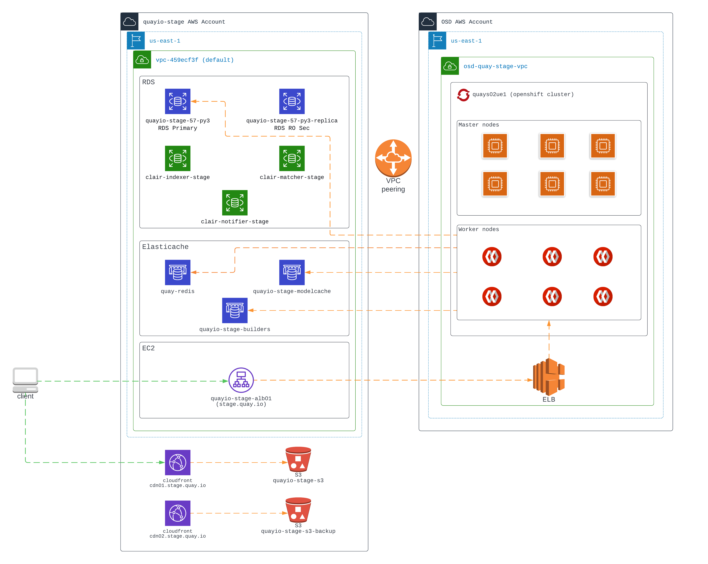
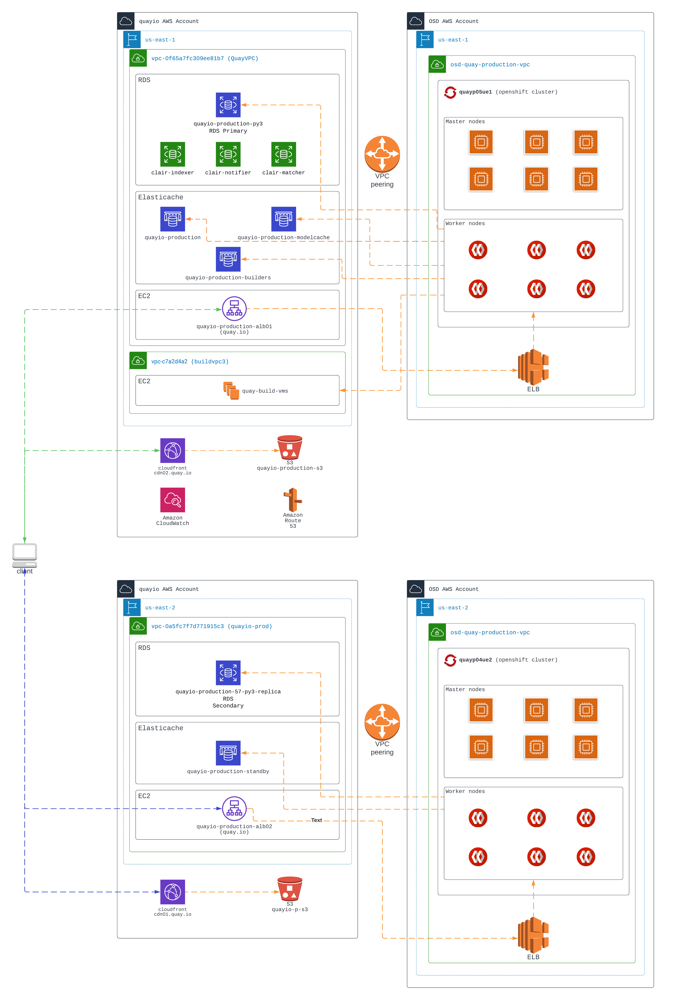

# Quay Disaster Recovery

In the event of a complete loss of Quay, please see the [disaster recovery guide](disaster-recovery.md)

## Quay Services

- [RDS (Database)](services/database.md)
- [Redis](services/redis.md)
- [Quay Application](quayio.md)
- [Quay Build Cluster](builder.md)
- Clair (currently managed by the Quay engineering team)
- Apostille (currently managed by the Quay engineering team)
- [Action logs pipeline: ElasticSearch, LogStash and Kinesis](services/action-logs/overview.md)

## Quay Deployment

### Staging

### Production

## Quay Configuration

Configuration values for Quay can be found [here](https://docs.projectquay.io/manage_quay.html#quay-schema)

## Debugging Quay issues

See [Debugging Quay](issues/overview.md) for the general guide.

## Quay SOPs

- [Quay Checklist](quay-checklist.md)
- [Quay Application SOPs](quayio.md)
- [Quay Builder Cluster Access & Setup](quay-builder-ocp-cluster-setup/README.md)
- [Quay Builder Cluster SOPs](builder.md)

## Quay AWS Accounts

| Environment | Namespace |
| --- | --- |
|Stage|[AWS Console](https://quayio-stage.signin.aws.amazon.com/console)|
|Production|[AWS Console](https://quayio.signin.aws.amazon.com/console)|
|Quay Builder|[AWS Console](https://505980430375.signin.aws.amazon.com/console)|

## Incident Management

- [Statuspage](statuspage.md)
