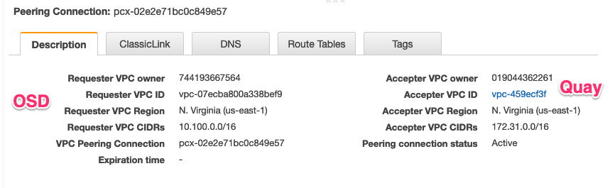
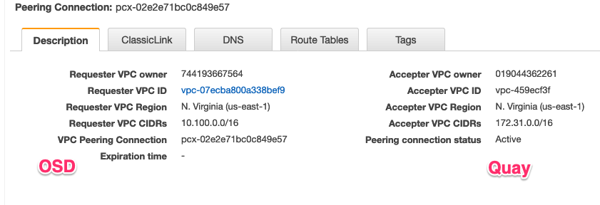
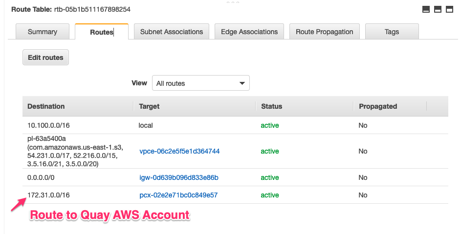

# Quay OSD Cluster VPC Peering Setup

## Staging

### OSD Cluster Networking

- Machine CIDR: `10.100.0.0/16`
- Service CIDR: `172.30.0.0/16`
- Pod CIDR: `10.128.0.0/14`

### Quay AWS VPC

- VPC ID: `vpc-459ecf3f`
- Default VPC: `Yes`
- IPv4 CIDR: `172.31.0.0/16`
- Route table: `rtb-91cb17ef`
- Owner: `019044362261`

### Peering Connection (Quay AWS Account)

### Route Table (Quay AWS Account)

### Peering Connection (OSD AWS Account)

### Route Table (OSD AWS Account)

### Steps to setup VPC Peering

Ref: [AWS Documentation](https://docs.aws.amazon.com/vpc/latest/peering/working-with-vpc-peering.html)

1. From the AWS account that hosts the OpenShift Dedicated cluster, initiate a VPC Peering request to the Quay AWS account.
2. From the Quay AWS account, accept the peering request.
3. Update the route table in both accounts to send traffic for appropriate CIDR over the peering connection.

## Production

Account: `206170669542`

### us-east-1

All Quay OSD clusters must be peered with following VPCs in `us-east-1`.

#### Quay VPC Peering

| VPC ID | CIDR |
| --- | --- |
| [vpc-0f65a7fc309ee81](https://console.aws.amazon.com/vpc/home?region=us-east-1#vpcs:vpcId=vpc-0f65a7fc309ee81b7) | 10.17.128.0/21 |
| [vpc-f94c689f](https://console.aws.amazon.com/vpc/home?region=us-east-1#vpcs:vpcId=vpc-f94c689f) | 10.18.0.0/18 |

#### Quay Security Group

| Security Group | Service | Port | Source |
| --- | --- | --- | --- |
|[sg-019a145991661b939](https://console.aws.amazon.com/ec2/v2/home?region=us-east-1#SecurityGroup:groupId=sg-019a145991661b939)| Redis | 6379 | OSD cluster CIDR |
|[sg-09d9313264a431f5a](https://console.aws.amazon.com/ec2/v2/home?region=us-east-1#SecurityGroup:groupId=sg-09d9313264a431f5a)| MySQL | 3306 | OSD cluster CIDR |

### us-east-2

Quay OSD cluster in `us-east-2` must be peered with following VPCs.

#### Quay VPCs

| VPC ID | CIDR |
| --- | --- |
| [vpc-0a5fc7f7d771915c3](https://us-east-2.console.aws.amazon.com/vpc/home?region=us-east-2#vpcs:vpcId=vpc-0a5fc7f7d771915c3) | 172.32.0.0/16 |

#### Quay Security Group

| Security Group | Service | Port | Source |
| --- | --- | --- | --- |
| [sg-0a9da9d087be9ed2f](https://us-east-2.console.aws.amazon.com/ec2/v2/home?region=us-east-2#SecurityGroup:groupId=sg-0a9da9d087be9ed2f) | MySQL  | 3306 | OSD CIDR |
| [sg-0a9da9d087be9ed2f](https://us-east-2.console.aws.amazon.com/ec2/v2/home?region=us-east-2#SecurityGroup:groupId=sg-0a9da9d087be9ed2f) |  Redis  | 6379 | OSD CIDR |
