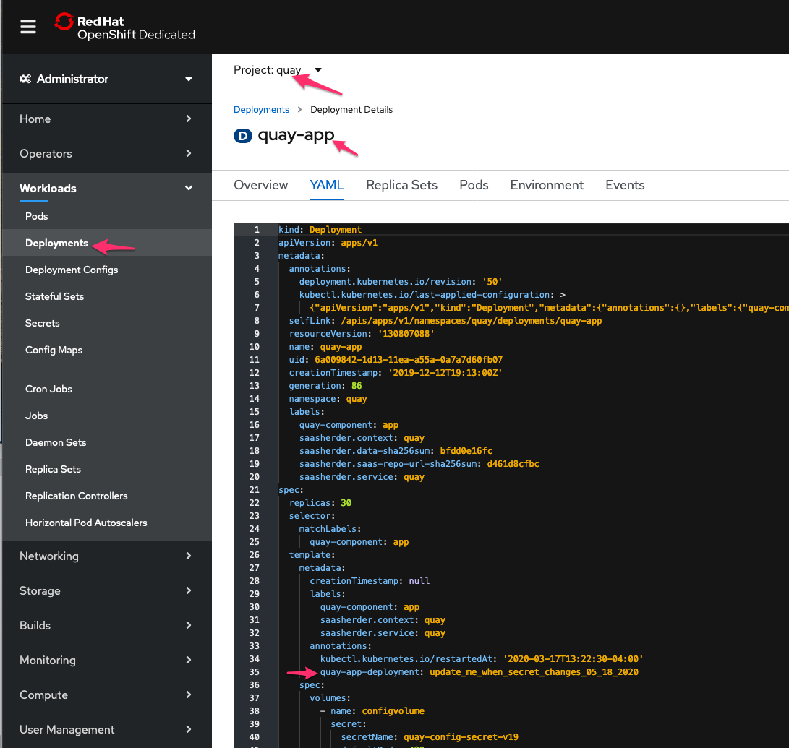

# Performing Rolling Restart of Quay

Quay.io occasionally experiences problem with database lockups. When this happens, the RDS instance has to be restarted from AWS console and Quay pods have to be recycled.

## Restarting RDS Instance

Follow AWS [docs](https://docs.aws.amazon.com/AmazonRDS/latest/UserGuide/USER_RebootInstance.html) to reboot the RDS instance.

## Recycle Pods

When Quay.io is down (website may continue to work but push/pull will not), SRE cannot use app-interface to recycle the pods. It must be done using OpenShit cluster console.

OpenShift cluster console information can be found [here](../quayio.md#openshift-clusters). Perform rolling restart on **one cluster at a time**.

To initiate rolling restart, look for annotation `quay-app-deployment` and set it to string value that is different than current value. You will see new pods being rolled out as soon as you save your changes.

