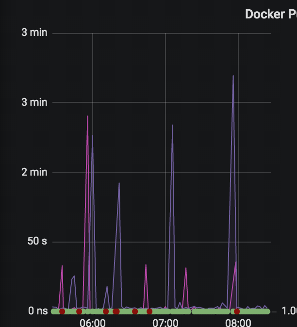

# Debugging 504s raised in the registry

## Customer reporting of 504s

A 504 error occurring in the registry/API layer will usually result in customers seeing errors of the following form:

```
metadata: GET https://quay.io/v2/openshift-release-dev/ocp-release/manifests/4.1.3: wrong HTTP status '504 Gateway Timeout'
```

## Debugging the cause of the 504

- Check the registry monitor status on [Grafana](https://grafana.quay.io). See if there are a number of *delays* or timeouts:



- Check Sentry for known issues: [Backend Production Sentry](https://sentry.io/organizations/coreos/issues/?project=52148)

### MaxConnectionsExceeded is reported many times

If you see many instances of `MaxConnectionsExceeded`, check the `server_name` tag (on the far right hand side). Typically, there will be one node name that is shown relative to many others. If so, **this pod has become partially wedged** and needs to be killed.

#### Killing the one wedged node

- Find the pod in OSD and kill it.

#### Multiple nodes are reported

- Check the ELB health checks to see if multiple nodes are reporting as unhealthy
- If so, search the CloudWatch logs for `[FAILED HEALTH CHECK]` and see why the nodes are reporting unhealthy
- Address the root cause of the nodes being unhealthy. For example, if it is due to disk space, redeploy the fleet.
