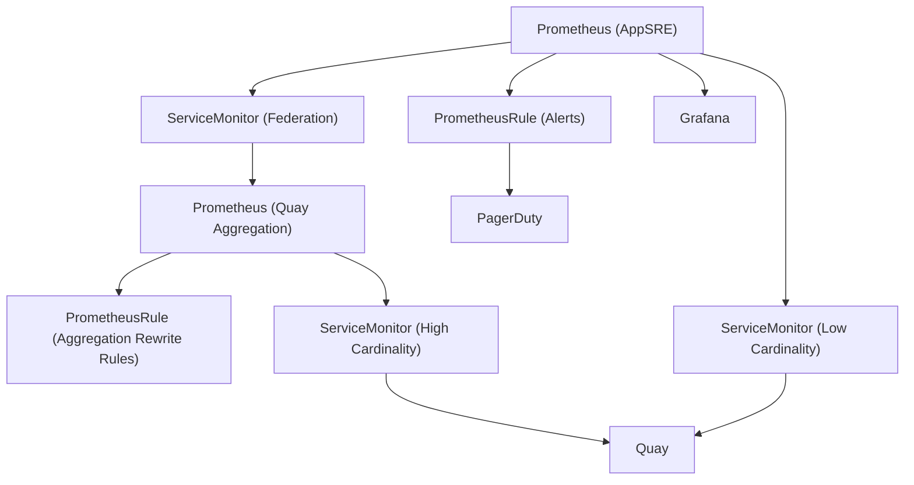

# Quay.io Monitoring Architecture

AppSRE manages an instance of Prometheus that integrates with their alerting and on-call rotation schemes.
All resources related to this software stack are found in the `openshift-customer-monitoring` namespace.
This is true of all OSD clusters.

This would normally suffice, but Quay has the unique requirement of aggregating some metrics that contain a high cardinality of labels. High cardinality issues are being tracked in https://issues.redhat.com/browse/PROJQUAY-3524.

In order to handle this aggregation, another instance of Prometheus with a lower retention is configured to scrape only these high cardinality metrics.

`$ cat resources/quayio-stage/quay/quay.aggregation.servicemonitor.yaml`

```yaml
...

spec:
  endpoints:
  - interval: 60s
    path: /metrics
    port: metrics
    metricRelabelings:
    - sourceLabels: [ __name__ ]
      regex: 'quay_request_duration_seconds_bucket'
      action: keep
  - interval: 30s
    path: /metrics
    port: metrics
    metricRelabelings:
    - sourceLabels: [ __name__ ]
      regex: 'quay_request_duration_seconds_count'
      action: keep
...
```

We scrape at different intervals to avoid running out of space in the aggregation instance. Since these metrics are used as sources of the following aggregation metrics:

```
aggregation:quay_request_duration_seconds_bucket:rate5m:sum
aggregation:quay_request_duration_seconds_count:rate1m:sum
```

we can scrape less often `quay_request_duration_seconds_bucket` and save space. See https://issues.redhat.com/browse/ASIC-200 for more details on Prometheus aggregation server data space issues.

Being an intermediate aggregation server with no long term store purpose, the data directory of the Prometheus server is mounted on a memory backed `emptyDir` for performance needs. Any issue with this server with regards to data is solved by restarting it which will scrape all the data and start fresh.

The AppSRE Prometheus instance continues to scrape the low cardinality metrics, then uses [Prometheus Federation] to scrape only the aggregated metrics from the additional Prometheus.

[Prometheus Federation]: https://prometheus.io/docs/prometheus/latest/federation/

`$ cat resources/quayio-stage/quay/app-sre.servicemonitor.yaml`

```yaml
...

spec:
  endpoints:
  - interval: 30s
    path: /metrics
    port: metrics
    metricRelabelings:
    - sourceLabels: [ __name__ ]
      regex: 'quay_request_duration_seconds.*'
      action: drop

...
```

`$ cat resources/quayio-stage/quay/quay.aggregation.federation.servicemonitor.yaml`

```yaml
...

spec:
  endpoints:
  - interval: 30s
    path: /federate
    port: web
    params:
      'match[]':
      - '{__name__=~"aggregation:.*"}'

...
```

## Architecture Diagram


