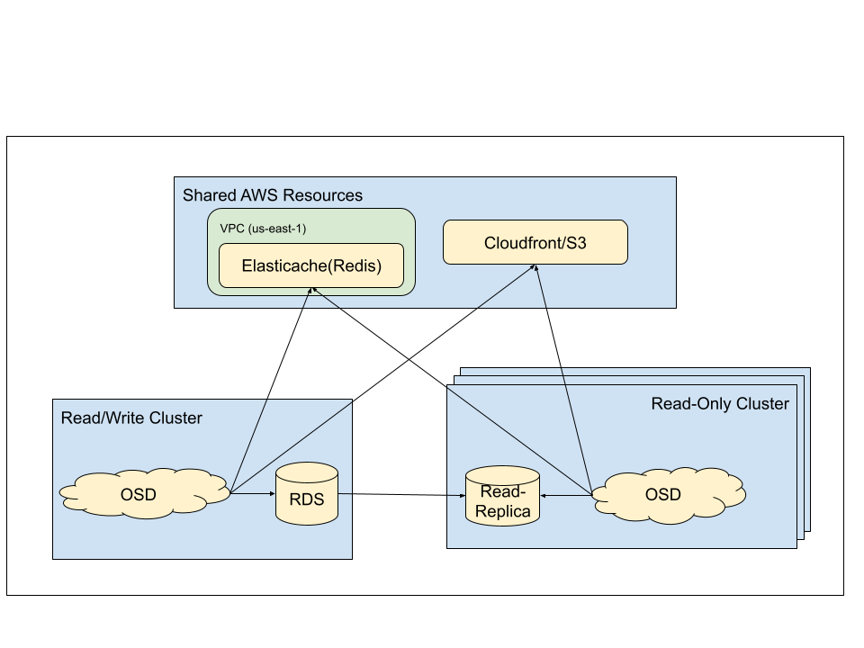
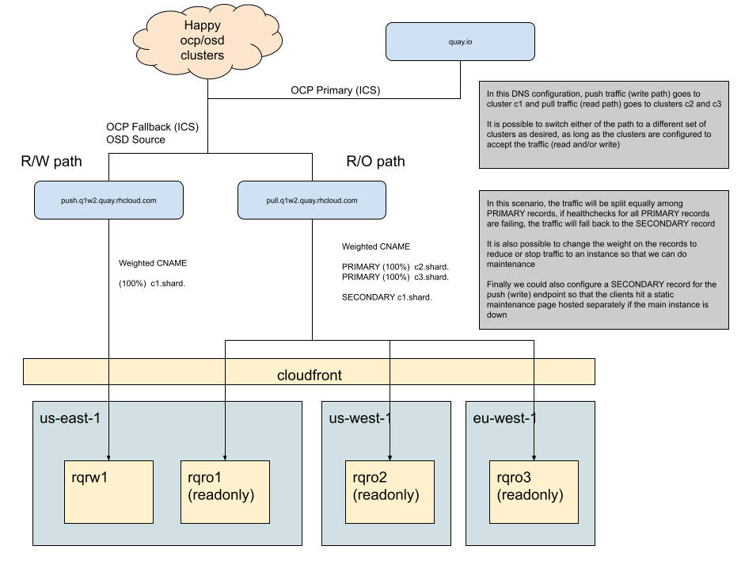

# OCM-Quay Architecture

OCM-Quay is a series of small quay clusters for Red Hat critical content.  It is not intended to provide data backup/resilancy for quay.io.  There is 1 cluster that will handle all push operations, and several read-only clusters to provide geographic redundancy and load-balancing.  New read-only clusters can be added to the mix to improve resilency/capacity as needed.

## Small Quay Clusters

There will be 1 master RDS instances that will be used by the read-write cluster.  Each read-only cluster will use a unique read-replica located in the same region as the cluster.  This means each read-only cluster will talk to its own read-replica instance.  Each read-only cluster has a deployment of quay configured in read-only mode that uses a read-only user to access its read-replica.

All clusters will share the same cloudfront/S3 and Elasicache instances.

*Note*: Quay has a cost saving feature that keeps traffic within AWS if the source of the pull is already within AWS.  The result of this is that blob retrieval that would normally be forwarded to cloudfront will instead be forwarded directly to S3.  Since the OSD clusters are within AWS, the pulls from those clusters will not hit cloudfront and instead will go straight to S3.

## DNS Load-Balancing

The push/write operations all go to the single read-write cluster though a push oriented endpoint (https://push.q1w2.quay.rhcloud.com/), whereas the pull operations are round-robined to the read-only clusters behind the pull oriented endpoint (https://pull.q1w2.quay.rhcloud.com/).

No pull operations should ever use the push endpoint.
