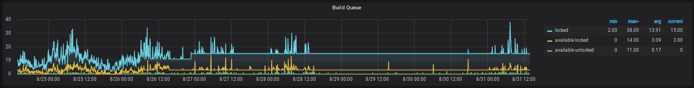

# Quay Build System Nefarious Usage Identification
Sometimes the Quay build system is used for purposes other than strictly 
building and shipping images. Often, like many nefarious compute-abusing 
activies, these types of behavior have patterns to them. This SoP is an 
iterative work intended to help (reactively) detect potential abusive activity.
  
# SQL Query Job  

Following the [SQL Query integration process]( https://gitlab.cee.redhat.com/service/app-interface/#execute-a-sql-query-on-an-app-interface-controlled-rds-instance) 
a query job can be added to get a current dump of the queueitem table in the 
quayprod database. An example  of this is available from 
[Aug-31-2020](https://gitlab.cee.redhat.com/service/app-interface/-/blob/master/data/services/quayio/queries/2020-08-31-select-abusers-proddb.yml). 
For further details on how to manage SQL queries, refer to [1].  

[1] https://gitlab.cee.redhat.com/service/app-interface/#execute-a-sql-query-on-an-app-interface-controlled-rds-instance  

# Abuse Indicator  

An indicator that ToS-violating activity may be on-going is the quay.io [build 
queue](https://grafana.app-sre.devshift.net/d/_BkydJaWz/quay-io-runtime?orgId=1&refresh=1m&from=now-7d&to=now&fullscreen&panelId=20) 
graph will plateau for a long period of time.  

  

----
keywords: miner, bitcoin, quay, builder, queueitem, abuse, bot, build-queue
