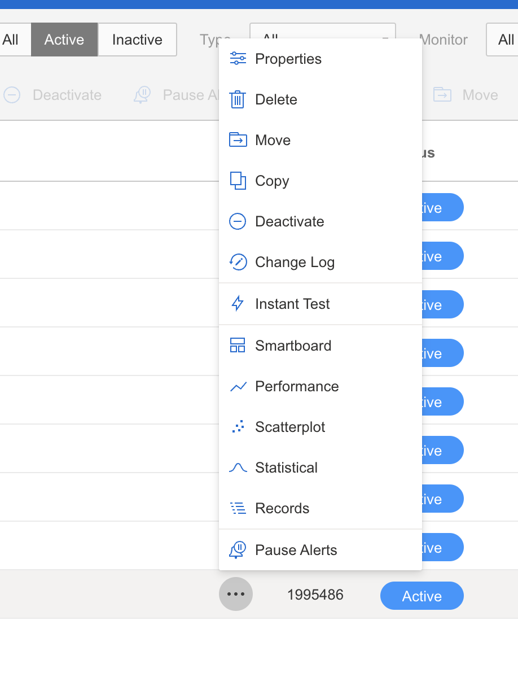

#  Quay push/pull monitor on catchpoint failure

The push/pull monitor [check on Catchpoint](https://portal.catchpoint.com/ui/Symphony/ControlCenter/Tests/Test/1995486/Properties) runs a javascript script that periodically pushes and pulls against quay.io to determine end-to-end push/pull functionality is working

# Debugging check failures

1. Try a manual push or pull from your system. Check [quay smoke test file](quay-smoke-test.md) on how to run manual push/pulls

2. If pushes and pulls work for you consistently and on different images from
   your local machine and the check is failing, there might be something wrong
   with the check. Please disable the check by going to the check via the link above and deactivate the check. Please open a bug with PROJQUAY to fix the alert . 
   

3. If you see continuous or intermittent failures then it might be something wrong with Quay. 
4. Check the [error logs](../quayio.md#application-logs) to see if there are any `500` error messages. Please file a bug with `PROJQUAY` with the error information
5. If the failure is continuous and also acommponied by other alerts, it is a serious issue and would require a region failover. Please page the Quay oncall and start preparing for a region failover.

