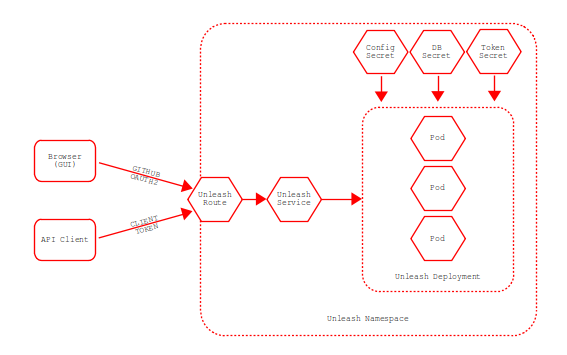

## Unleash Architecture

### Service Description

Unleash is a feature toggle management solution where tenants can create a relationship with a service in order to enable or disable that service integration in an environment. The information on each Unleash instance and namespace is stored in `app-interface`. There is an integration within `qontract-reconcile` called `unleash-watcher`, which watches for any changes in Unleash toggle features and notifies about those changes on Slack. More information can be found [here](https://service.pages.redhat.com/dev-guidelines/docs/appsre/advanced/feature-toggles/#requesting-an-instance).

More documentation on Unleash can be found [here](https://service.pages.redhat.com/dev-guidelines/docs/appsre/advanced/feature-toggles) and [here](https://gitlab.cee.redhat.com/service/app-interface/-/blob/master/docs/app-sre/sop/unleash-deployment.md).

### Components

Each unleash deployment has the following components:
- Vault secrets: If the vault secrets become bad, then unleash will not be powered.
- UI and API: If the two endpoint methods are down, then tenants will not be able to power Unleash for their service.

### Routes

Unleash endpoints usually follow this endpoint convention: `https://<application-name>.unleash.devshift.net`, see within various unleash namespace files like [this one](https://gitlab.cee.redhat.com/service/app-interface/-/blob/master/data/services/unleash/namespaces/app-sre-prod-01.yml):

Example:
```
- provider: resource-template
  type: jinja2
  path: /services/unleash/unleash.route.yaml
  variables:
    identifier: app-interface
    host: app-interface.unleash.devshift.net
```

### Dependencies

N/A

### Service Diagram



### Application Success Criteria

Unleash is a service that allows tenants to enable a toggle feature for their service, enabling full control on how and when they want to enable their functionality.

### State

N/A

### Load Testing

N/A

### Capacity

N/A
