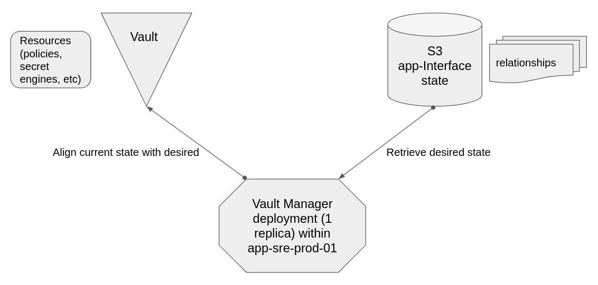

# Vault-Manager Architecture

## Service Description
[Vault Manager](https://github.com/app-sre/vault-manager) is tasked with reconciling resources (secret engines, auth methods, policies, etc.) within HashiCorp Vault, via relationships defined across files within App-Interface.

## Components 
Vault Manager's components are very similiar to that of the integrations within [Qontract Reconcile](https://github.com/app-sre/qontract-reconcile). Vault Manager is bundled as an image and deployed as a single replica kubernetes deployment. If the replica pod is not scheduled or failing, impact is that Vault resources will not be reconciled against changes to App Interface files associated with Vault.

## Routes 
None

## Dependencies
Vault Manager cannot perform its primary function if either of the following systems are inaccessible:
* Vault (current state)
* App-Interface S3 bucket (desired state)

## Service Diagram

## Application Success Criteria
Vault Manager's goal is to successfully reconcile the following HashiCorp Vault resources, based up relationships mapped in App-Interface:
* Secret Engines
* Auth Methods
* Policies
* Entities (optional)
* Entity Aliases (optional)
* Groups (optional)

## State
Vault-Manager relies on the desired state of App-Interface, stored within S3. Additionally, relies on current state of resources in Vault.

## Load Testing
N/A

## Capacity
Vault-Manager utilizes concurrency for many operations. The total allowable threads Vault-Manager can spawn is capped to 10 (default) to avoid potential bursts in CPU utilization. Additionally, vault-manager consumes negligble resources until an MR is merged within App-Interface that affects resources managed by it (uncommon relative to other qontract-reconcile integrations). During active reconciliation (~3 minutes to perform), CPU usage should not exceed 300 milicores and memory should not exceed 300MB.
